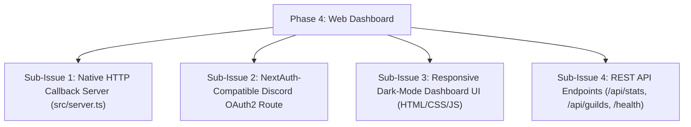

# HELIX - Phase 4: Web Dashboard & NextAuth OAuth2 Infrastructure

## Goals & Objectives
Build the companion web dashboard and HTTP server (`src/server.ts`) providing Discord OAuth2 authentication, guild management, system statistics, and REST endpoints.

---

## Sub-Issues & Milestone Breakdown

- [x] **Sub-Issue 1: HTTP Server**: Native Node.js `http` server integrated into the bot process.
- [x] **Sub-Issue 2: NextAuth OAuth2**: Endpoint `/api/auth/callback/discord` with state verification and session exchange.
- [x] **Sub-Issue 3: Dashboard UI**: Responsive dark-mode dashboard (`dashboard/index.html`) displaying bot health, guild list, and active plugins.
- [x] **Sub-Issue 4: API Endpoints**: Endpoints `/api/stats`, `/api/guilds`, `/api/plugins`, and `/health`.

---

## Verification & Criteria
1. Web dashboard loads cleanly and handles Discord OAuth2 redirects without external web frameworks.
2. Unit tests verify HTTP routing, session creation, and API payloads.
