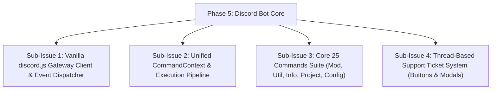

# HELIX - Phase 5: Discord Bot Gateway Client & Core Commands

## Goals & Objectives
Implement the standalone vanilla `discord.js v14` gateway client (`HelixBotClient`) and complete suite of 25 developer community commands across 5 categories.

---

## Sub-Issues & Milestone Breakdown

- [x] **Sub-Issue 1: Gateway Client**: `src/client.ts` with typed gateway intent management and event routing.
- [x] **Sub-Issue 2: Unified Pipeline**: `execute(context)` interface handling prefix (`>`) and slash commands transparently.
- [x] **Sub-Issue 3: Command Suite**:
  - `mod/`: `kick`, `ban`, `unban`, `timeout`, `untimeout`, `purge`, `warn`
  - `util/`: `ping`, `avatar`, `serverinfo`, `userinfo`, `poll`, `snowflake`, `remind`
  - `info/`: `help`, `info`, `status`, `list`
  - `project/`: `create`, `scaffold`
  - `config/`: `set`, `ticket`, `plugin`
- [x] **Sub-Issue 4: Ticket System**: Interactive buttons, modal inputs, private thread creation, and transcript generation.

---

## Verification & Criteria
1. All commands respond to both prefix and slash invocations.
2. Thread tickets execute interactively via Discord UI components.
