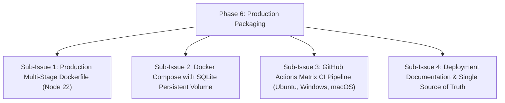

# HELIX - Phase 6: Packaging, Docker & Production Readiness

## Goals & Objectives
Package HELIX for self-hosted containerized execution via Docker, provide Heroku deployment guides, and maintain continuous integration testing.

---

## Sub-Issues & Milestone Breakdown

- [x] **Sub-Issue 1: Dockerfile**: Multi-stage production container build on `node:22-bookworm-slim`.
- [x] **Sub-Issue 2: Docker Compose**: `docker-compose.yml` with automated volume mounting (`./data:/app/data`).
- [x] **Sub-Issue 3: CI Pipeline**: GitHub Actions matrix testing across Windows, macOS, and Linux on Node.js 22.x.
- [x] **Sub-Issue 4: Deployment Docs**: `docs/deployment-docker.md` and `docs/deployment-heroku.md`.

---

## Verification & Criteria
1. Docker container boots cleanly with persistent SQLite database storage.
2. Continuous integration runs test matrix and typechecks automatically.
