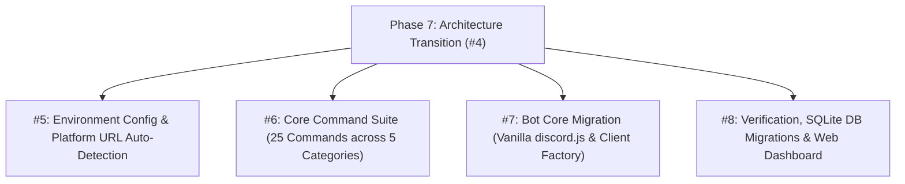

# HELIX - Phase 7: Full Discord Bot Architecture Transition

## Goals & Strategic Vision
Transition the HELIX repository from a dual CLI / companion bot into a dedicated, standalone **Discord bot project** named **HELIX**. The bot serves developer Discord communities with code intelligence (via language plugins), moderation tools, thread-based ticketing, server utilities, and unified guild/user settings.

## GitHub Issue & Sub-Issues Tracking
- **Parent GitHub Issue**: [#4 Full Discord Bot Architecture Transition (Phase 7)](https://github.com/HELIX-Origin/HELIX/issues/4)
- **Status**: Completed / Resolved

- [x] **Sub-Issue 1**: Multi-platform environment variable resolution & URL auto-detection ([#5](https://github.com/HELIX-Origin/HELIX/issues/5))
- [x] **Sub-Issue 2**: Core 25 commands across mod, util, info, project, and config categories ([#6](https://github.com/HELIX-Origin/HELIX/issues/6))
- [x] **Sub-Issue 3**: Bot core migration and vanilla discord.js gateway client ([#7](https://github.com/HELIX-Origin/HELIX/issues/7))
- [x] **Sub-Issue 4**: Verification, SQLite autonomous schema migrations, and web dashboard ([#8](https://github.com/HELIX-Origin/HELIX/issues/8))

---

## Key Architectural Decisions

### Vanilla discord.js (No Frameworks)
- **Framework**: Plain discord.js with TypeScript. No discordx, no decorators.
- **Rationale**: Decorator frameworks add complexity, type errors, and unnecessary abstraction. Plain discord.js is simpler, more maintainable, and better understood.

### Unified CommandDefinition Interface
- Single `execute(context)` function handles both prefix and slash invocations.
- Handlers auto-discover commands via `import.meta.glob` and named exports.
- Slash commands auto-built from `options`/`subcommands` metadata arrays.
- No manual slash command registration needed in command files.

### Named Exports Only
- All command files use `export const name: CommandDefinition = { ... }`.
- All event files use `export const name: BotEvent = { ... }`.
- No `export default` — handlers iterate `Object.values(mod)` to find exports.
- **No index.ts files** in commands/, events/, or handlers/ directories — these crash Discord bots because Discord uses filenames as command/event identifiers.

### Per-Guild Prefix
- Default prefix: `>` (not `!`).
- Per-guild customizable via `>set prefix {input}`.
- Stored in `guild_settings` table in SQLite.

---

## Implementation Status

### 1. Core Architecture
- [x] `src/client.ts` — Plain discord.js Client with `createBot()`, `getBot()`, `isBotOwner()`, `HelixBotClient` wrapper.
- [src/types/command.ts]` — `CommandDefinition`, `ExecuteContext`, `CommandOption` interfaces.
- [x] `src/handlers/command-handler.ts` — Prefix loader, arg parsing, auto-help, guild prefix.
- [x] `src/handlers/slash-handler.ts` — Auto-build SlashCommandBuilder, REST registration, interaction routing.
- [x] `src/handlers/event-handler.ts` — Event auto-loader via `import.meta.glob`.
- [x] `src/handlers/help-registrar.ts` — Help metadata registry without discordx.
- [x] `src/handlers/logs-handler.ts` — Timestamped console logging.
- [x] `src/handlers/error-handler.ts` — Centralized error handling.

### 2. Event Files (Named Exports)
- [x] `src/events/ready.ts` — Bot ready event.
- [x] `src/events/guild-create.ts` — Guild join event.
- [x] `src/events/guild-delete.ts` — Guild leave event.
- [x] `src/events/interactionCreate.ts` — Slash + button/modal routing.
- [x] `src/events/message-create.ts` — Prefix command routing.

### 3. Command Files (25 Commands, 6 Categories)

#### Moderation (`src/commands/mod/`)
- [x] `kick.ts` — Kick a member.
- [x] `ban.ts` — Ban a member.
- [x] `unban.ts` — Unban a user.
- [x] `timeout.ts` — Timeout a member.
- [x] `untimeout.ts` — Remove timeout.
- [x] `purge.ts` — Bulk delete messages.
- [x] `warn.ts` — Issue warnings (with subcommands: user, list, clear).

#### Utility (`src/commands/util/`)
- [x] `ping.ts` — Check gateway latency.
- [x] `avatar.ts` — Get user avatar.
- [x] `serverinfo.ts` — Display server statistics.
- [x] `userinfo.ts` — Display user information.
- [x] `poll.ts` — Create reaction polls.
- [x] `snowflake.ts` — Decode Discord snowflake IDs.
- [x] `remind.ts` — Set timed reminders.

#### AI & Code Intelligence (`src/commands/ai/`)
- [x] `ai.ts` — AI suite (subcommands: query, explain, auth-status, auth-login, auth-logout).

#### Information (`src/commands/info/`)
- [x] `help.ts` — Display all commands.
- [x] `info.ts` — System diagnostics.
- [x] `status.ts` — System health report.
- [x] `list.ts` — List available templates.

#### Project Scaffolding (`src/commands/project/`)
- [x] `create.ts` — Scaffold from templates.
- [x] `scaffold.ts` — Preview scaffolding.

#### Configuration (`src/commands/config/`)
- [x] `set.ts` — Configure guild settings (subcommands: prefix, tickets-hub, ticket-manager-role, mod-log-channel, welcome-channel, view).
- [x] `ticket.ts` — Support ticket system (subcommands: create, close, setup-hub, add, remove, transcript).

### 4. Database
- [x] `src/db/database.ts` — SQLite with autonomous schema migrations on boot.
- [x] Tables: `guild_settings`, `tickets`, `moderation_logs`, `warnings`, `user_settings`, `user_sessions`, `query_logs`, `scaffold_history`, `bot_kv`.
- [x] Default prefix changed from `'/'` to `'>'`.

### 5. Dashboard
- [x] `dashboard/` — Web dashboard with OAuth2 callback server.
- [x] `src/server.ts` — HTTP server with Discord OAuth2 flow.
- [x] Dashboard API routes for stats, AI, scaffolding, guilds, bot actions.

### 6. Entry Point
- [x] `index.ts` — Main entry point wiring handlers, events, and login.
- [x] `src/index.ts` — Source barrel exports.

---

## Known Issues (Tracked)
- **BUG-005**: TypeScript strict mode errors — `import.meta.glob`, execute return types, `.author` access, `HelixBotClient` exports, event typing.
- **BUG-004**: Auto-resolve NEXTAUTH_URL and callback URLs from platform detection.

---

## Verification Plan & Success Metrics
1. **Zero Subprocesses**: No spawning of external CLI executables.
2. **Clean Typecheck**: `npm run typecheck` passes with zero errors.
3. **Clean Build**: `npm run build` compiles successfully.
4. **All Commands Work**: Both prefix (`>command`) and slash (`/command`) invocations route correctly.
5. **Event Handling**: Bot responds to ready, guild join/leave, interactions, and messages.
6. **Database**: Autonomous schema migration on boot, all tables created.
7. **Plugin System** (Phase 8): Language plugins provide code intelligence without AI APIs.
