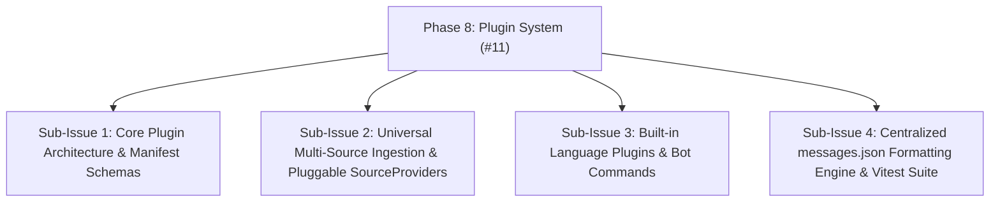

# HELIX - Phase 8: Language Plugin System & Built-in Code Intelligence Engine

## Goals & Strategic Vision
Replace AI-dependent code assistance with a plugin-based language intelligence system that uses official documentation, built-in linters, and static analysis. The bot provides code support without requiring paid APIs or external AI authentication. Users can host their own language plugins via GitHub repositories.

## GitHub Issue & Sub-Issues Tracking
- **Parent GitHub Issue**: [#11 Language Plugin System & Code Intelligence Engine (Phase 8)](https://github.com/HELIX-Origin/HELIX/issues/11)
- **Status**: Completed / Resolved



- [x] **Sub-Issue 1**: Core Plugin Architecture, `LanguagePlugin` interface, and manifest validation (`#11-sub1`)
- [x] **Sub-Issue 2**: Pluggable `SourceProvider` system supporting GitHub, GitLab, Bitbucket, Gists, and Pastebins (`#11-sub2`)
- [x] **Sub-Issue 3**: Built-in language plugins (`typescript`, `python`, `rust`, `go`, `java`, `csharp`) and commands (`>lint`, `>explain`, `>debug`, `>refactor`, `>generate`, `>inspect`, `>docs`) (`#11-sub3`)
- [x] **Sub-Issue 4**: Centralized formatting engine (`messages.json`), Vitest test suite, and typecheck verification (`#11-sub4`)

---

## Architecture

### Plugin Interface
Every language plugin implements a standard interface:

```typescript
interface LanguagePlugin {
  id: string;                          // e.g. "typescript", "python", "gdscript"
  name: string;                        // Display name
  version: string;                     // SemVer
  fileExtensions: string[];            // [".ts", ".tsx", ".js", ".jsx"]
  docUrl: string;                      // Official docs base URL

  // Core capabilities
  lint(code: string, fileName?: string): LintResult[];
  explain(code: string): ExplanationResult;
  suggestFixes(errors: LintError[]): CodeFix[];
  getDocumentation(topic: string): DocReference | null;

  // Optional advanced features
  format?(code: string): string;
  getPatterns?(): CodePattern[];
  getExamples?(topic: string): CodeExample[];
}

interface LintResult {
  line: number;
  column: number;
  severity: 'error' | 'warning' | 'info';
  code: string;           // e.g. "TS2345"
  message: string;
  fix?: CodeFix;
  docLink?: string;       // Link to official docs for this rule
}

interface CodeFix {
  description: string;
  replacement: string;
  startLine: number;
  startCol: number;
  endLine: number;
  endCol: number;
}

interface DocReference {
  title: string;
  url: string;
  summary: string;
  codeExamples?: string[];
}

interface ExplanationResult {
  summary: string;
  lineExplanations: { line: number; explanation: string }[];
  potentialIssues: string[];
  bestPractices: string[];
  documentation: DocReference[];
}
```

### Plugin Discovery & Loading

Plugin repositories (both built-in and community) use an identical folder structure with a root `config.json` that the bot reads first to discover all plugins in the repo.

```
plugins/
├── helix-origin/                # Built-in plugins shipped with HELIX
│   ├── config.json              # Repo-level manifest (list of plugins)
│   ├── typescript/
│   │   ├── plugin.json          # Individual plugin manifest
│   │   ├── linter.ts
│   │   ├── patterns.ts
│   │   ├── docs-cache.ts
│   │   └── examples/
│   ├── python/
│   ├── javascript/
│   ├── csharp/
│   ├── gdscript/
│   ├── lua/
│   ├── rust/
│   ├── go/
│   ├── java/
│   ├── php/
│   ├── sql/
│   ├── html-css/
│   └── flutter-dart/
├── community/                   # User-installed from GitHub
│   └── <repo-name>/
│       ├── config.json          # Copied from cloned repo
│       └── <plugin-dirs>/
└── plugin-loader.ts             # Discovery, validation, and loading engine
```

### Repository Config (`config.json`)

The root `config.json` is the entry point for any plugin repository. When the bot imports a repo, it reads this file first. The same schema is used by `helix-origin` and all community repos.

```json
{
  "repository": "helix-origin",
  "name": "HELIX Official Language Plugins",
  "version": "1.0.0",
  "description": "Built-in language plugins for linting, documentation, and code analysis",
  "author": "HELIX-Origin",
  "plugins": [
    { "id": "typescript", "path": "./typescript" },
    { "id": "javascript", "path": "./javascript" },
    { "id": "python", "path": "./python" },
    { "id": "csharp", "path": "./csharp" },
    { "id": "gdscript", "path": "./gdscript" },
    { "id": "rust", "path": "./rust" },
    { "id": "go", "path": "./go" },
    { "id": "java", "path": "./java" },
    { "id": "php", "path": "./php" },
    { "id": "sql", "path": "./sql" },
    { "id": "html-css", "path": "./html-css" },
    { "id": "flutter-dart", "path": "./flutter-dart" },
    { "id": "lua", "path": "./lua" }
  ]
}
```

Community repos use the same schema:
```json
{
  "repository": "username/my-custom-plugins",
  "name": "My Custom Language Plugins",
  "version": "1.0.0",
  "description": "Custom plugins for Kotlin and Swift",
  "author": "username",
  "plugins": [
    { "id": "kotlin", "path": "./kotlin" },
    { "id": "swift", "path": "./swift" }
  ]
}
```

### Plugin Manifest (`plugin.json`)
Each individual plugin folder contains its own `plugin.json`:
```json
{
  "id": "typescript",
  "name": "TypeScript",
  "version": "1.0.0",
  "description": "TypeScript/JavaScript linting, documentation, and code analysis",
  "author": "HELIX",
  "fileExtensions": [".ts", ".tsx", ".js", ".jsx", ".mjs", ".cjs"],
  "docUrl": "https://www.typescriptlang.org/docs/",
  "entry": "linter.ts",
  "capabilities": ["lint", "explain", "fixes", "docs", "format"],
  "dependencies": [],
  "repository": "https://github.com/HELIX-Origin/HELIX-CLI"
}
```

### Plugin Installation (GitHub Repositories)
```
> plugin install HELIX-Origin/helix-plugin-typescript
> plugin install username/custom-language-plugin
> plugin list
> plugin remove typescript
```

Plugins are GitHub repositories containing a root `config.json` manifest. The bot:
1. Clones the repository to `plugins/community/<repo-name>/`
2. Reads `config.json` to discover all plugins in the repo
3. Validates each plugin's `plugin.json` manifest and interface compliance
4. Registers each plugin in the runtime registry
5. No npm install needed — plugins are self-contained TypeScript

---

## Built-in Language Plugins (Phase 8 Scope)

| Language | Lint Strategy | Documentation Source | Priority |
|----------|--------------|---------------------|----------|
| TypeScript | TS Compiler API diagnostics | typescriptlang.org | High |
| JavaScript | ESLint-compatible rules | developer.mozilla.org | High |
| Python | AST pattern matching | docs.python.org | High |
| C# | Roslyn-style diagnostics | learn.microsoft.com | Medium |
| GDScript | Godot docs cross-ref | docs.godotengine.org | Medium |
| Rust | rustc warning patterns | doc.rust-lang.org | Medium |
| Go | go vet patterns | go.dev/doc | Medium |
| Java | Checkstyle-style rules | docs.oracle.com | Low |
| PHP | PHPDoc + pattern rules | php.net | Low |
| SQL | Syntax validation | Various (ansi-standard) | Low |
| HTML/CSS | W3C validation patterns | developer.mozilla.org | Low |
| Flutter/Dart | dart analyzer patterns | dart.dev | Low |
| Lua | lua check patterns | lua.org | Low |

---

## Discord Command Integration

### `>lint` / `/lint`
Analyze code for errors without AI. Uses the appropriate language plugin.
```
>lint ```typescript
const x: number = "hello";
```
```
Response: Embedded embed with line-highlighted errors, severity, doc links, and suggested fixes.

### `>explain` / `/explain`
Explain code structure and purpose using documentation cross-reference (NOT AI).
```
>explain ```python
def fibonacci(n):
    if n <= 1:
        return n
    return fibonacci(n-1) + fibonacci(n-2)
```
```
Response: Line-by-line explanation, complexity analysis, doc links to Python docs.

### `>docs` / `/docs`
Look up official documentation for a language topic.
```
>docs typescript "generic constraints"
>docs python "list comprehension"
```
Response: Official doc link, summary, code examples.

### `>plugin` / `/plugin`
Manage language plugins.
```
>plugin list                     # Show installed plugins
>plugin install <github-repo>    # Install from GitHub
>plugin remove <plugin-id>       # Remove a plugin
>plugin info <plugin-id>         # Show plugin details
```

---

## Implementation Tasks

### 1. Plugin System Core
- [x] Repository config schema and validation (`src/plugins/repo-config.ts`)
- [x] `LanguagePlugin` interface definition (`src/plugins/types.ts`)
- [x] Plugin manifest schema validation (`src/plugins/manifest.ts`)
- [x] Plugin loader with directory discovery (`src/plugins/plugin-loader.ts`)
- [x] Plugin registry with runtime enable/disable (`src/plugins/registry.ts`)
- [x] GitHub plugin installer (`src/commands/config/plugin.ts`)
- [x] Plugin Discord command (`src/commands/config/plugin.ts`)
- [x] Centralized message formatting engine (`src/handlers/message-handler.ts`, `src/messages.json`)

### 2. Built-in TypeScript Plugin
- [x] TypeScript compiler API integration for diagnostics
- [x] Official docs cross-reference database
- [x] Common patterns & anti-patterns catalog
- [x] Fix suggestion engine

### 3. Built-in Python Plugin
- [x] Python AST pattern matching (regex / parser-based)
- [x] Official docs cross-reference
- [x] Common patterns catalog

### 4. Built-in JavaScript Plugin
- [x] ESLint-compatible rule engine (subset)
- [x] MDN docs cross-reference
- [x] Common patterns catalog

### 5. Additional Built-in Plugins
- [x] C# plugin
- [x] GDScript plugin
- [x] Rust plugin
- [x] Go plugin
- [x] Remaining language plugins (Java, PHP, SQL, HTML/CSS, Flutter/Dart, Lua)

### 6. Discord Commands
- [x] `/lint` command with language auto-detection
- [x] `/explain` command using documentation cross-reference
- [x] `/docs` command for official doc lookup
- [x] `/plugin` management command (list, install, remove, enable, disable, info, reload)

### 7. Central Message & Embed Formatting
- [x] Dynamic embed template generation with variable interpolation
- [x] Unified error handling and response schema across all 23 native commands
- [x] Plugin health monitoring and error reporting

---

## Completion Criteria
1. Plugin system loads built-in and community plugins without errors.
2. `/lint` correctly identifies errors in TypeScript, JavaScript, and Python code.
3. `/explain` provides line-by-line explanations with official doc links.
4. `/docs` returns relevant official documentation references.
5. `>plugin install <github-repo>` successfully installs a community plugin.
6. Zero external AI API dependencies for code support features.
7. All existing tests continue to pass.
