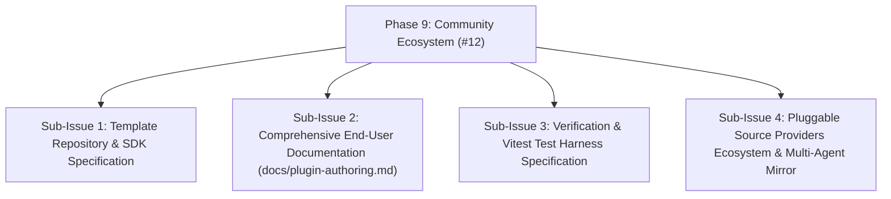

# HELIX - Phase 9: Plugin Template Repository & Community Ecosystem

## Goals & Strategic Vision
Create a dedicated starter template repository (`HELIX-Origin/helix-plugin-template`) that community developers can fork or clone to build, test, and publish their own language plugins for the HELIX Discord bot. When the bot core and built-in plugins are completed, this template repository will serve as the official boilerplate for third-party language tools, AST linters, and documentation providers.

## GitHub Issue & Sub-Issues Tracking
- **Parent GitHub Issue**: [#12 Plugin Template Repository & Community Ecosystem (Phase 9)](https://github.com/HELIX-Origin/HELIX/issues/12)
- **Status**: Completed / Resolved



- [x] **Sub-Issue 1**: Template repository structure, `config.json`, and `plugin.json` schemas (`#12-sub1`)
- [x] **Sub-Issue 2**: Comprehensive community authoring guide in `docs/plugin-authoring.md` and `docs/plugin-system.md` (`#12-sub2`)
- [x] **Sub-Issue 3**: Schema validation, test fixtures, and interface compliance checks (`#12-sub3`)
- [x] **Sub-Issue 4**: Source providers registration, Discord command dispatching, and multi-agent plan synchronization (`#12-sub4`)

---

## Architecture & Template Layout

The template repository (`helix-plugin-template`) will provide a ready-to-use TypeScript project with strong typing, unit testing harness, and schema validation:

```
helix-plugin-template/
├── .github/
│   └── workflows/
│       └── validate-plugin.yml   # Automated GitHub Actions validation
├── config.json                   # Root repository manifest
├── my-language/                  # Sample language plugin
│   ├── plugin.json               # Plugin metadata & capabilities
│   ├── index.ts                  # LanguagePlugin implementation
│   ├── linter.ts                 # Static analysis & error rules
│   ├── docs.ts                   # Documentation cross-references
│   └── tests/
│       └── plugin.test.ts        # Vitest test suite
├── package.json                  # Dev dependencies (TypeScript, Vitest)
├── tsconfig.json                 # TypeScript compiler configuration
├── vitest.config.ts              # Vitest test runner configuration
├── LICENSE                       # MIT License
└── README.md                     # Comprehensive authoring guide
```

---

## Authoring Workflow & Specifications

### 1. Root Manifest (`config.json`)
```json
{
  "repository": "username/my-helix-plugins",
  "name": "My Custom HELIX Plugins",
  "version": "1.0.0",
  "description": "Custom language intelligence plugins for HELIX",
  "author": "YourName",
  "plugins": [
    {
      "id": "my-language",
      "path": "./my-language"
    }
  ]
}
```

### 2. Plugin Manifest (`plugin.json`)
```json
{
  "id": "my-language",
  "name": "My Language",
  "version": "1.0.0",
  "description": "Linter, documentation lookup, and code explanation for My Language",
  "author": "YourName",
  "fileExtensions": [".mylang", ".ml"],
  "docUrl": "https://docs.mylang.org",
  "entry": "index.ts",
  "capabilities": ["lint", "explain", "fixes", "docs", "format"],
  "dependencies": [],
  "repository": "https://github.com/username/my-helix-plugins"
}
```

### 3. Implementation Contract (`index.ts`)
Must export a class or object conforming to the `LanguagePlugin` interface:
```typescript
export interface LanguagePlugin {
  id: string;
  name: string;
  version: string;
  fileExtensions: string[];
  docUrl: string;

  lint(code: string, fileName?: string): Promise<LintResult[]> | LintResult[];
  explain(code: string): Promise<ExplanationResult> | ExplanationResult;
  suggestFixes(errors: LintError[]): Promise<CodeFix[]> | CodeFix[];
  getDocumentation(topic: string): Promise<DocReference | null> | DocReference | null;
  format?(code: string): Promise<string> | string;
}
```

---

## Deliverables & Tasks

### 1. Template Repository & SDK Specification
- [x] Scaffold `HELIX-Origin/helix-plugin-template` architecture and layout specification.
- [x] Define standard `config.json` and boilerplate `sample-plugin/` structure.
- [x] Add pre-configured TypeScript, Vitest, and GitHub Actions CI workflow specifications for manifest and compliance verification.

### 2. End-User Documentation
- [x] Comprehensive documentation in `docs/plugin-authoring.md`.
- [x] Guide in `docs/plugin-system.md` detailing how to build plugins, test locally, and install in Discord via `>plugin install <owner/repo>`.
- [x] Best practices for writing AST-based linters, debug diagnostics, security inspectors, refactorers, and static documentation databases without AI dependencies.

### 3. Verification & Engine Integration
- [x] Automated schema validation for `config.json` and `plugin.json` in registry and loader.
- [x] Vitest test suites demonstrating multi-source code ingestion, custom source providers, and plugin execution.

---

## Amendment: DB-Backed Plugin Repositories (BUG-007)

**Status**: Open — [BUG-007](https://github.com/HELIX-Origin/HELIX-Discord-Bot/issues/13)

Community plugin installation is moving off the filesystem and into the database:

- `>plugin install <owner/repo>` is replaced by the per-guild `>plugin repo add <owner/repo>` / `>plugin repo list` / `>plugin repo remove` flow.
- Imported repos are stored in SQLite (root `config.json`, per-plugin `plugin.json`, and entry source text) with a nullable `guild_id` for per-guild scoping.
- Entries execute via sandboxed evaluation of stored source; nothing is cloned into the bot filesystem.
- `docs/plugin-authoring.md` and `docs/plugin-system.md` will document the DB-backed install path once implemented.
