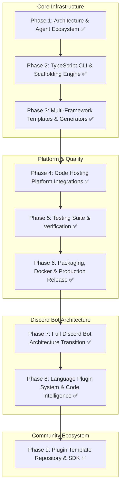

# HELIX -- Project Roadmap

---

### [Phase 1](phase1.md) — Core Foundation & Agent Ecosystem
- [x] Universal agent directory structure (`.agents/`, `.copilot/`, `.gemini/`, `.opencode/`)
- [x] Agent definitions for all project types (discord-bot, web, desktop, mobile, game-engine, backend, code-hosting)
- [x] 21 framework/language skills
- [x] Bug tracking framework
- [x] YML template catalog with index

### [Phase 2](phase2.md) — TypeScript CLI Architecture & Scaffolding Engine
- [x] TypeScript project config, commander CLI, interactive prompts
- [x] File system generator with atomic writes
- [x] Template engine with variable substitution and binary file safety

### [Phase 3](phase3.md) — Project Type Generators & Template System
- [x] Generators for: Discord bot, Web (React/Vue), Desktop (Electron/Tauri), Mobile (Flutter/RN), Game Engines (Unity/Godot/RPGM/Ren'\''Py), Backend (Rust/Go/Java/Python)
- [x] CI/CD pipeline templates (GitHub Actions, GitLab CI, Bitbucket Pipelines)

### [Phase 4](phase4.md) — Code Hosting Platform Integrations
- [x] GitHub CLI (`gh`), GitLab CLI (`glab`), Bitbucket automation
- [x] Remote repo creation, auth discovery

### [Phase 5](phase5.md) — Testing Suite & Verification
- [x] Vitest infrastructure with TypeScript ESM
- [x] Unit tests: CLI parsers, template substitution, validation
- [x] Integration tests: end-to-end scaffolding per domain
- [x] 63/63 tests passing across 16 test suites

### [Phase 6](phase6.md) — Packaging, Docker & Production Release
- [x] Dual ESM build (`dist/index.js`, `dist/bot/index.js`) via tsup
- [x] Docker multi-stage image + Docker Compose with SQLite volume
- [x] GitHub Actions CI/CD: matrix tests, Heroku deploy, npm release
- [x] Resolved BUG-001, BUG-002, BUG-003

### [Phase 7](phase7.md) — Full Discord Bot Architecture Transition
- [x] Standalone vanilla discord.js bot with TypeScript
- [x] 25 commands across 5 categories (mod, util, info, project, config)
- [x] Per-guild configurable prefix (default `>`)
- [x] Thread-based ticket system with button/modal interactions
- [x] SQLite database with autonomous schema migrations
- [x] OAuth2 callback server and web dashboard
- [x] Plugin system infrastructure (types, manifest, loader, registry)
- [x] Resolved BUG-004 (URL auto-resolution), BUG-005 (TypeScript strict mode)

### [Phase 8](phase8.md) — Language Plugin System & Code Intelligence Engine
- [x] Built-in TypeScript plugin (TS Compiler API diagnostics)
- [x] Built-in JavaScript plugin (ESLint-compatible rules)
- [x] Built-in Python plugin (AST pattern matching)
- [x] Built-in plugins: C#, GDScript, Rust, Go, Java, PHP, SQL, HTML/CSS, Flutter/Dart, Lua
- [x] Discord commands: `/lint`, `/explain`, `/docs`
- [x] GitHub-hosted community plugin installer (`>plugin install`)
- [x] Centralized message formatting engine (`messages.json`)

### [Phase 9](phase9.md) — Plugin Template Repository & Community Ecosystem
- [x] Official template repo architecture (`HELIX-Origin/helix-plugin-template`)
- [x] Boilerplate plugin structure, tests, and CI validator specifications
- [x] Comprehensive community documentation (`docs/plugin-authoring.md`)
- [x] Pluggable custom source providers and language intelligence dispatchers
