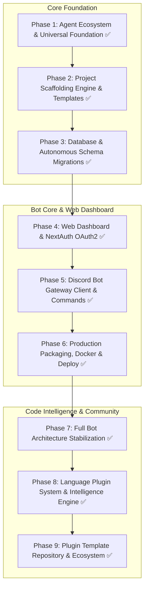
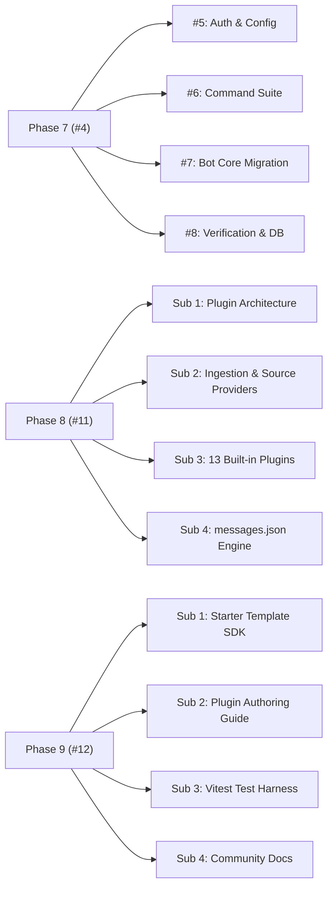

# HELIX -- Project Roadmap

---

## Phase Milestones & GitHub Tracking

| Phase | Milestone Name | Status | GitHub Issue | Sub-Issues |
|-------|----------------|--------|--------------|------------|
| **Phase 1** | Agent Ecosystem & Universal Foundation | Completed | N/A | 4 Sub-Tasks |
| **Phase 2** | Project Scaffolding Engine & Templates | Completed | N/A | 4 Sub-Tasks |
| **Phase 3** | Database & Autonomous Schema Migrations | Completed | N/A | 4 Sub-Tasks |
| **Phase 4** | Web Dashboard & NextAuth OAuth2 | Completed | N/A | 4 Sub-Tasks |
| **Phase 5** | Discord Bot Gateway Client & Commands | Completed | N/A | 4 Sub-Tasks |
| **Phase 6** | Production Packaging, Docker & Deploy | Completed | N/A | 4 Sub-Tasks |
| **Phase 7** | Full Bot Architecture Stabilization | Completed | [#4](https://github.com/HELIX-Origin/HELIX/issues/4) | [#5](https://github.com/HELIX-Origin/HELIX/issues/5), [#6](https://github.com/HELIX-Origin/HELIX/issues/6), [#7](https://github.com/HELIX-Origin/HELIX/issues/7), [#8](https://github.com/HELIX-Origin/HELIX/issues/8) |
| **Phase 8** | Language Plugin System & Intelligence Engine | Completed | [#11](https://github.com/HELIX-Origin/HELIX/issues/11) | 4 Sub-Tasks |
| **Phase 9** | Plugin Template Repository & Ecosystem | Completed | [#12](https://github.com/HELIX-Origin/HELIX/issues/12) | 4 Sub-Tasks |

---

### [Phase 1](phase1.md) — Agent Ecosystem & Universal Foundation
- [x] Universal agent directory structure (`.agents/`, `.copilot/`, `.gemini/`, `.opencode/`)
- [x] Mandatory rules: Zero-AI runtime (`01`), Discord bot architecture (`02`), messages.json (`03`), GitHub issues protocol (`04`), documentation standards (`05`)
- [x] 21 framework and language skills knowledge base
- [x] Bug tracking index with GitHub Issues synchronization

### [Phase 2](phase2.md) — Project Scaffolding Engine & Templates
- [x] Scaffolding engine with template variable interpolation (`TemplateEngine`)
- [x] Binary asset safe bypass (`isBinaryFile`)
- [x] 17 production-ready starter templates across Web, Desktop, Mobile, Game, and Backend domains
- [x] Scaffolding Discord commands (`>project create`, `>project scaffold`)

### [Phase 3](phase3.md) — Database & Autonomous Schema Migrations
- [x] SQLite database singleton (`BotDatabase`) using `better-sqlite3`
- [x] Autonomous schema migrations on boot (`migrations.ts`)
- [x] Tables: `guild_settings`, `tickets`, `moderation_logs`, `warnings`, `user_settings`, `user_sessions`, `bot_kv`
- [x] Per-guild configuration persistence (custom prefix, ticket hub, mod log channel)

### [Phase 4](phase4.md) — Web Dashboard & NextAuth OAuth2
- [x] Native Node.js HTTP server (`src/server.ts`)
- [x] NextAuth Discord OAuth2 callback handler (`/api/auth/callback/discord`)
- [x] Responsive dark-mode dashboard HTML/CSS/JS (`dashboard/index.html`)
- [x] REST API endpoints (`/api/stats`, `/api/guilds`, `/api/plugins`, `/health`)

### [Phase 5](phase5.md) — Discord Bot Gateway Client & Commands
- [x] Vanilla discord.js v14 client architecture (`HelixBotClient`)
- [x] 25 commands across 5 categories (`mod`, `util`, `info`, `project`, `config`)
- [x] Thread-based ticket system with interactive buttons and modals
- [x] Unified `execute(context)` execution supporting prefix (`>`) and slash commands

### [Phase 6](phase6.md) — Production Packaging, Docker & Deploy
- [x] Production multi-stage Docker image (`node:22-bookworm-slim`)
- [x] Docker Compose with persistent SQLite volume (`./data:/app/data`)
- [x] GitHub Actions CI matrix runner across Ubuntu, Windows, macOS
- [x] Resolved BUG-001, BUG-002, BUG-003

### [Phase 7](phase7.md) — Full Bot Architecture Stabilization
- [x] Complete transition to standalone Discord bot architecture (GitHub Issue [#4](https://github.com/HELIX-Origin/HELIX/issues/4))
- [x] Multi-platform dynamic URL auto-detection in `src/env.ts` (Resolved BUG-004)
- [x] TypeScript strict mode type safety and type narrowing (Resolved BUG-005)
- [x] Resolved sub-issues #5, #6, #7, #8

### [Phase 8](phase8.md) — Language Plugin System & Intelligence Engine
- [x] Zero-AI local language plugin architecture (GitHub Issue [#11](https://github.com/HELIX-Origin/HELIX/issues/11))
- [x] Universal multi-source code ingestion (Chat codeblocks, Discord attachments, GitHub, GitLab, Bitbucket, Pastebins)
- [x] 13 built-in language plugins (`typescript`, `python`, `rust`, `go`, `java`, `csharp`, etc.)
- [x] Bot commands: `>lint`, `>explain`, `>debug`, `>refactor`, `>generate`, `>inspect`, `>docs`
- [x] Centralized message formatting engine (`messages.json` + `message-handler.ts`, Resolved BUG-006)

### [Phase 9](phase9.md) — Plugin Template Repository & Ecosystem
- [x] Template repository specification (`HELIX-Origin/helix-plugin-template`) (GitHub Issue [#12](https://github.com/HELIX-Origin/HELIX/issues/12))
- [x] Pluggable `SourceProvider` registration for custom code repositories
- [x] Comprehensive community plugin authoring guide (`docs/plugin-authoring.md`)
- [x] Public plugin installation via `>plugin install <owner/repo>`
