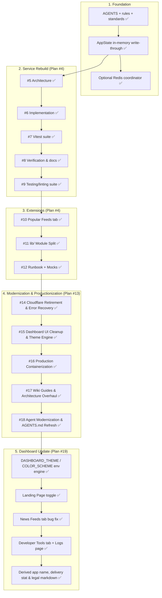

# Discord RSS — Global Repository Roadmap

> **Global Repository Roadmap**: This document is the overarching repository roadmap recording all plans, major architectural shifts, and milestone evolutions across HELIX RSS.
>
> **GitHub Issue Relationship**: In contrast to this local repository-wide roadmap, **GitHub issue roadmaps are per-plan**. Each time a new plan is created, it is run within its own dedicated parent `[PLAN]` issue (e.g. Issue #4 for the Service Rebuild, Issue #13 for Modernization & Productionization). That parent issue serves as the roadmap exclusively for that plan and its dedicated sub-issues.

---

## Global Repository Milestones

| Plan / Milestone | Target Domain | Status | Tracking / Issue |
|---|---|---|---|
| **Standards & Rules** | Roadmap-first protocol, emoji matrix, safety invariants | Complete | `.agents/rules/remote-issue-protocol.md` |
| **AppState Persistence** | In-memory primary layer over SQLite write-through | Complete | [#5](https://github.com/HELIX-Origin/HELIX-RSS/issues/5) (Plan #4) |
| **Service Implementation** | Repository write-through, Redis coordinator, watchers | Complete | [#6](https://github.com/HELIX-Origin/HELIX-RSS/issues/6) (Plan #4) |
| **Vitest Suite Rebuild** | Comprehensive unit & integration testing harness | Complete | [#7](https://github.com/HELIX-Origin/HELIX-RSS/issues/7) (Plan #4) |
| **Verification & Docs** | Multi-user onboarding smoke test, documentation sync | Complete | [#8](https://github.com/HELIX-Origin/HELIX-RSS/issues/8) (Plan #4) |
| **Popular Feeds** | Presets catalog and one-click subscription dashboard tab | Complete | [#10](https://github.com/HELIX-Origin/HELIX-RSS/issues/10) (Plan #4) |
| **Modular Refactor** | Codebase decomposition and type isolation | Complete | [#11](https://github.com/HELIX-Origin/HELIX-RSS/issues/11) (Plan #4) |
| **Runbook & OAuth Mocking** | Zero-downtime operations and test mock servers | Complete | [#12](https://github.com/HELIX-Origin/HELIX-RSS/issues/12) (Plan #4) |
| **Cloudflare Retirement & Error Recovery** | Remove Cloudflare OAuth, add `/oauth/error` and `/api/oauth/error` | Complete | [#14](https://github.com/HELIX-Origin/HELIX-RSS/issues/14) (Plan #13) |
| **Dashboard Cleanup & Theme Engine** | Remove Integrations tab, UI OAuth settings, Light/Dark themes | Complete | [#15](https://github.com/HELIX-Origin/HELIX-RSS/issues/15) (Plan #13) |
| **Containerization** | Production Node 22 Alpine `Dockerfile`, `docker-compose.yml`, healthcheck | Complete | [#16](https://github.com/HELIX-Origin/HELIX-RSS/issues/16) (Plan #13) |
| **Wiki Overhaul** | Local and VPS OS guides, Docker, ER diagrams | Complete | [#17](https://github.com/HELIX-Origin/HELIX-RSS/issues/17) (Plan #13) |
| **Agent Catalog Modernization** | Multi-agent catalog, current issues tracking in `AGENTS.md` | Complete | [#18](https://github.com/HELIX-Origin/HELIX-RSS/issues/18) (Plan #13) |
| **Bot Commands & Rich Presentation** | `/about` and `/help` commands (dynamic import, human-readable embeds), RSS primary images and clean links | Complete | `src/bot/commands/` & `src/webhook/` |
| **Site Status Monitors Retirement** | Complete removal of site monitors from backend, DB, UI, and bot commands | Complete | Plan #13 / Roadmap |
| **Cloud Hosting Retirement** | All cloud PaaS hosting (Heroku, Render, Fly.io, Railway, Vercel) removed; `app.json`, Deploy button, `Procfile`, and `$PORT` binding retired. Self-hosting only via Local, VPS, and Docker. | Complete | Roadmap |
| **Env Themes, Landing Page & News Feeds Fix** | `DASHBOARD_THEME` / `DASHBOARD_COLOR_SCHEME` / `LANDING_PAGE_ENABLED` env-driven theme engine, landing page routes, and News Feeds tab regression fix | Complete | [#19](https://github.com/HELIX-Origin/HELIX-RSS/issues/19) (Plan #19) |
| **Developer Tools & Service Logs** | Bot owner/team Developer Tools tab with runtime diagnostics, manual triggers, and a filterable Service Logs page (`/api/admin/*` owner-gated) | Complete | Roadmap |

---

## Plan 13: Modernization & Productionization ([#13](https://github.com/HELIX-Origin/HELIX-RSS/issues/13))

- [x] **Sub-Issue 9: Cloudflare OAuth Retirement & `/oauth/error` Recovery** ([#14](https://github.com/HELIX-Origin/HELIX-RSS/issues/14))
  - [x] Removed `src/oauth/cloudflare.ts` and associated env configurations.
  - [x] Implemented `/oauth/error` and `/api/oauth/error` recovery routes.
  - [x] Restricted OAuth credential modifications to `.env` variables exclusively.
  - [x] Replaced legacy Cloudflare integration tests with `tests/integration/oauth/oauth.test.ts`.
- [x] **Sub-Issue 10: Dashboard UI Cleanup & Modern Theme System** ([#15](https://github.com/HELIX-Origin/HELIX-RSS/issues/15))
  - [x] Removed obsolete `Integrations` tab navigation and panels.
  - [x] Removed `OAuth Provider Credentials` form from settings.
  - [x] Replaced legacy webhook terminology with direct Discord channel destination labels.
  - [x] Implemented dynamic Light & Dark themes with `localStorage` persistence and header toggle.
- [x] **Sub-Issue 11: Production Containerization** ([#16](https://github.com/HELIX-Origin/HELIX-RSS/issues/16))
  - [x] Multi-stage `Dockerfile` using Node 22 Alpine, non-root user `helixuser`, and `/health` probe.
  - [x] `docker-compose.yml` mounting `./data:/app/data` with environment mapping.
- [x] **Sub-Issue 12: Comprehensive Wiki & Architecture Documentation** ([#17](https://github.com/HELIX-Origin/HELIX-RSS/issues/17))
  - [x] `wiki/Deployment-and-Hosting.md` (Local: Ubuntu, Arch, Fedora, macOS, Windows, Raspberry Pi; Docker and VPS with automatic HTTPS).
  - [x] `wiki/Architecture-and-Design.md` (Mermaid system architecture, SQLite ER diagram, REST API reference).
  - [x] `wiki/Development-and-Testing.md` (Vitest, MSW, standards, troubleshooting).
  - [x] Synchronized navigation (`HOME.md`, `Configuration.md`, `Integrations-and-Security.md`, `_Sidebar.md`).
- [x] **Sub-Issue 13: Agent Catalog & Documentation Governance** ([#18](https://github.com/HELIX-Origin/HELIX-RSS/issues/18))
  - [x] Documented resolved issues in `AGENTS.md` (`Current Issues`).
  - [x] Created dedicated agent specification files under `.agents/agents/`.
  - [x] Passed all unified checks (`npm run check`) with 100% passing tests (33 test files, 149 tests).

---

## Plan 19: Dashboard Update ([#19](https://github.com/HELIX-Origin/HELIX-RSS/issues/19))

> 👉 Tracked locally in `PLAN.md` at the repo root.

- [x] **Env-Driven Theme Engine** — `DASHBOARD_THEME` (glassmorphism, dark, light, cyberpunk, dracula, nord, emerald) + `DASHBOARD_COLOR_SCHEME` (11 accents) parsed in `src/config.ts` and applied across dashboard, landing, login, and legal views via `getThemeInfo()` / `getColorSchemeInfo()`.
- [x] **Landing Page Toggle** — `LANDING_PAGE_ENABLED`; `/`, `/home`, `/landing` routes in `src/dashboard/server.ts`; when disabled `/` redirects to `/dashboard`.
- [x] **News Feeds Tab Bug Fix** — removed lingering `loadPopularTab()` call and stale `'popular'` tab alias in `src/dashboard/views/dashboard.ts` (tab was renamed to News Feeds).
- [x] **Docs & Tracking Sync** — added `PLAN.md`, documented vars in `.env.example`, updated `AGENTS.md` Current Issues.
- [x] **Developer Tools Tab & Service Logs** — restored an owner/team-only **Developer Tools** sidebar tab (`isOwnerUser`) with runtime diagnostics grid, Developer Actions (poll feeds, sync slash commands, optimize DB), and a filterable **Service Logs** page (`/api/admin/activity`); all `/api/admin/*` routes hardened to `requireOwner`.
- [x] **Operational Fixes & Derived App Name** — `loadOverviewTab()` calls `loadDiscordChannels()` (Discord Delivery stat was stuck at `0`); line-based `markdownToHtml` renderer for `/privacy` & `/tos`; app name derived from the Discord application via `appDisplayName(deps)` across bot embeds, dashboard views, auth/error, and OAuth pages.
- [x] Passed unified verification gate (`npm run check`).

---

## Operating Protocol & Roadmap Governance (Rule 04 Compliance)

1. **Local Roadmap is Global**:
   - `roadmap.md` is the repo-wide ledger for all plans, milestones, and architectural updates.
   - It is never scoped down to a single issue; rather, it documents the overall state and history of all plans.
2. **GitHub Issue Roadmaps are Per-Plan**:
   - Each distinct plan is initiated by opening its own dedicated parent `[PLAN]` issue (e.g. `[PLAN] Multi-user Discord RSS rebuild` -> #4, `[PLAN] Cloudflare Retirement, Dashboard Clean-up...` -> #13).
   - The first post of the parent issue contains the roadmap **specifically for that plan**.
   - Sub-issues are created as dedicated GitHub issues linked to that parent issue to track modular units of work.
3. **Roadmap Updates via Edit**:
   - Progress on a plan is recorded by editing the first post of that plan's parent issue (`gh issue edit <parent> --body-file <plan-body.md>`).
4. **Verification Gate**:
   - Any milestone marked complete must pass the unified verification gate (`npm run check` with 0 type errors, 0 lint warnings, Prettier compliance, and 100% test pass rate).