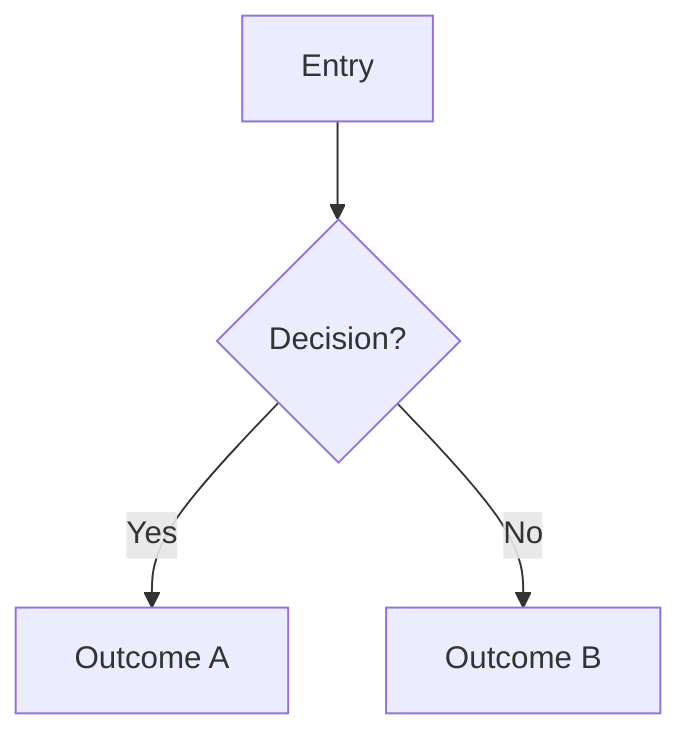

# Rule 09: GitHub-Flavored Mermaid & Diagram Standards

This standard governs **every Mermaid diagram** written in this repository — `AGENTS`, `.agents/`, `wiki/`, README, issue bodies, and PR descriptions. All diagrams are rendered by **GitHub's Mermaid renderer**, so they must use syntax that renderer supports, and must be structured for legibility.

## Baseline

1. **Fence**: Every diagram is wrapped in a fenced code block with the `mermaid` language identifier:

   ````md
   ```mermaid
   flowchart TD
       A --> B
   ```
   ````

2. **Render target**: GitHub (issues, PRs, wikis, Markdown files) uses a **Mermaid v10.x renderer**. Features from Mermaid v11+ are not guaranteed to render. Verify the active version with:

   ````md
   ```mermaid
   info
   ```
   ````

3. **Diagram types**: Prefer the core types GitHub renders reliably:
   - `flowchart` (preferred) or `graph` — directional / decision flows
   - `sequenceDiagram` — request / interaction lifecycles
   - `classDiagram` — type / module relationships
   - `stateDiagram-v2` — state transitions
   - `gantt`, `pie`, `gitGraph`, `erDiagram` — for their respective shapes

## Syntax Rules (GitHub-Compatible)

1. **Quote every label** that contains special characters. Special characters (`(`, `)`, `[`, `]`, `:`, `#`, `|`, `"`, backtick, `/`, `<`, `>`, `&`, `=`) must not appear raw in node or edge text:

   - Node: `CMD["/reddit add"]` — NOT `CMD[/reddit add]`
   - Subgraph title: `subgraph Caps["Per-Tab Subscription Caps"]` — NOT `subgraph Caps [Per-Tab Subscription Caps]`
   - Edge label: `A -->|"Yes"| B`

2. **Subgraph titles take the quoted form** `subgraph id["Title"]`. The unquoted form (`subgraph id [Title]`) silently breaks on GitHub's renderer.

3. **Avoid exotic node shapes**. GitHub's renderer rejects or mis-reads some shapes (e.g. trapezoid `A[/text]`, `A[\text]`). Stick to the well-supported shapes:
   - `A[text]` rectangle
   - `A{text}` rhombus / decision
   - `A([text])` stadium
   - `A[(text)]` cylinder
   - `A((text))` circle

4. **No `%%{init:...}%%` directives**. GitHub does not honor custom theme/configuration directives; diagrams render in GitHub's own theme. `classDef` / `linkStyle` color overrides are the only supported styling.

5. **No math / LaTeX** in labels. GitHub does not render `$...$` math; write plain text or Unicode (`>=` → "at or above").

6. **Reserved words as IDs**: avoid `end`, `class`, `note`, `subgraph`, `link`, `default`, `linkStyle` as node IDs. Prefix instead (`end_state`).

7. **Flowchart header**: `flowchart TD` (top-down) or `flowchart LR` (left-right). `flowchart` is the modern keyword; `graph` still works as an alias.

## Legibility & Structuring

1. **One diagram = one concern.** Do not merge unrelated flows into a single diagram. Split distinct flows into separate ```` ```mermaid ```` blocks, each under its own heading.

2. **Keep diagrams small.** If a single flow exceeds roughly 8–12 nodes, split it into multiple diagrams (e.g. one per logical stage). GitHub renders wide/tall diagrams by shrinking the canvas, which makes labels unreadable.

3. **Default to `TD` (top-down)** for decision trees — it reads naturally and keeps the canvas narrow. Use `LR` only for short pipelines with wide, shallow content.

4. **Short labels.** Keep node and edge text concise. Put explanatory detail in surrounding prose, not in the diagram.

5. **Group with subgraphs sparingly.** Subgraphs push content sideways and compress the canvas. Prefer disconnected, separate diagrams over subgraph-heavy single diagrams.

6. **Label every edge** where the transition isn't self-evident (`-->|"No"|`, `-->|"Yes"|`); decisions must always label their outgoing branches.

## Conformity Checklist

- [ ] ```` ```mermaid ```` fence used
- [ ] Labels quoting special characters
- [ ] Subgraph titles in quoted form (`subgraph id["Title"]`)
- [ ] No trapezoid / unusual shapes
- [ ] No `%%{init}%%` directives or math
- [ ] No reserved-word node IDs
- [ ] One concern per diagram, ≤ 8–12 nodes
- [ ] Multiple diagrams used instead of one wide canvas
- [ ] Rendering verified on github.com before commit

## Template (compliant baseline)

One concern, `TD`, quoted labels, small:

````md
## Flow Title


````