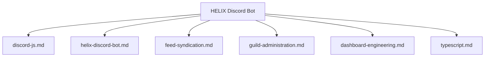

# 🧠 Agent Technical Skills & Domain Guides (`.agents/skills/`)

This directory contains technical skill definitions, subsystem architectural guides, and engineering playbooks for **HELIX Discord Bot**.

---

## 📋 Skills Catalog

| Skill | Target Domain | Core Focus | Guide File |
|---|---|---|---|
| **Discord.js v14 Engineering** | Discord Subsystem | Self-contained commands (`src/bot/commands/<cat>/<cmd>.ts`), modular `src/bot/lib/`, events, EmbedHandler, API limits | [discord-js.md](discord-js.md) |
| **HELIX Development Workflow** | Bot Architecture | Command creation, event registration, persistence, verification checklist | [helix-discord-bot.md](helix-discord-bot.md) |
| **Feed Syndication & Forums** | Feed & Content Delivery | RSS/Atom/Reddit ingestion, weekly Sunday Free Games schedule, forum single-thread delivery | [feed-syndication.md](feed-syndication.md) |
| **Guild Administration** | Moderation & Roles | Moderation commands, Discord native permissions, role hierarchy, mod log channels | [guild-administration.md](guild-administration.md) |
| **Management Dashboard Engineering** | Dashboard & OAuth | Zero-frontend-dep SSR, Discord OAuth2, guild admin authorization, EmbedHandler preview parity | [dashboard-engineering.md](dashboard-engineering.md) |
| **TypeScript ESM & Node.js** | Language & Runtime | ESM conventions, `.js` imports, `node:sqlite`, in-memory `AppState` write-through | [typescript.md](typescript.md) |
| **GitHub-Flavored Mermaid Diagrams** | Documentation & Diagrams | GitHub-compatible Mermaid syntax, one concern per diagram, legibility | [mermaid-diagrams.md](mermaid-diagrams.md) |

---

## 🗺️ Subsystem Architecture Mapping

---

## 🎯 Usage by Agents

When tasked with implementing or refactoring features in a specific subsystem, agents should review the corresponding skill document to ensure consistency with existing patterns and invariants.
