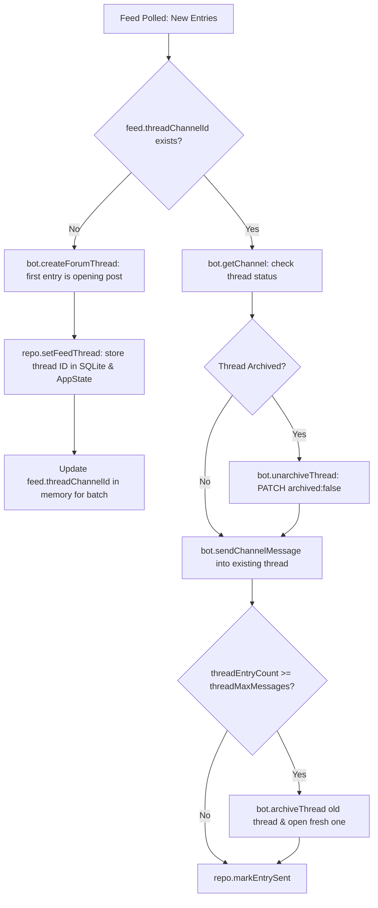

# Skill: Feed Syndication & Single-Thread Forum Delivery

## Overview
This skill details the feed syndication engine in **HELIX Discord Bot**, covering XML/Atom parsing, HTML scraping, weekly Free Games aggregation, YouTube/Twitch live alerts, target resolution, and single-thread forum delivery.

---

## 1. Supported Sources & Schedule

| Source | Feed Type | Ingestion Engine | Cadence |
|---|---|---|---|
| **RSS / Atom Feeds** | `rss` | Native XML tokenization (`src/feed/xml.ts`) | Configured interval (default 1h) |
| **Reddit Feeds** | `reddit` | Reddit RSS (Atom XML) | Configured interval |
| **HTML Web Scrapers** | `scrape` | Selector-based scraper (`src/feed/scraper.ts`) | Configured interval |
| **Free Games** | `free_games*` | Epic Store API + GamerPower API (`freegames.ts`) | **Weekly on Sunday** (`getUTCDay() === 0`) |
| **YouTube Uploads / Live** | `youtube` | Webhook subscription + periodic poll fallback | Real-time / 1h fallback |
| **Twitch Streams** | `twitch` | Webhook subscription + periodic poll fallback | Real-time / 1h fallback |

---

## 2. Forum Delivery Architecture: Single Thread Per Source

When a guild or category targets a Discord Forum channel, **each feed source delivers into its own dedicated thread inside that forum**:

### Invariants for Forum Delivery:
1. **Thread ID Propagation**: In-memory `feed.threadChannelId` must be immediately updated upon thread creation so that subsequent entries in the same poll batch deliver to the same thread.
2. **Unarchive Sleeping Threads**: Discord auto-archives inactive threads after 24h. HELIX unarchives them (`unarchiveThread`) instead of creating a replacement thread.
3. **Only Replace on HTTP 404**: Replacement threads are opened ONLY if Discord returns 404 (Unknown Channel / deleted) or when message rotation is reached (`threadMaxMessages`).

---

## 3. Free Games Weekly Automation & Deduplication

1. **Sunday-Only Execution**:
   - `pollFeedLocked()` checks `new Date().getUTCDay() === 0`.
   - If not Sunday, polling is skipped.
   - Once polled on Sunday, `lastCheckedAt` matches `todayIso`, preventing multiple polls on the same Sunday.
2. **Title Normalization**:
   - `normalizeGameTitle(title)` strips store tags (e.g. `(Epic Games) Giveaway`, `(Steam) Giveaway`) to ensure identical games from Epic Store and GamerPower APIs are deduplicated before delivery.
