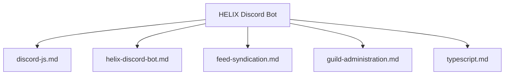

# Skills Catalog

Index of technical skills, subsystem domain guides, and engineering references for **HELIX Discord Bot**.

---

## Active Skills Directory

| Skill | Target Domain | Core Focus | File |
|---|---|---|---|
| **Discord.js v14 Engineering** | Discord Subsystem | Modular `lib/options/<category>/`, commands, events, EmbedHandler, API limits | [discord-js.md](discord-js.md) |
| **HELIX Development Workflow** | Bot Architecture | Command creation, event registration, persistence, verification checklist | [helix-discord-bot.md](helix-discord-bot.md) |
| **Feed Syndication & Forums** | Feed & Content Delivery | RSS/Atom/Reddit, weekly Sunday Free Games, single-thread forum delivery | [feed-syndication.md](feed-syndication.md) |
| **Guild Administration** | Moderation & Roles | Moderation actions, permissions, role hierarchy, mod log channels | [guild-administration.md](guild-administration.md) |
| **Management Dashboard Engineering** | Dashboard & OAuth | Zero-frontend-dep SSR, Discord OAuth2, guild admin authorization, EmbedHandler parity | [dashboard-engineering.md](dashboard-engineering.md) |
| **TypeScript ESM & Node.js** | Language & Runtime | ESM conventions, `.js` imports, `node:sqlite`, in-memory `AppState` | [typescript.md](typescript.md) |

---

## Skill Domain Mapping

