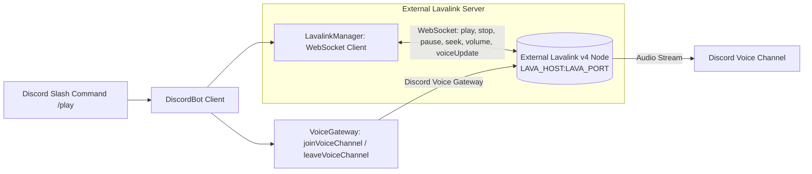

# Skill: Lavalink v4 Music & Voice Architecture

## Overview
This skill outlines the music playback subsystem in **HELIX Discord Bot**, built on official **Lavalink v4** with exclusive support for external Lavalink servers. In-process embedded Lavalink nodes are completely abandoned and retired.

---

## 1. System Architecture

---

## 2. Key Components

1. **Solely Supported External Node Model**:
   - The bot functions purely as a Lavalink client connecting to an external Lavalink v4 node over WebSocket (`ws://` or `wss://`).
   - Configured via `LAVA_HOST`, `LAVA_PORT`, `LAVA_PASS`, `LAVA_SECURE`.
   - Feature flagged by `LAVA_ENABLED` (defaults to `true`).
   - Embedded Java runtime / in-process Lavalink bootstrapping is retired; no local Java installation is required on the bot host.

2. **Lavalink v4 Protocol**:
   - Native Lavalink v4 WebSocket operations: `play`, `stop`, `pause`, `seek`, `volume`, `filters`, `destroy`, `voiceUpdate`.
   - Track auto-advancement on `TrackEndEvent`.
   - Client-side queue management, history tracking, shuffle, and repeat modes.

3. **Voice Gateway Bridge**:
   - `VoiceGateway` interface bridges Discord gateway voice state updates (`voiceStateUpdate`, `voiceServerUpdate`) directly to the external Lavalink session via the `voiceUpdate` op.

4. **Categorized Modular Music Commands & Options**:
   - Commands in `src/bot/commands/music/`: `play.ts`, `pause.ts`, `skip.ts`, `queue.ts`, `volume.ts`, `seek.ts`, `loop.ts`, `shuffle.ts`, `equalizer.ts`, `nowplaying.ts`, `stop.ts`.
   - Options in `src/bot/lib/options/music/`: `play.ts`, `volume.ts`, `seek.ts`, `loop.ts`, `equalizer.ts`, `jump.ts`, `seek.ts`.
