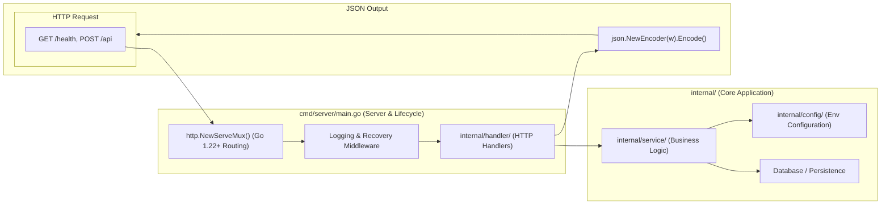

# Go REST API Backend Template

Idiomatic Go web service following standard project layout (`cmd/`, `internal/`, `pkg/`) with structured logging and graceful shutdown.

---

## 1. System Architecture & Project Topology



---

## 2. Repository Layout

```
backend-go/
├── cmd/
│   └── server/
│       └── main.go            # Entrypoint & server lifecycle
├── internal/
│   ├── config/                # Environment config loader
│   │   └── config.go
│   ├── handler/               # HTTP request handlers
│   │   └── health.go
│   └── service/               # Business logic layer
├── go.mod                     # Go module definition
├── go.sum
└── README.md
```

---

## 3. Core Boilerplate (`cmd/server/main.go`)

```go
package main

import (
	"encoding/json"
	"log/slog"
	"net/http"
	"os"
	"time"
)

type HealthResponse struct {
	Status    string    `json:"status"`
	Timestamp time.Time `json:"timestamp"`
}

func healthHandler(w http.ResponseWriter, r *http.Request) {
	w.Header().Set("Content-Type", "application/json")
	json.NewEncoder(w).Encode(HealthResponse{
		Status:    "ok",
		Timestamp: time.Now(),
	})
}

func main() {
	logger := slog.New(slog.NewJSONHandler(os.Stdout, nil))
	slog.SetDefault(logger)

	mux := http.NewServeMux()
	mux.HandleFunc("GET /health", healthHandler)

	server := &http.Server{
		Addr:         ":8080",
		Handler:      mux,
		ReadTimeout:  10 * time.Second,
		WriteTimeout: 10 * time.Second,
	}

	slog.Info("Starting Go backend server", "port", 8080)
	if err := server.ListenAndServe(); err != nil && err != http.ErrServerClosed {
		slog.Error("Server failed", "error", err)
	}
}
```
