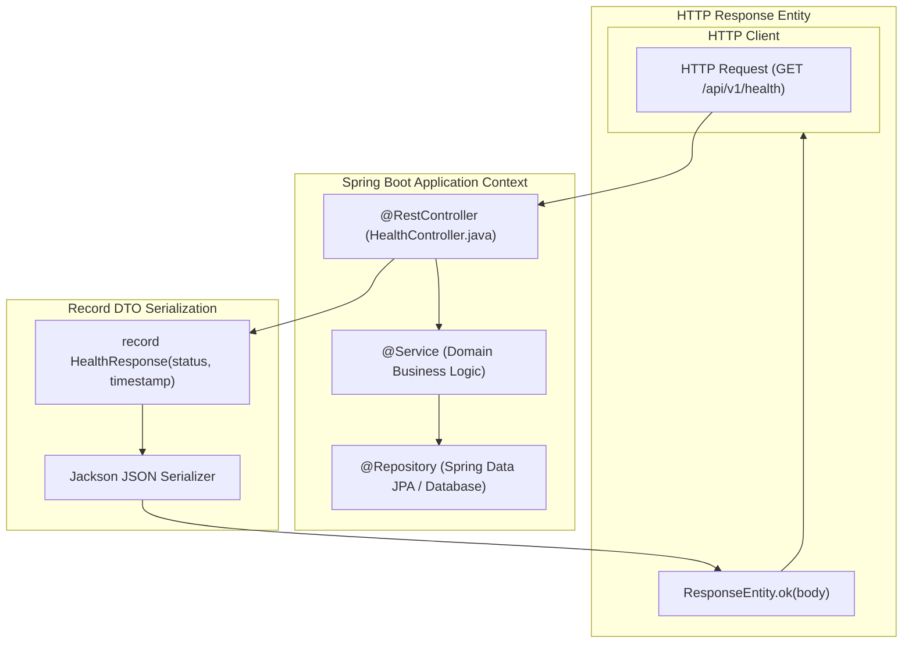

# Spring Boot 3 Java Backend Template

Enterprise-grade microservice architecture built on **Java 21**, **Spring Boot 3.3+**, **Spring Web**, and **Gradle**.

---

## 1. System Architecture & Spring MVC Lifecycle



---

## 2. Repository Layout

```
backend-java/
├── src/
│   ├── main/
│   │   ├── java/com/helix/backend/
│   │   │   ├── controller/    # REST API Endpoints (@RestController)
│   │   │   │   └── HealthController.java
│   │   │   ├── dto/           # Request/Response records
│   │   │   │   └── HealthResponse.java
│   │   │   ├── service/       # Business logic services
│   │   │   └── Application.java # @SpringBootApplication entrypoint
│   │   └── resources/
│   │       └── application.yml
│   └── test/                  # JUnit 5 & Mockito test suites
├── build.gradle.kts           # Kotlin DSL Gradle build script
├── settings.gradle.kts
└── README.md
```

---

## 3. Core Controller Boilerplate

### `HealthController.java`
```java
package com.helix.backend.controller;

import org.springframework.http.ResponseEntity;
import org.springframework.web.bind.annotation.GetMapping;
import org.springframework.web.bind.annotation.RequestMapping;
import org.springframework.web.bind.annotation.RestController;
import java.time.Instant;

record HealthResponse(String status, Instant timestamp) {}

@RestController
@RequestMapping("/api")
public class HealthController {

    @GetMapping("/health")
    public ResponseEntity<HealthResponse> health() {
        return ResponseEntity.ok(new HealthResponse("healthy", Instant.now()));
    }
}
```
