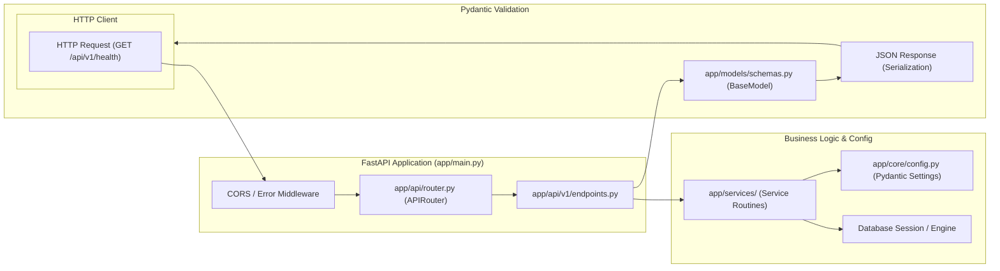

# FastAPI Backend Service Template

Asynchronous, high-performance web API service built on **Python 3.12**, **FastAPI**, **Pydantic v2**, and managed with **uv**.

---

## 1. System Architecture & Request Pipeline



---

## 2. Repository Layout

```
backend-python/
├── app/
│   ├── api/                   # API route modules
│   │   ├── v1/
│   │   │   └── endpoints.py
│   │   └── router.py          # APIRouter aggregation
│   ├── core/                  # Settings, database session, logging
│   │   └── config.py
│   ├── models/                # Pydantic schemas & DB models
│   │   └── schemas.py
│   ├── services/              # Business logic routines
│   └── main.py                # FastAPI app initialization & middleware
├── tests/                     # Pytest unit & async client tests
│   └── test_api.py
├── pyproject.toml             # uv & project dependencies
└── README.md
```

---

## 3. Core Boilerplate (`app/main.py`)

```python
from fastapi import FastAPI
from pydantic import BaseModel
from datetime import datetime, timezone

app = FastAPI(
    title="HELIX FastAPI Backend",
    version="1.0.0",
    description="High-performance async REST API",
)

class HealthResponse(BaseModel):
    status: str
    timestamp: datetime

@app.get("/health", response_model=HealthResponse)
async def health_check() -> HealthResponse:
    return HealthResponse(
        status="healthy",
        timestamp=datetime.now(timezone.utc),
    )
```

---

## 4. Development Commands

```bash
# Install dependencies into virtual environment
uv sync

# Run development server with live reload
uv run uvicorn app.main:app --reload --port 8000

# Run automated tests with pytest
uv run pytest
```
