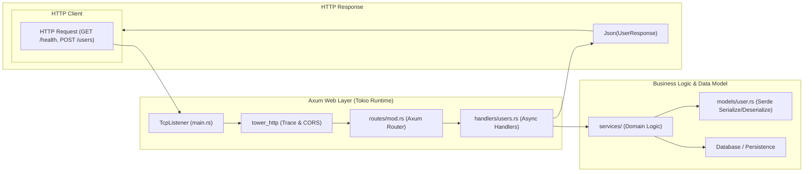

# Rust Backend Microservice Template

High-throughput, memory-safe asynchronous web service powered by **Rust**, **Axum**, **Tokio**, and **Serde**.

---

## 1. System Architecture & Request Lifecycle



---

## 2. Repository Layout

```
backend-rust/
├── src/
│   ├── config/                # Environment variable parsing
│   │   └── mod.rs
│   ├── handlers/              # HTTP Route handlers
│   │   ├── health.rs
│   │   └── users.rs
│   ├── models/                # Serde request/response DTOs & database entities
│   │   └── user.rs
│   ├── routes/                # Axum Router assembly
│   │   └── mod.rs
│   ├── services/              # Business logic & repository access
│   └── main.rs                # Async entrypoint & TCP listener
├── tests/                     # Integration test suite
│   └── api_tests.rs
├── Cargo.toml                 # Cargo dependencies & build profiles
└── README.md
```

---

## 3. Configuration & Boilerplate

### `Cargo.toml`
```toml
[package]
name = "rust-api-service"
version = "0.1.0"
edition = "2021"

[dependencies]
axum = "0.7"
tokio = { version = "1.38", features = ["full"] }
serde = { version = "1.0", features = ["derive"] }
serde_json = "1.0"
tower-http = { version = "0.5", features = ["cors", "trace"] }
tracing = "0.1"
tracing-subscriber = { version = "0.3", features = ["env-filter"] }
```

### `src/main.rs`
```rust
use axum::{
    routing::get,
    Json, Router,
};
use serde::{Deserialize, Serialize};
use std::net::SocketAddr;
use tracing_subscriber::{layer::SubscriberExt, util::SubscriberInitExt};

#[derive(Serialize)]
struct HealthResponse {
    status: &'static str,
    version: &'static str,
}

async fn health_check() -> Json<HealthResponse> {
    Json(HealthResponse {
        status: "healthy",
        version: env!("CARGO_PKG_VERSION"),
    })
}

#[tokio::main]
async fn main() {
    tracing_subscriber::registry()
        .with(tracing_subscriber::EnvFilter::new("info"))
        .with(tracing_subscriber::fmt::layer())
        .init();

    let app = Router::new().route("/health", get(health_check));

    let addr = SocketAddr::from(([0, 0, 0, 0], 8080));
    tracing::info!("Server listening on http://{}", addr);

    let listener = tokio::net::TcpListener::bind(addr).await.unwrap();
    axum::serve(listener, app).await.unwrap();
}
```

---

## 4. Development Commands

```bash
# Run with automatic reload
cargo watch -x run

# Run integration tests
cargo test

# Build optimized release binary
cargo build --release
```
