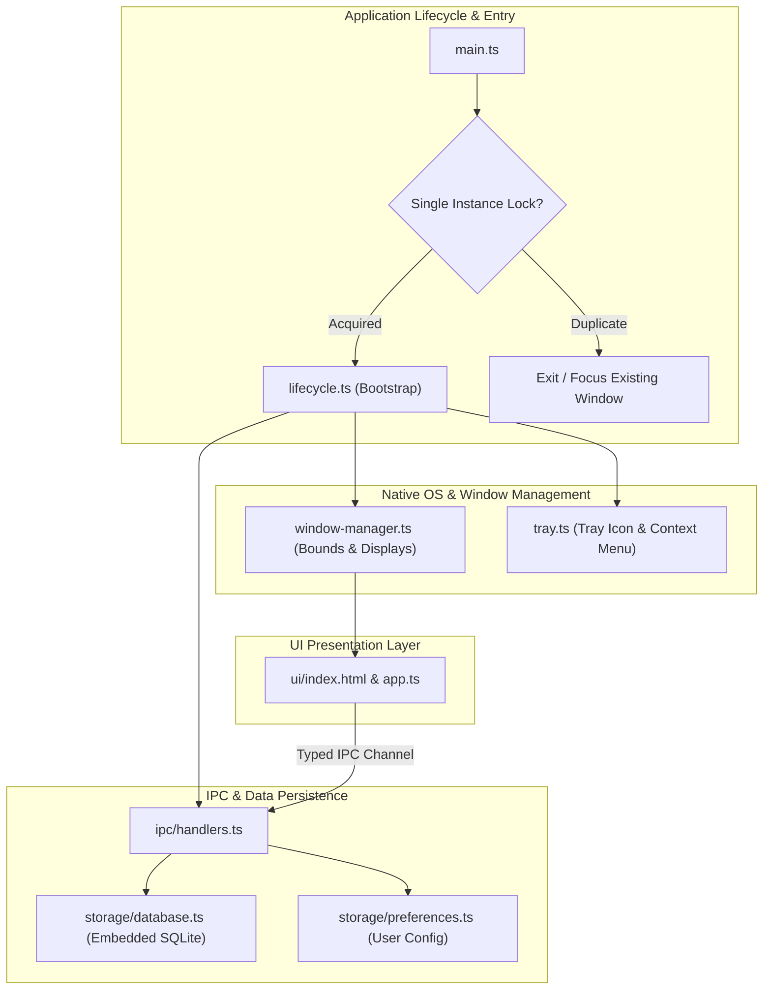

# Generic Desktop Application Foundation Template

A multi-target architectural baseline for cross-platform desktop GUI software, headless system tray daemons, and developer desktop utilities.

---

## 1. System Architecture & Process Topology



---

## 2. Project Architecture & Directory Layout

```
desktop-app/
├── src/
│   ├── core/                  # Core OS interaction layer
│   │   ├── lifecycle.ts       # Application bootstrap, single-instance lock, graceful exit
│   │   ├── window-manager.ts  # Native window state, positioning, and multi-display management
│   │   └── tray.ts            # System tray icon, notifications, and context menu
│   ├── ipc/                   # Inter-Process Communication contracts
│   │   ├── channels.ts        # Typed channel enum definitions
│   │   └── handlers.ts        # Main-process request/response handlers
│   ├── storage/               # Local persistence & SQLite database access
│   │   ├── database.ts        # Embedded SQLite / LevelDB instance
│   │   └── preferences.ts     # User settings and window bounds storage
│   ├── ui/                    # Renderer UI source (HTML/CSS/TypeScript)
│   │   ├── index.html
│   │   └── app.ts
│   └── main.ts                # Application main process entrypoint
├── package.json
├── tsconfig.json
└── README.md
```

---

## 3. Desktop Engineering Standards

1. **Single Instance Locking**: Always acquire a single-instance lock (`app.requestSingleInstanceLock()`) to prevent multiple conflicting processes.
2. **Window State Persistence**: Save window coordinates (`x`, `y`, `width`, `height`, `isMaximized`) to disk on close and restore on startup.
3. **Graceful Shutdown**: Intercept `SIGINT`, `SIGTERM`, and `before-quit` events to safely commit open SQLite transactions and close file handles.
4. **Crash Reporting**: Log unhandled rejections and exceptions to a rotating local log file.

---

## 4. Core Boilerplate Implementation

### `src/core/lifecycle.ts`
```typescript
export interface AppConfig {
  appName: string;
  version: string;
  singleInstance: boolean;
}

export class AppLifecycle {
  private isShuttingDown = false;
  private cleanupTasks: Array<() => Promise<void> | void> = [];

  constructor(private config: AppConfig) {
    this.setupProcessSignals();
  }

  public onShutdown(task: () => Promise<void> | void): void {
    this.cleanupTasks.push(task);
  }

  public async shutdown(exitCode = 0): Promise<void> {
    if (this.isShuttingDown) return;
    this.isShuttingDown = true;
    console.log(`[Lifecycle] Shutting down ${this.config.appName}...`);

    for (const task of this.cleanupTasks) {
      try {
        await task();
      } catch (err) {
        console.error("[Lifecycle] Error during cleanup task:", err);
      }
    }

    process.exit(exitCode);
  }

  private setupProcessSignals(): void {
    process.on("SIGINT", () => this.shutdown(0));
    process.on("SIGTERM", () => this.shutdown(0));
    process.on("uncaughtException", (err) => {
      console.error("[Lifecycle] Fatal Uncaught Exception:", err);
      this.shutdown(1);
    });
  }
}
```

### `src/storage/preferences.ts`
```typescript
import fs from "fs";
import path from "path";

export interface WindowBounds {
  x: number;
  y: number;
  width: number;
  height: number;
  isMaximized: boolean;
}

export class PreferencesManager {
  private configPath: string;
  private data: Record<string, any> = {};

  constructor(storageDir: string) {
    if (!fs.existsSync(storageDir)) {
      fs.mkdirSync(storageDir, { recursive: true });
    }
    this.configPath = path.join(storageDir, "settings.json");
    this.load();
  }

  public get<T>(key: string, defaultValue: T): T {
    return key in this.data ? (this.data[key] as T) : defaultValue;
  }

  public set<T>(key: string, value: T): void {
    this.data[key] = value;
    this.save();
  }

  private load(): void {
    try {
      if (fs.existsSync(this.configPath)) {
        const raw = fs.readFileSync(this.configPath, "utf-8");
        this.data = JSON.parse(raw);
      }
    } catch {
      this.data = {};
    }
  }

  private save(): void {
    try {
      fs.writeFileSync(this.configPath, JSON.stringify(this.data, null, 2), "utf-8");
    } catch (err) {
      console.error("[Preferences] Failed to save configuration:", err);
    }
  }
}
```

---

## 5. Build & Distribution

```bash
# Install dependencies
npm install

# Start development mode
npm run dev

# Compile TypeScript
npm run build
```
