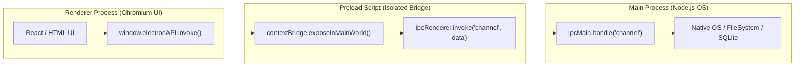

# Electron Desktop Application Template

Cross-platform desktop application architecture utilizing **Electron 30+**, **Vite**, **TypeScript**, and secure **IPC Context Bridges**.

---

## 1. System Architecture & Secure IPC Bridge



---

## 2. Repository Layout

```
desktop-electron/
├── src/
│   ├── main/                  # Electron Main Process (Node.js runtime)
│   │   ├── index.ts           # BrowserWindow lifecycle & app events
│   │   └── ipc-handlers.ts    # Main-side IPC handlers (filesystem, OS APIs)
│   ├── preload/               # Preload Script (ContextIsolation bridge)
│   │   └── index.ts           # contextBridge.exposeInMainWorld APIs
│   └── renderer/              # Web Renderer Process (DOM runtime)
│       ├── src/
│       │   ├── App.tsx
│       │   └── main.tsx
│       └── index.html
├── electron-builder.yml       # Multi-platform installer packaging config
├── vite.config.ts             # Vite multi-target build configuration
├── tsconfig.json              # TypeScript compiler options
└── package.json
```

---

## 3. Security & Architecture Standards

- **Context Isolation**: Always enable `contextIsolation: true` and `nodeIntegration: false` in `webPreferences`.
- **Typed IPC Bridge**: Expose strictly typed APIs via `contextBridge.exposeInMainWorld('electronAPI', { ... })`.
- **Process Separation**: Heavy filesystem, database, or child process operations must reside exclusively in the main process.

---

## 4. Configuration & Boilerplate

### `src/preload/index.ts`
```typescript
import { contextBridge, ipcRenderer } from "electron";

export interface IElectronAPI {
  ping: () => Promise<string>;
  openFileDialog: () => Promise<string | null>;
}

const api: IElectronAPI = {
  ping: () => ipcRenderer.invoke("app:ping"),
  openFileDialog: () => ipcRenderer.invoke("dialog:openFile"),
};

contextBridge.exposeInMainWorld("electronAPI", api);
```

### `src/main/index.ts`
```typescript
import { app, BrowserWindow, ipcMain, dialog } from "electron";
import path from "path";

function createWindow(): BrowserWindow {
  const win = new BrowserWindow({
    width: 1024,
    height: 768,
    webPreferences: {
      preload: path.join(__dirname, "../preload/index.js"),
      contextIsolation: true,
      nodeIntegration: false,
    },
  });

  if (process.env.VITE_DEV_SERVER_URL) {
    win.loadURL(process.env.VITE_DEV_SERVER_URL);
  } else {
    win.loadFile(path.join(__dirname, "../renderer/index.html"));
  }

  return win;
}

app.whenReady().then(() => {
  ipcMain.handle("app:ping", () => "pong");
  ipcMain.handle("dialog:openFile", async () => {
    const result = await dialog.showOpenDialog({ properties: ["openFile"] });
    return result.filePaths[0] || null;
  });

  createWindow();
});
```

---

## 5. Build & Packaging Commands

```bash
# Start Vite and Electron in watch mode
npm run dev

# Compile TypeScript and bundle renderer
npm run build

# Package standalone installers (.exe, .dmg, .AppImage)
npm run package
```
