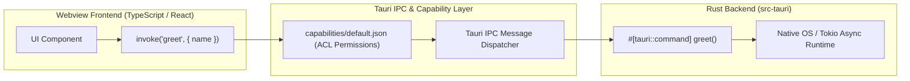

# Tauri v2 Desktop Application Template

High-performance, secure, and memory-efficient cross-platform desktop application built with **Tauri v2**, **Rust**, and **TypeScript + Vite**.

---

## 1. System Architecture & Tauri IPC Flow



---

## 2. Repository Layout

```
desktop-tauri/
├── src/                       # Frontend Web UI (React, Vue, or Svelte)
│   ├── App.tsx
│   └── main.tsx
├── src-tauri/                 # Rust Native Backend
│   ├── src/
│   │   ├── commands/          # Custom Rust IPC commands
│   │   │   └── system.rs
│   │   ├── lib.rs             # Tauri builder & plugin registration
│   │   └── main.rs            # Desktop executable entrypoint
│   ├── Cargo.toml             # Rust dependencies
│   ├── capabilities/          # Tauri v2 security capability manifests
│   │   └── default.json
│   └── tauri.conf.json        # Window, bundle, and security settings
├── vite.config.ts             # Vite build settings
└── package.json
```

---

## 3. Key Code Boilerplate

### `src-tauri/src/main.rs`
```rust
#![cfg_attr(not(debug_assertions), windows_subsystem = "windows")]

#[tauri::command]
fn greet(name: &str) -> String {
    format!("Hello, {}! You've been greeted from Rust!", name)
}

fn main() {
    tauri::Builder::default()
        .invoke_handler(tauri::generate_handler![greet])
        .run(tauri::generate_context!())
        .expect("error while running tauri application");
}
```

### `src/App.tsx`
```tsx
import { useState } from "react";
import { invoke } from "@tauri-apps/api/core";

export function App() {
  const [greeting, setGreeting] = useState("");

  async function handleGreet() {
    const msg = await invoke<string>("greet", { name: "Developer" });
    setGreeting(msg);
  }

  return (
    <main className="container">
      <h1>Tauri v2 Desktop Application</h1>
      <button onClick={handleGreet}>Greet from Rust</button>
      {greeting && <p>{greeting}</p>}
    </main>
  );
}
```

---

## 4. Development Commands

```bash
# Launch development window with hot reload
npm run tauri dev

# Compile optimized native binary and OS installer
npm run tauri build
```
