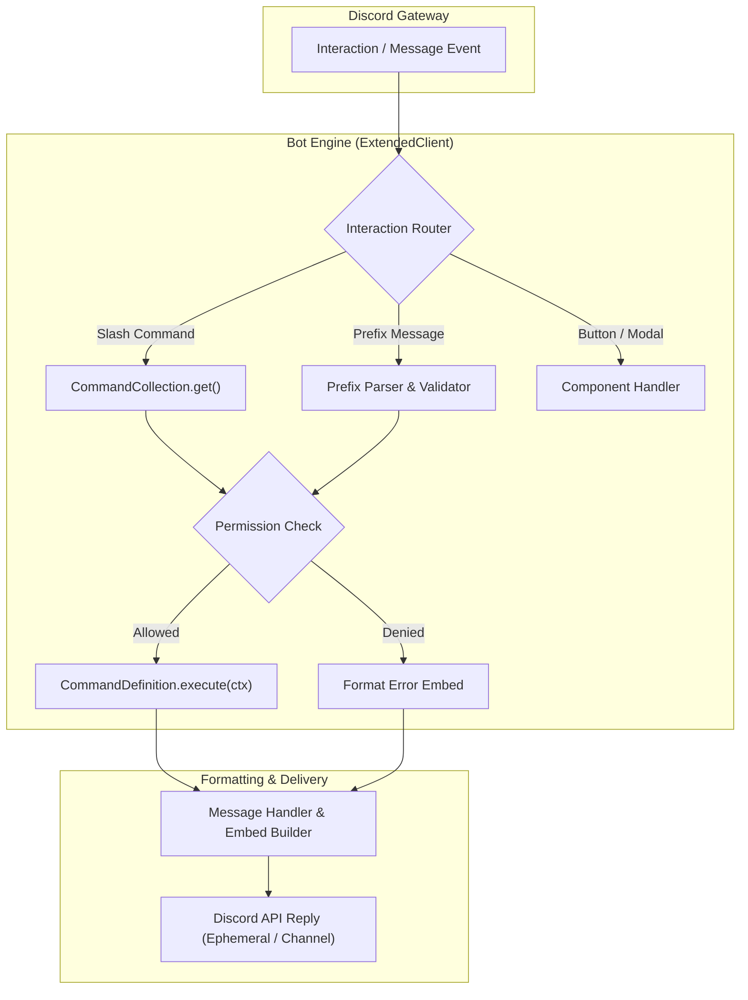

# Discord Bot Project Template

Production-grade Discord bot architecture utilizing **discord.js v14**, **TypeScript**, and modern ES Modules (`NodeNext`).

---

## 1. System Architecture & Flow



---

## 2. Repository Layout

```
discord-bot/
├── src/
│   ├── index.ts               # Client initialization & gateway connection
│   ├── client.ts              # Custom ExtendedClient wrapper
│   ├── deploy-commands.ts     # REST API slash command registration
│   ├── commands/              # Slash and prefix command modules
│   │   ├── info/
│   │   │   ├── ping.ts
│   │   │   └── help.ts
│   │   └── moderation/
│   │       └── kick.ts
│   ├── events/                # Gateway event listeners
│   │   ├── ready.ts
│   │   └── interactionCreate.ts
│   ├── handlers/              # Command, event, and error dispatchers
│   │   ├── command-handler.ts
│   │   └── event-handler.ts
│   ├── types/                 # TypeScript interfaces
│   │   └── command.ts
│   └── utils/                 # Logger and formatting utilities
│       └── logger.ts
├── .env.example               # Environment variables template
├── package.json               # Node package manifest
├── tsconfig.json              # TypeScript strict compiler options
└── README.md                  # Project documentation
```

---

## 3. Language & Formatting Standards

- **TypeScript Strict Mode**: Enable `"strict": true`, `"noImplicitAny": true`, `"strictNullChecks": true`.
- **ES Modules**: Use `"type": "module"` in `package.json` with `.js` extensions on relative imports (`import { logger } from './utils/logger.js'`).
- **Unified Command Definition**: Export named objects implementing the `CommandDefinition` interface.
- **No Sub-barrel Files**: Do not place `index.ts` files inside `commands/` or `events/` directories to prevent circular dependency crashes during auto-discovery.

---

## 4. Configuration & Boilerplate

### `package.json`
```json
{
  "name": "my-discord-bot",
  "version": "1.0.0",
  "type": "module",
  "scripts": {
    "dev": "tsx watch src/index.ts",
    "build": "tsc",
    "start": "node dist/index.js",
    "deploy": "tsx src/deploy-commands.ts"
  },
  "dependencies": {
    "discord.js": "^14.16.3",
    "dotenv": "^16.4.5"
  },
  "devDependencies": {
    "@types/node": "^22.5.4",
    "tsx": "^4.19.1",
    "typescript": "^5.5.4"
  }
}
```

### `tsconfig.json`
```json
{
  "compilerOptions": {
    "target": "ES2022",
    "module": "NodeNext",
    "moduleResolution": "NodeNext",
    "strict": true,
    "esModuleInterop": true,
    "skipLibCheck": true,
    "forceConsistentCasingInFileNames": true,
    "outDir": "./dist",
    "rootDir": "./src"
  },
  "include": ["src/**/*"]
}
```

### `src/types/command.ts`
```typescript
import {
  ChatInputCommandInteraction,
  Message,
  PermissionFlagsBits,
  SlashCommandBuilder,
} from "discord.js";

export interface ExecuteContext {
  interaction?: ChatInputCommandInteraction;
  message?: Message;
  args?: string[];
  guild: NonNullable<ChatInputCommandInteraction["guild"] | Message["guild"]>;
  user: ChatInputCommandInteraction["user"] | Message["author"];
}

export interface CommandDefinition {
  name: string;
  description: string;
  category: "info" | "moderation" | "utility" | "admin";
  permissions?: (typeof PermissionFlagsBits)[keyof typeof PermissionFlagsBits][];
  slashData?: SlashCommandBuilder;
  execute(ctx: ExecuteContext): Promise<void>;
}
```

### `src/commands/info/ping.ts`
```typescript
import { EmbedBuilder } from "discord.js";
import type { CommandDefinition } from "../../types/command.js";

export const ping: CommandDefinition = {
  name: "ping",
  description: "Check bot latency and gateway ping",
  category: "info",
  async execute({ interaction, message }) {
    const embed = new EmbedBuilder()
      .setTitle("🏓 Pong!")
      .setColor(0x00d2ff)
      .setDescription("Bot is online and responsive.")
      .setTimestamp();

    if (interaction) {
      await interaction.reply({ embeds: [embed] });
    } else if (message) {
      await message.reply({ embeds: [embed] });
    }
  },
};
```

---

## 5. Development & Deployment Workflow

```bash
# 1. Populate secrets
cp .env.example .env

# 2. Register slash commands with Discord Gateway
npm run deploy

# 3. Start local development
npm run dev

# 4. Production build and launch
npm run build
npm start
```
