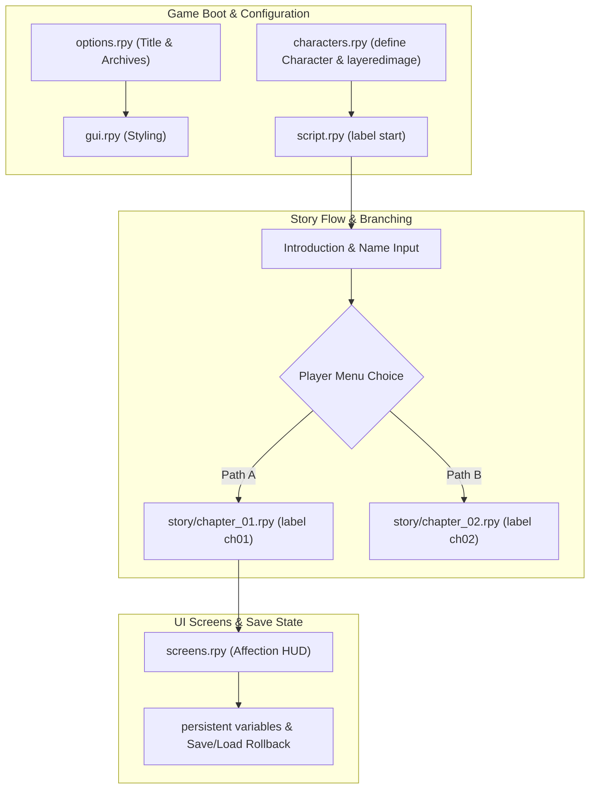

# Ren'Py Visual Novel Project Architecture Template

A complete visual novel development architecture using **Ren'Py 8 (Python 3)** with layered character sprites, modular dialogue scripts, custom GUI screens, sound channels, and persistent variables.

---

## 1. System Architecture & Dialogue Flow



---

## 2. Repository Layout

```
game-renpy/
├── game/
│   ├── audio/                 # Background music (.ogg), sound effects, voice lines
│   │   ├── bgm/
│   │   └── sfx/
│   ├── images/                # Backgrounds, CGs, and layered character sprites
│   │   ├── bg/
│   │   └── characters/
│   │       ├── eileen_base.png
│   │       ├── eileen_happy.png
│   │       └── eileen_sad.png
│   ├── gui/                   # GUI frames, dialogue boxes, choice buttons
│   ├── script.rpy             # Main game entrypoint and storyline router
│   ├── characters.rpy         # Character object definitions and image declarations
│   ├── screens.rpy            # Custom UI screens (HUD, Inventory, Relationship bars)
│   ├── options.rpy            # Window title, resolution, build archive configs
│   ├── gui.rpy                # Typography, textbox padding, dialog colors
│   └── story/                 # Modular story chapters
│       ├── chapter_01.rpy
│       └── chapter_02.rpy
└── README.md
```

---

## 3. Ren'Py Scripting Standards & Boilerplate

### `game/characters.rpy` (Character & Sprite Definitions)
```renpy
# Character Declarations with Dialogue Colors
define e = Character("Eileen", color="#00d2ff", image="eileen")
define p = Character("[player_name]", color="#00ff88")

# Layered Image Definitions
layeredimage eileen:
    always:
        "images/characters/eileen_base.png"
    group expression:
        attribute happy default:
            "images/characters/eileen_happy.png"
        attribute sad:
            "images/characters/eileen_sad.png"
```

### `game/script.rpy` (Story Flow & Branching)
```renpy
# Persistent Variables & Flags
default player_name = "Alex"
default affinity_eileen = 0

label start:
    scene bg room with fade

    show eileen happy at center with dissolve
    e "Hello! Welcome to our visual novel created with the HELIX Ren'Py template."

    menu:
        "How would you like to respond?"

        "I'm excited to be here!":
            $ affinity_eileen += 10
            show eileen happy
            e "That makes me so happy to hear!"

        "Let's get straight to business.":
            show eileen sad
            e "Understood. Let's proceed."

    jump chapter_01_start
```
