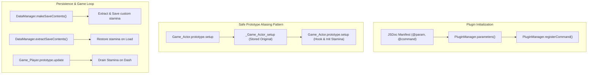

# RPG Maker MZ/MV Plugin Architecture Template

A robust, conflict-free JavaScript plugin template for **RPG Maker MZ** and **RPG Maker MV** with JSDoc headers, Plugin Commands, save state serialization, and safe prototype aliasing.

---

## 1. System Architecture & Prototype Aliasing



---

## 2. Plugin Header & Specification

```javascript
//=============================================================================
// RPG Maker MZ - Helix_CustomSystem.js
//=============================================================================

/*:
 * @target MZ
 * @plugindesc v1.0.0 Advanced gameplay enhancement and custom attribute system.
 * @author HELIX
 * @url https://github.com/HELIX-Origin/HELIX
 *
 * @help Helix_CustomSystem.js
 *
 * This plugin introduces custom stamina, dynamic event triggers, and save data
 * serialization to RPG Maker MZ.
 *
 * --- Plugin Commands ---
 * ModifyStamina -> Increase or decrease an actor's current stamina.
 *
 * @param DefaultMaxStamina
 * @text Max Stamina
 * @type number
 * @min 1
 * @default 100
 * @desc Default maximum stamina points for all party members.
 *
 * @param EnableStaminaDrain
 * @text Enable Dashing Drain
 * @type boolean
 * @default true
 * @desc If true, dashing drains actor stamina over time.
 *
 * @command ModifyStamina
 * @text Modify Actor Stamina
 * @desc Modifies an actor's current stamina value.
 *
 * @arg actorId
 * @text Actor ID
 * @type actor
 * @default 1
 * @desc The target actor to modify.
 *
 * @arg amount
 * @text Amount
 * @type number
 * @min -9999
 * @default 10
 * @desc Stamina to add (positive) or subtract (negative).
 */

(() => {
    'use strict';

    const PLUGIN_NAME = "Helix_CustomSystem";
    const parameters = PluginManager.parameters(PLUGIN_NAME);
    const defaultMaxStamina = Number(parameters['DefaultMaxStamina'] || 100);
    const enableDrain = String(parameters['EnableStaminaDrain'] || 'true') === 'true';

    //-------------------------------------------------------------------------
    // Plugin Commands (MZ Standard)
    //-------------------------------------------------------------------------
    PluginManager.registerCommand(PLUGIN_NAME, "ModifyStamina", args => {
        const actorId = Number(args.actorId || 1);
        const amount = Number(args.amount || 0);
        const actor = $gameActors.actor(actorId);
        if (actor) {
            actor.gainStamina(amount);
        }
    });

    //-------------------------------------------------------------------------
    // Game_Actor Extension & Aliasing
    //-------------------------------------------------------------------------
    const _Game_Actor_setup = Game_Actor.prototype.setup;
    Game_Actor.prototype.setup = function(actorId) {
        _Game_Actor_setup.call(this, actorId);
        this._stamina = defaultMaxStamina;
        this._maxStamina = defaultMaxStamina;
    };

    Game_Actor.prototype.stamina = function() {
        return this._stamina || 0;
    };

    Game_Actor.prototype.gainStamina = function(amount) {
        this._stamina = Math.max(0, Math.min(this._maxStamina, (this._stamina || 0) + amount));
    };

    //-------------------------------------------------------------------------
    // Game_Player Dashing Drain
    //-------------------------------------------------------------------------
    const _Game_Player_updateDashing = Game_Player.prototype.updateDashing;
    Game_Player.prototype.updateDashing = function() {
        _Game_Player_updateDashing.call(this);
        if (enableDrain && this.isDashing() && this.isMoving()) {
            const leader = $gameParty.leader();
            if (leader) {
                leader.gainStamina(-0.1);
            }
        }
    };
})();
```
