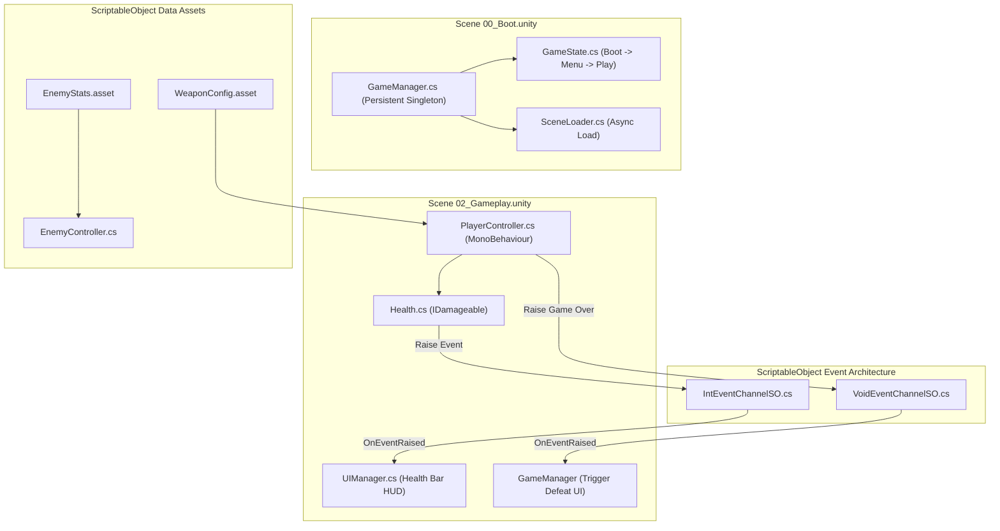

# Unity Game Project Architecture Template

A production-grade Unity C# project structure designed for maintainability, zero-allocation gameplay loops, and modular assembly compilation.

---

## 1. System Architecture & Event Bus Pattern



---

## 2. Repository Layout

```
game-unity/
├── Assets/
│   ├── _Project/                  # All custom project assets (prefixed with _ to stay on top)
│   │   ├── Animations/            # Animator controllers, clips, override controllers
│   │   ├── Audio/                 # BGM, SFX, AudioMixer configurations
│   │   ├── Materials/             # Shaders, PhysicMaterials, Render materials
│   │   ├── Prefabs/               # Entity prefabs (Player, Enemies, Projectiles, Spawners)
│   │   ├── Scenes/                # Game scenes
│   │   │   ├── 00_Boot.unity      # Initialization, persistent singletons, splash
│   │   │   ├── 01_MainMenu.unity  # Main menu UI
│   │   │   └── 02_Gameplay.unity  # Main gameplay scene
│   │   ├── ScriptableObjects/     # Static game balance, item catalogs, sound tables
│   │   │   ├── Events/            # ScriptableObject Void/Generic Event Channels
│   │   │   └── Data/              # ItemData, EnemyStats, WeaponConfig
│   │   └── Scripts/               # C# Codebase
│   │       ├── Core/              # Game state machine, service locator, scene loader
│   │       │   ├── GameManager.cs
│   │       │   ├── GameState.cs
│   │       │   └── SceneLoader.cs
│   │       ├── Events/            # Event channel ScriptableObjects
│   │       │   ├── VoidEventChannelSO.cs
│   │       │   └── IntEventChannelSO.cs
│   │       ├── Gameplay/          # Player controller, combat mechanics, health
│   │       │   ├── PlayerController.cs
│   │       │   ├── Health.cs
│   │       │   └── IDamageable.cs
│   │       ├── UI/                # HUD controllers, menu buttons, health bars
│   │       │   └── UIManager.cs
│   │       └── Project.asmdef     # Assembly Definition file for fast incremental compilation
│   └── Plugins/                   # Third-party SDKs, native plugins, imported assets
├── ProjectSettings/               # InputManager, TagManager, QualitySettings, Physics
├── Packages/
│   └── manifest.json              # Unity Package Manager dependencies (URP, InputSystem)
└── README.md
```

---

## 3. Unity C# Coding Standards & Architecture

1. **Assembly Definitions (`.asmdef`)**:
   - Every major system (`Core`, `Gameplay`, `UI`) should be in its own assembly definition. This prevents Unity from recompiling the entire project on every script change and drastically reduces domain reload times.
2. **ScriptableObject Event Architecture**:
   - Do NOT use direct static references or heavy `FindObjectOfType` calls.
   - Use `ScriptableObject` Event Channels as listeners/broadcasters to decouple systems (e.g. Player dies -> Player raises `OnPlayerDeathSO` -> UI and Sound Manager respond independently).
3. **Garbage Collection (GC) Optimization**:
   - Avoid `new` allocations inside `Update()`, `FixedUpdate()`, and `LateUpdate()`.
   - Use non-allocating physics queries (e.g. `Physics.OverlapSphereNonAlloc`).
   - Use `TryGetComponent` instead of `GetComponent`.

---

## 4. Core Boilerplate Implementation

### `Assets/_Project/Scripts/Events/VoidEventChannelSO.cs`
```csharp
using UnityEngine;
using UnityEngine.Events;

namespace Project.Events
{
    [CreateAssetMenu(menuName = "Events/Void Event Channel", fileName = "NewVoidEventChannel")]
    public class VoidEventChannelSO : ScriptableObject
    {
        public UnityAction OnEventRaised;

        public void RaiseEvent()
        {
            if (OnEventRaised != null)
            {
                OnEventRaised.Invoke();
            }
        }
    }
}
```

### `Assets/_Project/Scripts/Gameplay/Health.cs`
```csharp
using UnityEngine;
using Project.Events;

namespace Project.Gameplay
{
    public interface IDamageable
    {
        void TakeDamage(int amount);
    }

    public class Health : MonoBehaviour, IDamageable
    {
        [Header("Settings")]
        [SerializeField] private int maxHealth = 100;
        
        [Header("Broadcasting Events")]
        [SerializeField] private VoidEventChannelSO onDeathChannel;

        private int currentHealth;

        public int CurrentHealth => currentHealth;
        public bool IsDead => currentHealth <= 0;

        private void Awake()
        {
            currentHealth = maxHealth;
        }

        public void TakeDamage(int amount)
        {
            if (IsDead) return;

            currentHealth = Mathf.Max(0, currentHealth - amount);
            Debug.Log($"[{gameObject.name}] Took {amount} damage. Current: {currentHealth}/{maxHealth}");

            if (currentHealth == 0)
            {
                Die();
            }
        }

        private void Die()
        {
            Debug.Log($"[{gameObject.name}] Died.");
            if (onDeathChannel != null)
            {
                onDeathChannel.RaiseEvent();
            }
        }
    }
}
```

### `Assets/_Project/Scripts/Gameplay/PlayerController.cs`
```csharp
using UnityEngine;

namespace Project.Gameplay
{
    [RequireComponent(typeof(CharacterController))]
    public class PlayerController : MonoBehaviour
    {
        [Header("Movement Settings")]
        [SerializeField] private float moveSpeed = 6.0f;
        [SerializeField] private float gravity = -9.81f;
        [SerializeField] private float jumpHeight = 1.5f;

        private CharacterController controller;
        private Vector3 velocity;
        private bool isGrounded;

        private void Awake()
        {
            controller = GetComponent<CharacterController>();
        }

        private void Update()
        {
            isGrounded = controller.isGrounded;
            if (isGrounded && velocity.y < 0)
            {
                velocity.y = -2f;
            }

            float horizontal = Input.GetAxisRaw("Horizontal");
            float vertical = Input.GetAxisRaw("Vertical");
            Vector3 moveDirection = (transform.right * horizontal + transform.forward * vertical).normalized;

            controller.Move(moveDirection * (moveSpeed * Time.deltaTime));

            if (Input.GetButtonDown("Jump") && isGrounded)
            {
                velocity.y = Mathf.Sqrt(jumpHeight * -2f * gravity);
            }

            velocity.y += gravity * Time.deltaTime;
            controller.Move(velocity * Time.deltaTime);
        }
    }
}
```

---

## 5. Build & Verification Pipeline

```bash
# Verify C# compilation via dotnet
dotnet build Assets/_Project/Scripts/Project.asmdef

# Execute Unity automated test runner (EditMode & PlayMode)
Unity.exe -batchmode -runTests -projectPath . -testResults ./test-results.xml
```
