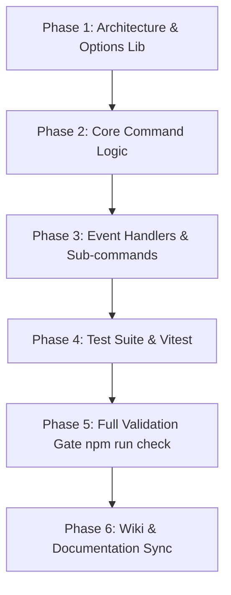

# GitHub Issue Roadmap Template — HELIX Discord Bot

First post is the **single living source of truth** for this issue/feature/epic. It is edited in-place as work progresses — never replaced by new posts.

---

## 1. Goal & Context
- **Objective**: Detailed description of what is being built or fixed.
- **Affected Subsystems**: e.g., `src/bot/commands/<category>/`, `src/bot/lib/options/<category>/`, `src/bot/events/`.
- **Discord API Constraints**: Character counts, option counts, choices limits, permissions required.

---

## 2. Architecture & Modular Options Plan
- [ ] Options separated into `src/bot/lib/options/<category>/<command>.ts`.
- [ ] Command file imports options from modular lib.
- [ ] Embed responses standardized via `EmbedHandler`.
- [ ] Permissions enforced via `PermissionFlagsBits` and role hierarchy.

---

## 3. Milestones & Task Breakdown
- [ ] **Phase 1: Options & Command Registry**
  - [ ] `src/bot/lib/options/<category>/<command>.ts` defined with typed builders
  - [ ] Slash command builder configured in `src/bot/commands/<category>/<command>.ts`
- [ ] **Phase 2: Business Logic & Handlers**
  - [ ] Execution logic in dedicated service or command handler
  - [ ] Error boundary with isolated catch blocks
- [ ] **Phase 3: Automated Testing & Verification**
  - [ ] Unit tests added in `tests/bot/`
  - [ ] `npm run check` passes completely (types, format, lint, tests)
- [ ] **Phase 4: Documentation Sync**
  - [ ] Updated command docs in `wiki/Discord-Bot.md` or corresponding wiki page
  - [ ] Synchronized `AGENTS.md` and `.agents/` if operational rules changed

---

## 4. Acceptance Criteria
1. Command deploys cleanly with Discord REST API without payload size errors.
2. Option definitions strictly adhere to categorized lib folder layout.
3. Automated test suite passes with zero regressions.
4. `npm run check` exits with code 0.
