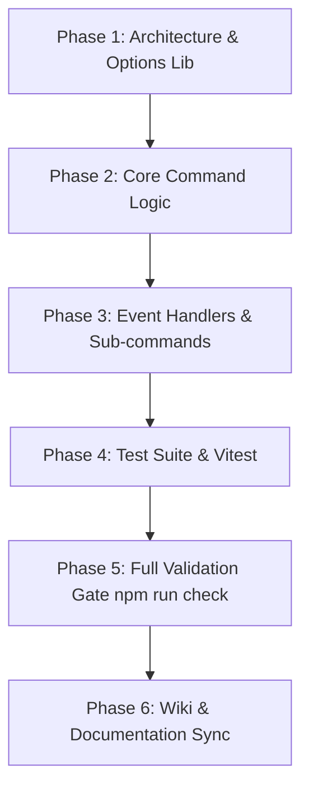

# GitHub Issue Roadmap Template — HELIX Discord Bot

First post is the **single living source of truth** for this issue/feature/epic. It is edited in-place as work progresses — never replaced by new posts.

```mermaid
flowchart TD
    Phase1["Phase 1: Architecture & Options Lib"] --> Phase2["Phase 2: Core Command Logic"]
    Phase2 --> Phase3["Phase 3: Event Handlers & Sub-commands"]
    Phase3 --> Phase4["Phase 4: Test Suite & Vitest"]
    Phase4 --> Phase5["Phase 5: Full Validation Gate npm run check"]
    Phase5 --> Phase6["Phase 6: Wiki & Documentation Sync"]
```

---

## 1. Goal & Context
- **Objective**: Detailed description of what is being built or fixed.
- **Affected Subsystems**: e.g., `src/bot/commands/<category>/`, `src/bot/lib/`, `src/bot/events/`.
- **Discord API Constraints**: Character counts, option counts, choices limits, permissions required.

---

## 2. Architecture & Modular Options Plan
- [ ] Command file exports only the command and its colocated parts; no reusable logic (Rule 06 §3.1).
- [ ] Reusable services moved into `src/bot/lib/`.
- [ ] Options colocated in the command file, or factored to `src/bot/lib/options/<command>.ts` if large.
- [ ] Embed responses standardized via `EmbedHandler`.
- [ ] Permissions enforced via `PermissionFlagsBits` and role hierarchy.

---

## 3. Milestones & Task Breakdown
- [ ] **Phase 1: Options & Command Registry**
  - [ ] `<name>CommandDef` defined in `src/bot/commands/<category>/<command>.ts`
  - [ ] `<name>Command: BotCommand` exported so `loader.ts` discovers it
  - [ ] `registerCommandMetadata({...})` called for help/dashboard
- [ ] **Phase 2: Business Logic & Handlers**
  - [ ] Execution logic in dedicated service or command handler
  - [ ] Error boundary with isolated catch blocks
- [ ] **Phase 3: Automated Testing & Verification**
  - [ ] Unit tests added in `tests/bot/`
  - [ ] `npm run check` passes completely (types, format, lint, tests)
- [ ] **Phase 4: Documentation Sync**
  - [ ] Updated command docs in `wiki/Discord-Bot` or corresponding wiki page
  - [ ] Synchronized `AGENTS` and `.agents/` if operational rules changed

---

## 4. Acceptance Criteria
1. Command deploys cleanly with Discord REST API without payload size errors.
2. Option definitions strictly adhere to categorized lib folder layout.
3. Automated test suite passes with zero regressions.
4. `npm run check` exits with code 0.
