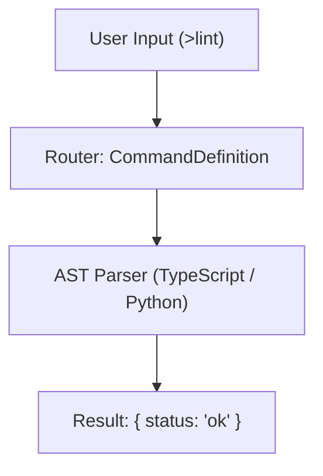
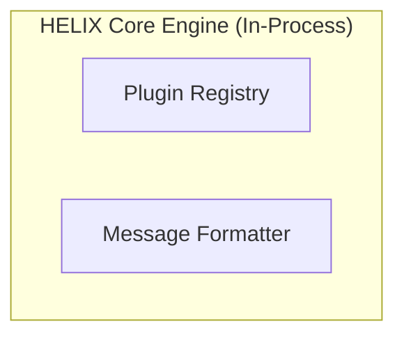
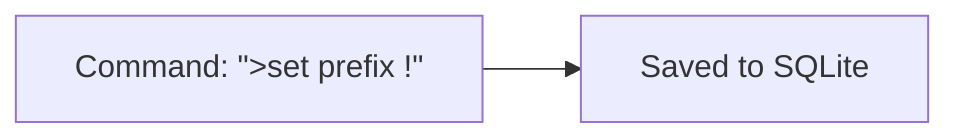
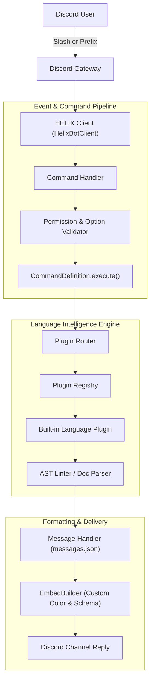
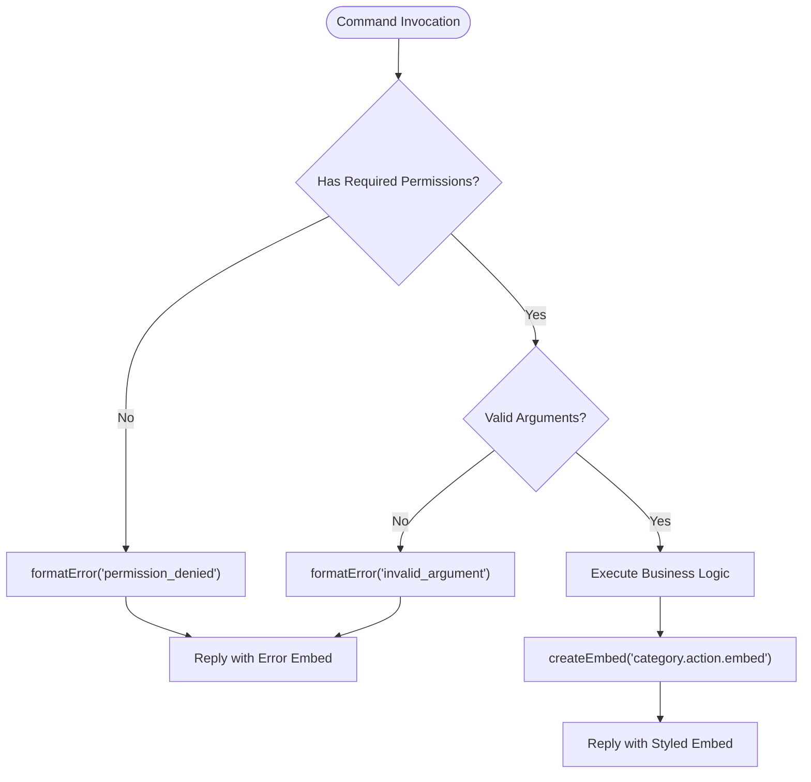
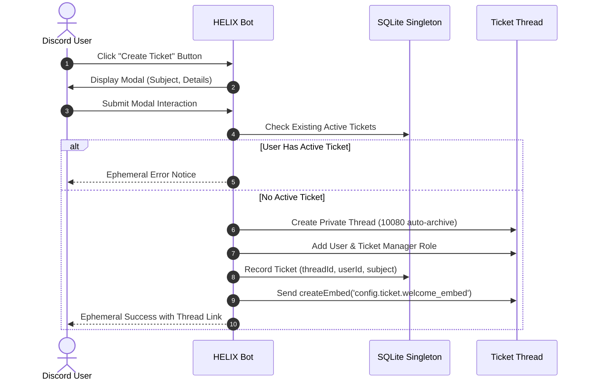
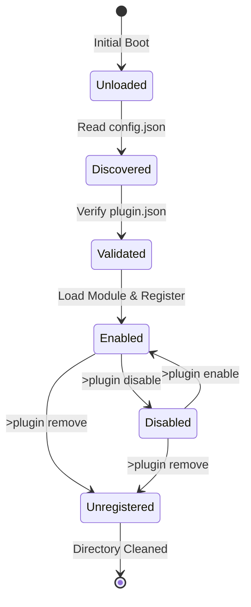
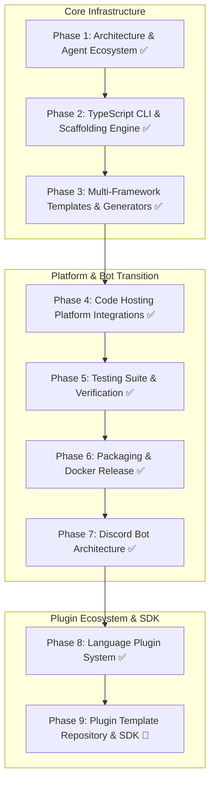

# Mermaid Diagram Formatting Standard & Template Guide

## Purpose
This guide defines mandatory syntax rules and standardized templates for generating Mermaid diagrams in HELIX documentation, architecture plans, and agent artifacts. Following these rules prevents rendering crashes, parser failures, and corrupted diagrams across GitHub, Antigravity, and documentation viewers.

---

## 1. Golden Rules for Syntax Safety

### Rule 1: Always Double-Quote Labels with Special Characters
If a node label contains parentheses `()`, brackets `[]`, braces `{}`, colons `:`, slashes `/`, commas `,`, ampersands `&`, or punctuation, **ALWAYS** enclose the text in double quotes inside the bracket syntax:



```mermaid
%% INCORRECT - WILL CRASH PARSER
%% A[User Input (>lint)] --> B[Router: CommandDefinition]
```

### Rule 2: Use Safe Alphanumeric Node Identifiers
- Keep node IDs simple: `A`, `B`, `node_1`, `clientGateway`, `authFlow`.
- **Never** put spaces, colons, dashes, or special characters in the node ID itself.
  - Right: `step1["Step 1: Parse Arguments"]`
  - Wrong: `step 1: parse["Step 1: Parse Arguments"]`

### Rule 3: Quote Subgraph Names with Special Characters
When naming subgraphs, if the title has spaces or punctuation, enclose it in quotes or assign a clean identifier:


### Rule 4: Escape Quotes Inside Labels
If a label must include quotes, use the `#quot;` entity:


---

## 2. Standardized Templates

### Template A: Architecture Flowchart (`flowchart TD` / `flowchart LR`)
Use for system dataflow, routing, and lifecycle pipelines:



---

### Template B: Decision & Triage Flowchart
Use for conditional logic, authorization checks, and validation paths:



---

### Template C: Interaction Sequence Diagram (`sequenceDiagram`)
Use for multi-party protocol flows (e.g. Ticket creation, OAuth2 authentication):



---

### Template D: State Machine Diagram (`stateDiagram-v2`)
Use for ticket lifecycles, plugin loading states, and job processing:



---

### Template E: Roadmap & Milestone Pipeline (`flowchart TD` / `flowchart LR`)
Use for project roadmaps, phase tracking, and milestone progressions (Note: `gantt` is unsupported by markdown parsers):



---

## 3. Supported Mermaid Diagram Types

| Diagram Type | Header Identifier | Supported | Notes |
|--------------|-------------------|-----------|-------|
| Flowchart / Graph | `flowchart TD`, `flowchart LR`, `graph TD` | **Yes** | Primary choice for architecture, roadmaps, and triage |
| State Diagram | `stateDiagram-v2` | **Yes** | Use for entity and lifecycle states |
| Sequence Diagram | `sequenceDiagram` | **Yes** | Use for event, OAuth2, and command flows |
| Class Diagram | `classDiagram` | **Yes** | Use for object hierarchies and models |
| Entity Relationship | `erDiagram` | **Yes** | Use for database schemas |
| XY Chart | `xychart-beta` | **Yes** | Use for numeric data & metric charts |
| Gantt Chart | `gantt` | **NO** | ❌ Causes parser error in IDE and markdown renderers |

