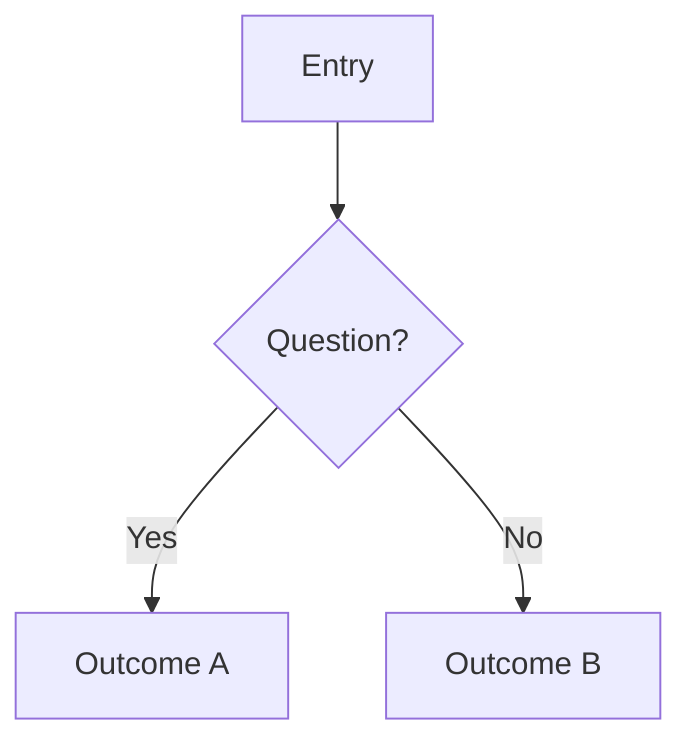

# Mermaid Diagram Template

**Compliance**: Rule 09 (GitHub-Flavored Mermaid & Diagram Standards). Use one diagram per concern; split large flows into multiple diagrams under separate headings. Verify on github.com before committing.

## Flow Title



## Decision Matrix Title

```mermaid
flowchart TD
    Input["Input"] --> CheckA{"Condition A?"}
    CheckA -->|"Yes"| ResultA["Result A"]
    CheckA -->|"No"| CheckB{"Condition B?"}
    CheckB -->|"Yes"| ResultB["Result B"]
    CheckB -->|"No"| ResultC["Result C"]
```



## Checklist
- [ ] ```` ```mermaid ```` fence used
- [ ] Labels quoting special characters
- [ ] Subgraph titles in quoted form (`subgraph id["Title"]`)
- [ ] No trapezoid shapes / `%%{init}%%` / math / reserved-word IDs
- [ ] One concern per diagram, ≤ 8–12 nodes
- [ ] Renders correctly on github.com