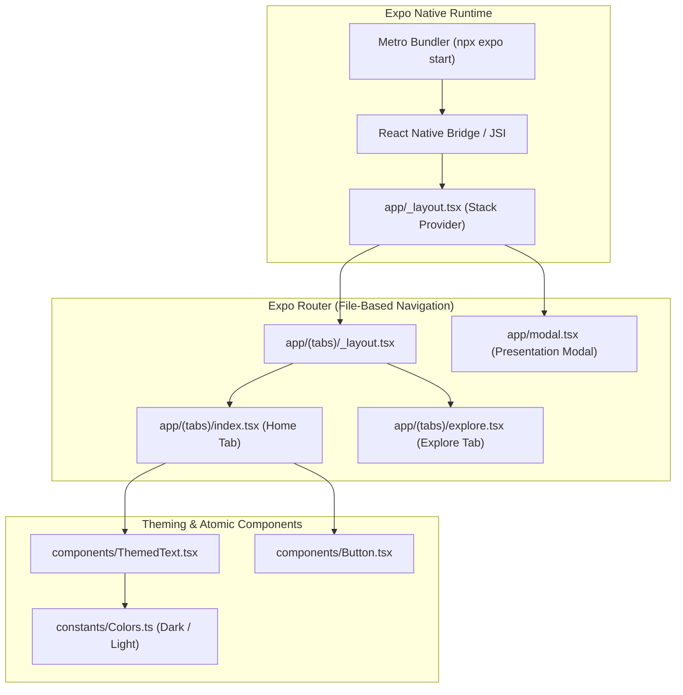

# React Native & Expo Mobile App Template

Native mobile application for iOS and Android powered by **Expo SDK 51+**, **Expo Router (File-based Routing)**, and **TypeScript**.

---

## 1. System Architecture & File-Based Navigation



---

## 2. Repository Layout

```
mobile-react-native/
├── app/                       # File-based routing navigation tree
│   ├── (tabs)/                # Bottom tab navigation group
│   │   ├── index.tsx          # Home tab
│   │   └── explore.tsx        # Explore tab
│   ├── _layout.tsx            # Root navigation stack
│   └── modal.tsx              # Modal presentation screen
├── components/                # Reusable UI component library
│   ├── Button.tsx
│   └── ThemedText.tsx
├── constants/                 # Color schemes, typography, spacing
│   └── Colors.ts
├── hooks/                     # Custom React Native hooks
│   └── useColorScheme.ts
├── app.json                   # Expo application manifest & bundle identifier
├── tsconfig.json              # TypeScript compiler settings
└── package.json
```

---

## 3. Setup & Development Commands

```bash
# Install dependencies
npm install

# Start Metro Bundler with Expo Go QR code
npx expo start

# Run on iOS Simulator (macOS only)
npx expo start --ios

# Run on Android Emulator
npx expo start --android

# Build native binaries via EAS (Expo Application Services)
npx eas build --platform all
```
