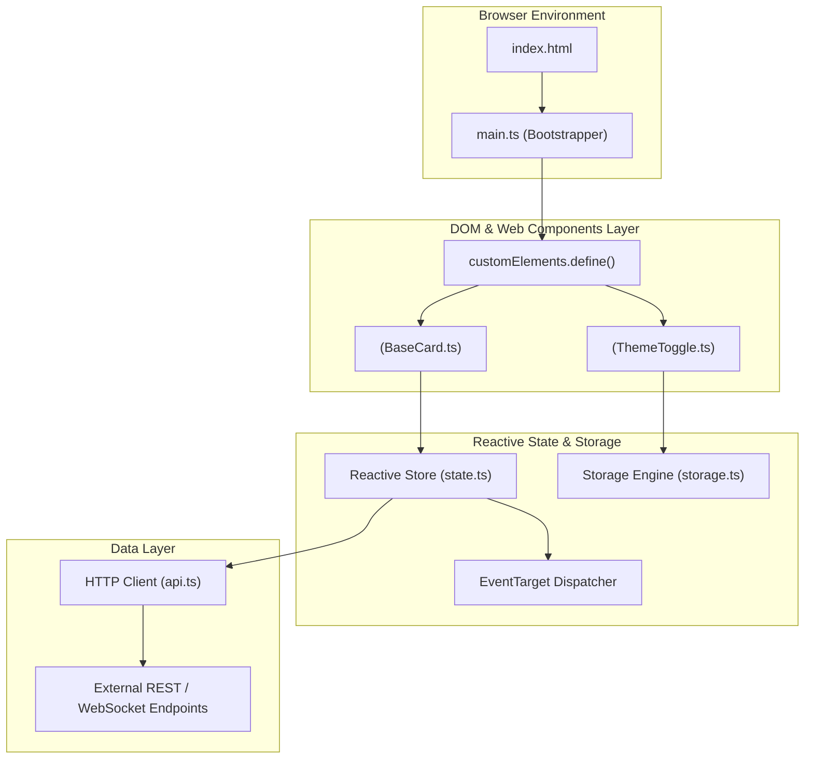

# Generic Modern Web Application Template

A production-grade, framework-agnostic web application foundation built on **Vite 5**, **TypeScript (ES2022)**, and modern browser standards (Web Components, CSS Custom Properties, Canvas 2D / WebGL, and Fetch API).

---

## 1. System Architecture & Component Model



---

## 2. Project Architecture & Directory Layout

```
web-app/
├── public/                    # Static assets served as-is at root URL
│   ├── favicon.ico
│   └── robots.txt
├── src/
│   ├── components/            # Reusable UI Custom Elements (Web Components)
│   │   ├── BaseCard.ts        # Custom <base-card> HTMLElement
│   │   └── ThemeToggle.ts     # Dark/Light mode toggle component
│   ├── modules/               # Core business logic & state engines
│   │   ├── state.ts           # Lightweight reactive event-driven store
│   │   ├── storage.ts         # Type-safe LocalStorage & IndexedDB wrappers
│   │   └── api.ts             # Generic HTTP fetch client with interceptors
│   ├── styles/                # CSS architecture
│   │   ├── reset.css          # Modern CSS reset
│   │   ├── variables.css      # Design tokens (colors, typography, spacing)
│   │   └── main.css           # Global layout & utility classes
│   ├── types/                 # Shared TypeScript models & event declarations
│   │   └── index.ts
│   └── main.ts                # Application bootstrapper & DOM attachment
├── index.html                 # HTML5 entrypoint with module script tag
├── vite.config.ts             # Vite bundling, aliases, & dev server options
├── tsconfig.json              # TypeScript compiler options
└── package.json               # Node dependencies and build scripts
```

---

## 3. Language & Code Formatting Guidelines

1. **TypeScript Standards**:
   - Enable `"strict": true`, `"noImplicitAny": true`, `"exactOptionalPropertyTypes": true`.
   - Use ES Modules (`import`/`export`) throughout.
   - Avoid `any`. Use generic constraints `<T>` or `unknown` with runtime type narrowing (`typeof`, `instanceof`).
2. **DOM Manipulation & Web Standards**:
   - Prefer standard Web Components (`customElements.define('my-element', MyElement)`) or pure functional DOM factories.
   - Never inject unsanitized HTML via `innerHTML`. Use `textContent`, `createElement`, or `HTMLTemplateElement`.
3. **CSS Architecture**:
   - Use CSS Custom Properties (`--color-primary`, `--radius-md`) for design tokens.
   - Support responsive design via modern Flexbox and CSS Grid layouts.

---

## 4. Configuration & Dependency Manifests

### `package.json`
```json
{
  "name": "my-web-app",
  "private": true,
  "version": "1.0.0",
  "type": "module",
  "scripts": {
    "dev": "vite",
    "build": "tsc && vite build",
    "preview": "vite preview",
    "typecheck": "tsc --noEmit"
  },
  "devDependencies": {
    "typescript": "^5.5.4",
    "vite": "^5.4.2"
  }
}
```

### `tsconfig.json`
```json
{
  "compilerOptions": {
    "target": "ES2022",
    "useDefineForClassFields": true,
    "module": "ESNext",
    "lib": ["ES2022", "DOM", "DOM.Iterable"],
    "skipLibCheck": true,
    "moduleResolution": "bundler",
    "allowImportingTsExtensions": true,
    "resolveJsonModule": true,
    "isolatedModules": true,
    "noEmit": true,
    "strict": true,
    "noUnusedLocals": true,
    "noUnusedParameters": true,
    "noFallthroughCasesInSwitch": true
  },
  "include": ["src"]
}
```

---

## 4. Core Implementation & Boilerplate

### `src/modules/state.ts` (Reactive Store)
```typescript
type Listener<T> = (state: T) => void;

export class ObservableStore<T extends Record<string, any>> {
  private state: T;
  private listeners: Set<Listener<T>> = new Set();

  constructor(initialState: T) {
    this.state = { ...initialState };
  }

  public getState(): Readonly<T> {
    return Object.freeze({ ...this.state });
  }

  public setState(patch: Partial<T>): void {
    this.state = { ...this.state, ...patch };
    this.notify();
  }

  public subscribe(listener: Listener<T>): () => void {
    this.listeners.add(listener);
    listener(this.getState());
    return () => this.listeners.delete(listener);
  }

  private notify(): void {
    const current = this.getState();
    this.listeners.forEach((listener) => listener(current));
  }
}

export interface AppState {
  theme: "light" | "dark";
  counter: number;
  user: { name: string } | null;
}

export const appStore = new ObservableStore<AppState>({
  theme: "dark",
  counter: 0,
  user: null,
});
```

### `src/components/ThemeToggle.ts` (Web Component)
```typescript
import { appStore } from "../modules/state.js";

export class ThemeToggle extends HTMLElement {
  private button: HTMLButtonElement;
  private unsubscribe?: () => void;

  constructor() {
    super();
    this.attachShadow({ mode: "open" });

    this.button = document.createElement("button");
    this.button.className = "theme-btn";

    const style = document.createElement("style");
    style.textContent = `
      .theme-btn {
        padding: 0.5rem 1rem;
        background: var(--btn-bg, #00d2ff);
        color: #0f172a;
        border: none;
        border-radius: 0.375rem;
        font-weight: 600;
        cursor: pointer;
        transition: transform 0.15s ease;
      }
      .theme-btn:active { transform: scale(0.96); }
    `;

    this.shadowRoot?.append(style, this.button);
  }

  connectedCallback(): void {
    this.unsubscribe = appStore.subscribe((state) => {
      this.button.textContent = state.theme === "dark" ? "🌙 Dark Mode" : "☀️ Light Mode";
      document.documentElement.setAttribute("data-theme", state.theme);
    });

    this.button.addEventListener("click", () => {
      const current = appStore.getState().theme;
      appStore.setState({ theme: current === "dark" ? "light" : "dark" });
    });
  }

  disconnectedCallback(): void {
    if (this.unsubscribe) this.unsubscribe();
  }
}

customElements.define("theme-toggle", ThemeToggle);
```

### `src/main.ts`
```typescript
import "./styles/main.css";
import "./components/ThemeToggle.js";
import { appStore } from "./modules/state.js";

const appRoot = document.getElementById("app");
if (appRoot) {
  appRoot.innerHTML = `
    <header class="app-header">
      <h1>HELIX Vanilla Web App</h1>
      <theme-toggle></theme-toggle>
    </header>
    <main class="app-content">
      <p>Modern TypeScript application without heavy framework overhead.</p>
      <div class="card">
        <button id="counter-btn" class="primary-btn">Clicks: 0</button>
      </div>
    </main>
  `;

  const counterBtn = document.getElementById("counter-btn");
  if (counterBtn) {
    appStore.subscribe((state) => {
      counterBtn.textContent = `Clicks: ${state.counter}`;
    });

    counterBtn.addEventListener("click", () => {
      appStore.setState({ counter: appStore.getState().counter + 1 });
    });
  }
}
```

---

## 5. Development & Deployment Workflows

```bash
# 1. Install packages
npm install

# 2. Run local development with Fast Refresh
npm run dev

# 3. Type check without compiling
npm run typecheck

# 4. Generate production bundle in dist/
npm run build

# 5. Preview production output
npm run preview
```
