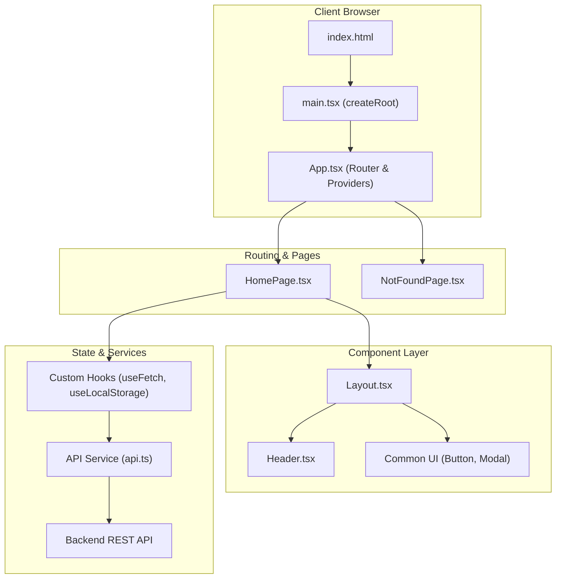

# React 19 Web Application Template

Modern Single Page Application (SPA) architecture utilizing **React 19**, **Vite 5**, **TypeScript**, and **Tailwind CSS**.

---

## 1. System Architecture & Component Hierarchy



---

## 2. Repository Layout

```
web-react/
├── public/                    # Static public assets (favicon, robots.txt)
├── src/
│   ├── assets/                # Images, icons, and static stylesheets
│   ├── components/            # UI component primitives
│   │   ├── common/            # Buttons, Cards, Inputs, Modals
│   │   │   ├── Button.tsx
│   │   │   └── Modal.tsx
│   │   └── layout/            # Header, Footer, Sidebar, Navigation
│   │       ├── Header.tsx
│   │       └── Layout.tsx
│   ├── hooks/                 # Custom React hooks (useAuth, useFetch)
│   │   └── useLocalStorage.ts
│   ├── pages/                 # Top-level route pages
│   │   ├── HomePage.tsx
│   │   └── NotFoundPage.tsx
│   ├── services/              # API fetch clients & external endpoints
│   │   └── api.ts
│   ├── types/                 # Shared data entities & TypeScript models
│   │   └── index.ts
│   ├── App.tsx                # App root with Router & State Providers
│   ├── index.css              # Global styles & Tailwind directives
│   └── main.tsx               # ReactDOM createRoot bootstrap
├── index.html                 # HTML entry shell
├── tailwind.config.js         # Tailwind theme & content paths
├── postcss.config.js          # PostCSS plugins
├── vite.config.ts             # Vite bundler & alias configuration
├── tsconfig.json              # TypeScript compiler configuration
└── package.json               # Project manifest
```

---

## 3. Language & Formatting Standards

- **Functional Components & Hooks**: Use functional components with explicit props interfaces (`interface ButtonProps { ... }`).
- **React 19 Conventions**: Use the native `use()` hook for promises and context where applicable.
- **Tailwind CSS Directives**: Organize utility classes logically (layout -> spacing -> typography -> color -> states).
- **Type Safety**: Strictly avoid `any`. Use generic API wrappers (`ApiResponse<T>`).

---

## 4. Configuration & Boilerplate

### `vite.config.ts`
```typescript
import { defineConfig } from "vite";
import react from "@vitejs/plugin-react";
import path from "path";

export default defineConfig({
  plugins: [react()],
  resolve: {
    alias: {
      "@": path.resolve(__dirname, "./src"),
    },
  },
  server: {
    port: 3000,
    open: true,
  },
});
```

### `src/components/common/Button.tsx`
```tsx
import React from "react";

interface ButtonProps extends React.ButtonHTMLAttributes<HTMLButtonElement> {
  variant?: "primary" | "secondary" | "danger";
  isLoading?: boolean;
}

export const Button: React.FC<ButtonProps> = ({
  children,
  variant = "primary",
  isLoading = false,
  className = "",
  disabled,
  ...props
}) => {
  const baseStyles = "px-4 py-2 rounded-lg font-medium transition-all duration-200 focus:outline-none focus:ring-2 disabled:opacity-50";
  const variantStyles = {
    primary: "bg-cyan-500 hover:bg-cyan-600 text-white focus:ring-cyan-400",
    secondary: "bg-slate-700 hover:bg-slate-600 text-slate-100 focus:ring-slate-500",
    danger: "bg-rose-500 hover:bg-rose-600 text-white focus:ring-rose-400",
  };

  return (
    <button
      className={`${baseStyles} ${variantStyles[variant]} ${className}`}
      disabled={disabled || isLoading}
      {...props}
    >
      {isLoading ? <span className="animate-pulse">Loading...</span> : children}
    </button>
  );
};
```

---

## 5. Development & Build Commands

```bash
# Install dependencies
npm install

# Start development server with Fast Refresh
npm run dev

# Run TypeScript typecheck & production bundle
npm run build

# Preview production build locally
npm run preview
```
