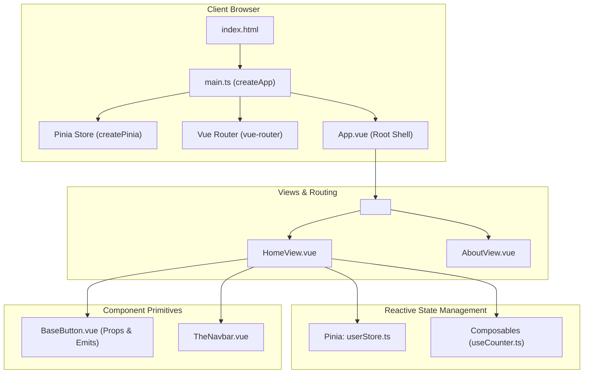

# Vue 3 Web Application Template

Modern Single Page Application built on **Vue 3 (Composition API)**, **Vite**, **TypeScript**, and **Pinia**.

---

## 1. System Architecture & Reactivity Flow



---

## 2. Repository Layout

```
web-vue/
├── public/                    # Static assets
├── src/
│   ├── assets/                # CSS and media files
│   ├── components/            # Reusable Single File Components (.vue)
│   │   ├── common/
│   │   │   └── BaseButton.vue
│   │   └── layout/
│   │       └── TheNavbar.vue
│   ├── composables/           # Reusable composition functions (useTheme)
│   │   └── useCounter.ts
│   ├── router/                # Vue Router route map
│   │   └── index.ts
│   ├── stores/                # Pinia state stores
│   │   └── userStore.ts
│   ├── views/                 # Route page views
│   │   ├── HomeView.vue
│   │   └── AboutView.vue
│   ├── App.vue                # Root application shell
│   └── main.ts                # Application initialization
├── index.html
├── vite.config.ts
├── tsconfig.json
└── package.json
```

---

## 3. Language & Formatting Standards

- **`<script setup lang="ts">`**: Always use `<script setup>` with TypeScript for clean, declarative component logic.
- **Typed Props & Emits**: Use `defineProps<{ ... }>()` and `defineEmits<{ ... }>()`.
- **Pinia Stores**: Use setup stores (`defineStore('id', () => { ... })`) for idiomatic reactivity.

---

## 4. Configuration & Boilerplate

### `src/stores/userStore.ts`
```typescript
import { defineStore } from "pinia";
import { ref, computed } from "vue";

export interface User {
  id: string;
  name: string;
  email: string;
}

export const useUserStore = defineStore("user", () => {
  const currentUser = ref<User | null>(null);
  const isAuthenticated = computed(() => currentUser.value !== null);

  function setUser(user: User) {
    currentUser.value = user;
  }

  function logout() {
    currentUser.value = null;
  }

  return { currentUser, isAuthenticated, setUser, logout };
});
```

### `src/components/common/BaseButton.vue`
```vue
<script setup lang="ts">
interface Props {
  variant?: "primary" | "secondary";
  disabled?: boolean;
}

withDefaults(defineProps<Props>(), {
  variant: "primary",
  disabled: false,
});

defineEmits<{
  (e: "click", event: MouseEvent): void;
}>();
</script>

<template>
  <button
    :class="['btn', `btn-${variant}`]"
    :disabled="disabled"
    @click="$emit('click', $event)"
  >
    <slot />
  </button>
</template>

<style scoped>
.btn {
  padding: 0.5rem 1rem;
  border-radius: 0.5rem;
  font-weight: 500;
  cursor: pointer;
}
.btn-primary {
  background: #00d2ff;
  color: #0f172a;
}
</style>
```

---

## 5. Setup & Build Commands

```bash
npm install
npm run dev
npm run build
```
