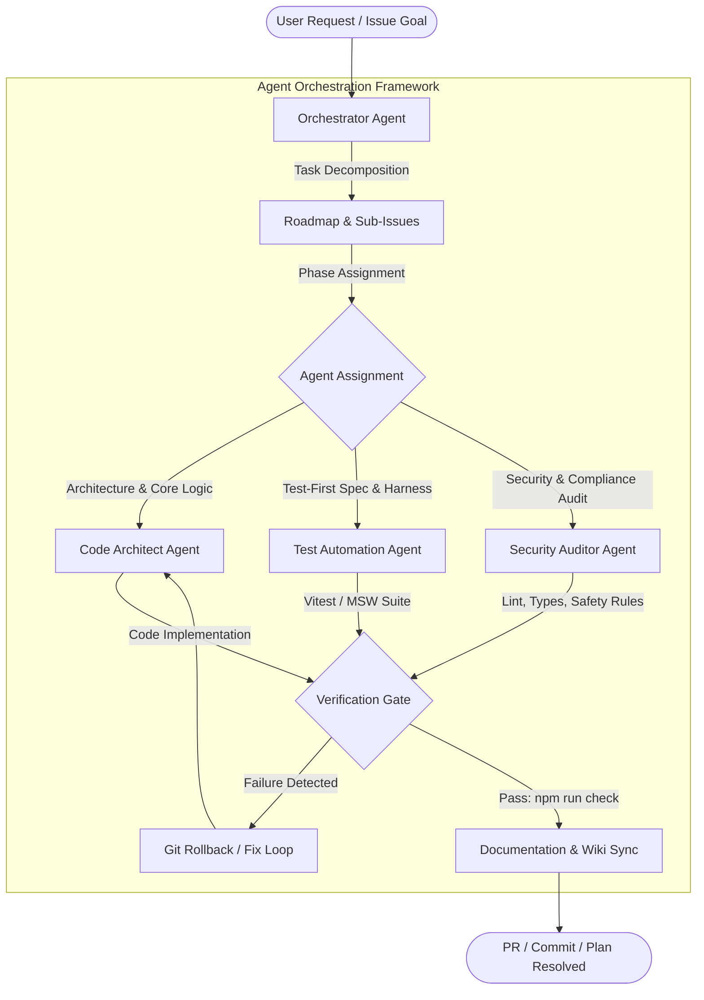

# AGENTS

This document is the central entry point and operating manual for all AI agents, coding assistants, and automated agents working on this repository.

## Project

**HELIX Discord Bot** is a self-hosted, multi-user Discord bot built in TypeScript ESM — RSS/Atom/Reddit/Free-Games feed delivery, YouTube & Twitch live/upload alerts, and an integrated management dashboard.
- **Runtime dependencies**: Minimal (uses native Node.js `http`, `node:sqlite`, and web standard APIs; in-memory `ioredis-mock` for coordination without external redis binaries).
- **Architecture**: In-memory write-through repository layer (`AppState`), native SQLite persistence, integrated dashboard UI with Light/Dark themes, Discord OAuth authentication, and direct message embed delivery to Discord channels.

---

## Current Issues

This section documents active and recently resolved critical issues as required by project tracking standards:

### 1. Cloudflare OAuth Failure & Retirement (Resolved / Retired)
- **Problem**: Cloudflare OAuth login failed with `Page not found: The route /oauth/error does not exist`. Furthermore, Cloudflare OAuth requires custom domains and public SSL certificates which cannot be sustained under self-hosted zero-cost requirements.
- **Resolution**:
  - Cloudflare OAuth provider and dependencies were retired entirely from the codebase.
  - Dedicated `/oauth/error` and `/api/oauth/error` routes were implemented in `src/dashboard/routes/oauth.ts` and `src/dashboard/http/oauth-callback.ts` to ensure clean error recovery.
  - Discord OAuth remains the primary authentication and authorization provider.
  - The obsolete `Integrations` tab was removed from the dashboard navigation.
  - In-dashboard OAuth credential configuration was removed from Settings to avoid out-of-sync credential state; configuration is exclusively handled through `.env`.

### 2. Legacy Webhook Terminology in Dashboard UI (Resolved)
- **Problem**: Earlier iterations of the dashboard referenced "Webhooks" and "Missing Webhooks", whereas the service now posts directly to Discord channels via the bot.
- **Resolution**: UI labels, modal subtitles, diagnostic metrics, and status badges were updated to reflect direct Discord Channel delivery.

### 3. Theme Support (Resolved)
- **Problem**: The dashboard was dark-mode only without theme customization.
- **Resolution**: Fully responsive Light and Dark themes were implemented with auto-detection via `prefers-color-scheme`, local storage persistence, and an interactive toggle in the header.

### 4. Site Status Monitors Retirement (Resolved / Retired)
- **Problem**: Site status monitors added unnecessary complexity and maintenance overhead without Cloudflare support.
- **Resolution**: Decommissioned and removed status monitoring across backend services, SQLite persistence, dashboard UI, and bot commands (`/monitor`). Service is streamlined to focus exclusively on RSS/Atom/Scrape feeds to Discord.

### 5. Cloud Hosting Retirement (Resolved / Retired)
- **Problem**: Cloud PaaS targets (Heroku, Render, Fly.io, Railway, Vercel) and one-click deploy buttons added maintenance overhead, inconsistent environment handling, out-of-sync credentials, and continuous platform-blocking/payment barriers.
- **Resolution**:
  - **All cloud hosting was retired**; the service is self-hosted exclusively on **Local**, **VPS**, and **Docker**.
  - `app.json`, the Deploy to Heroku button, and the Heroku `Procfile` were removed.
  - PaaS-only `$PORT` binding handling was removed from `src/config.ts`; port binding is configured via `INTERNAL_URL` / `DISCORD_PORT`.
  - Deployment documentation in `README.md` and `wiki/Deployment-and-Hosting.md` now covers only Local, VPS, and Docker.

### 6. News Feeds Tab Regression & Dashboard Env Theme Engine (Resolved)
- **Problem**: Renaming the "Popular Feeds" tab to "News Feeds" left a lingering `loadPopularTab()` call in `src/dashboard/views/dashboard.ts`, throwing `loadPopularTab is not defined` after enabling a catalog feed. Dashboard looked fixed/dark-only with no configurable appearance.
- **Resolution**:
  - Replaced `loadPopularTab()` with `loadNewsTab()` and removed the stale `'popular'` tab alias (`tabId === 'news'`).
  - Added an **env-only theme engine**: `DASHBOARD_THEME` (glassmorphism, dark, light, cyberpunk, dracula, nord, emerald), `DASHBOARD_COLOR_SCHEME` (11 accent schemes), and `LANDING_PAGE_ENABLED` — configured exclusively via `.env` per Rule 00.
  - Added theme-aware landing page with `/`, `/home`, `/landing` routes; `/` redirects to `/dashboard` when `LANDING_PAGE_ENABLED=false`.
  - Documented new variables in `.env.example`; planned and tracked via `PLAN.md` and [#19](https://github.com/HELIX-Origin/HELIX-RSS/issues/19).

### 7. Developer Tools Tab Restored with Owner/Team-Only Logs Page (Resolved)
- **Problem**: The host-only Dev Tools page (introduced in `3e9a4d1`) was removed during the large dashboard rewrite; the `activity_log` table and `/api/admin/*` endpoints existed but had no dashboard UI.
- **Resolution**:
  - Restored a **Developer Tools** sidebar tab, rendered only for the Discord bot owner/team (`isOwnerUser` → role `owner`, set for application owner + team members during OAuth).
  - Added a runtime diagnostics grid (`/api/admin/stats`): feeds, entries delivered, users, DB size, uptime, memory RSS/heap, Node version, platform.
  - Added a **Service Logs** page (`/api/admin/activity`) with level filtering (all/info/warn/error/debug) and adjustable limits.
  - Added Developer Actions: "Poll All Feeds Now", "Sync Discord Slash Commands", "Optimize SQLite DB" — every action is written to the activity log.
  - Hardened all `/api/admin/*` routes to `requireOwner` (owner/team only at the API layer as well).

### 8. Dashboard Operational Fixes & Derived App Name (Resolved)
- **Problem**: The Overview "Discord Delivery" stat stayed at `0`, `/privacy` & `/tos` rendered links/formatting as raw markdown, and the app name was hardcoded instead of using the Discord bot application name.
- **Resolution**:
  - `loadOverviewTab()` now calls `loadDiscordChannels()` so the delivered-channels stat reflects the real bot channel state.
  - Rewrote `markdownToHtml` in `src/dashboard/views/legal.ts` as a line-based renderer (headings, bold/italic/code, `[text](url)` links, lists, `---` rules) for `/privacy` and `/tos`.
  - App name now derives from the Discord application (`DiscordBot.getAppName()` via `appDisplayName(deps)` in `src/app.ts`) across bot embeds (`/about`, `/stats`, `/help`, `/feed`), dashboard views, auth/error pages, and OAuth views.

### 9. Discord Threads as Feed Delivery Targets (Implemented)
- **Problem**: Feeds could only deliver into text/announcement channels; Discord Threads were filtered out of channel discovery in `src/bot/rest.ts` and unsupported as delivery targets.
- **Resolution**:
  - **Implemented per [#20](https://github.com/HELIX-Origin/HELIX-RSS/issues/20)**: optional, per-guild forum/thread delivery. Each feed in a thread-enabled guild delivers into its own dedicated thread inside a forum channel (one thread per feed; first entry is the opening post).
  - `FeedThreadManager` in `src/feed/threads.ts`: forum channel selection (per-guild dashboard config or `FORUM_CHANNEL_IDS` env default), thread creation/rotation, keepalive polling, archive-at-size (`THREAD_MAX_MESSAGES`, default 100).
  - Schema v5: `feeds.thread_channel_id`/`thread_entry_count`; `discord_guilds.threads_enabled`/`forum_channel_ids`.
  - Config via dashboard **Feeds tab** (per server, not host-only) or env (`FORUM_CHANNEL_IDS`, `THREAD_KEEPALIVE_ENABLED`, `THREAD_KEEPALIVE_INTERVAL_MS`, `THREAD_KEEPALIVE_GRACE_MS`, `THREAD_MAX_MESSAGES`).
  - Legacy channel delivery is unchanged for guilds without thread delivery enabled.

### 10. Dashboard Guild-Centric Rework, Landing Page Audit, Manual Polling Removal & Daily Free Games Polling (In Progress)
- **Problem**: The dashboard is per-feed with large cards and per-feed channel pickers, which does not scale. Manual polling is unreliable for several sources. The landing page still advertises retired and unsupported features. Free Games only runs weekly, missing short-lived giveaways.
- **Status**: **Complete — tracked in [#21](https://github.com/HELIX-Origin/HELIX-RSS/issues/21).** Phases 1 (unsupported source/landing cleanup), 2 (per-guild category target data model/API), 3 (guild selection page + category UI redesign), 4 (manual polling removal), and 5 (daily free games polling) are all implemented and pushed. **Phases 6+ (URL/OAuth fixes, dashboard UX, audit bug fixes) are in progress; Phases 11+ (Feeds primary tab, Guild Admin, entertainment GIFs, Lavalink music + Queue page) are planned.**
- **Supported sources locked**: **RSS/Atom/JSON (including News presets), Reddit, Free Games**. YouTube & Twitch are supported as **live-stream + upload/online alerts** (delivered primarily via webhooks with periodic polling fallback; `feedCategory` → `streamalerts`), **not** as RSS-fetch feed types. TikTok and Bluesky are **not supported**.
  - Channel/thread assignment is **per guild, per category** (`rss`, `reddit`, `freegames`, `streamalerts`), not per individual feed.
  - Manual polling endpoints/buttons will be removed entirely.
  - Free Games will poll **daily** and post only new giveaways.
  - **Product expansion (tracked in [#21](https://github.com/HELIX-Origin/HELIX-RSS/issues/21), Phases 11+):** dashboard **Feeds primary tab** with per-feed sub-pages, **Guild Admin** page + administration commands, **entertainment GIF commands (KLIPY API)**, and **music via Lavalink** with a **Queue Management** dashboard page.
  - The project/development name is **HELIX Discord Bot** (renamed from HELIX RSS); the dashboard and bot embeds keep using the live Discord application name + icon at runtime.

---

## Agent Ecosystem Architecture & Orchestration

The repository operates on a multi-agent team model where agents collaborate, decompose tasks, execute automated verification, and maintain documentation synchronization.

---

## Agent Team Catalog & Capabilities

| Agent | Target Domain | Key Responsibilities | Specification File |
|---|---|---|---|
| **Orchestrator** | Project Management & Workflow | Task decomposition, roadmap execution, permission handling, user approval gateways, rollback coordination | [orchestrator.md](.agents/agents/orchestrator.md) |
| **Code Architect** | Backend & UI Engineering | TypeScript ESM architecture, zero-unsolicited runtime injection, SQLite write-through state, HTTP routing | [code-architect.md](.agents/agents/code-architect.md) |
| **Test Automation** | Quality Assurance | Test-driven development (TDD), Vitest suite, mock servers, MSW handlers, regression coverage | [test-automation.md](.agents/agents/test-automation.md) |
| **Security Auditor** | Security & Code Quality | Vulnerability scanning, secrets protection, ESLint rule enforcement, Prettier formatting, dependency audits | [security-auditor.md](.agents/agents/security-auditor.md) |
| **Feed Watcher** | RSS/Atom Ingestion | Feed polling, HTML scraping, XML parsing, deduplication, Discord embed formatting and dispatch | [feed-watcher.md](.agents/agents/feed-watcher.md) |

---

## Standard Agent Execution Capabilities

All agents have access to and must leverage the repository's standard execution toolset:
1. **File System Operations**: Read, write, and patch files with rigorous error handling and path resolution.
2. **Type Checking**: `npm run typecheck` (`tsc --noEmit`).
3. **Linting & Fixing**: `npm run lint` (`eslint src tests --max-warnings 0`) and automatic correction.
4. **Code Formatting**: `npm run format` and validation via `npm run format:check`.
5. **Automated Testing**: `npm test` (`vitest run`) and `npm run test:watch`.
6. **Full Validation Gate**: `npm run check` (runs typecheck, format check, linting, and all unit + integration tests in one unified command).
7. **Compilation**: `npm run build` (outputs to `dist/`).
8. **Version Control & Rollbacks**: `git status`, `git diff`, `git checkout`, `git restore` for safe rollbacks whenever test regressions occur.

---

## Agent Rules (`.agents/rules/`)

All agent actions are bound by `.agents/rules/`:
- **Rule 00 (`agent-safety-compliance.md`)**: Safety invariants, zero irreversible damage, credentials/tokens stay in `.env`, never committed.
- **Rule 01 (`zero-unsolicited-injection.md`)**: Runtime dependencies require explicit user approval; only standard dev tooling is permitted.
- **Rule 02 (`typescript-architecture.md`)**: Strict TypeScript ESM structure across `src/`.
- **Rule 03 (`message-formatting.md`)**: Embed building and Discord channel routing standards.
- **Rule 04 (`remote-issue-protocol.md`)**: Roadmap-first tracking; the first post is the roadmap edited as progress occurs; Mermaid diagrams required.
- **Rule 05 (`documentation-standards.md`)**: Keep `wiki/` and agent files synchronized (documentation is hosted entirely via `wiki/`).

---

## Testing & Verification Standard

- Always run `npm run check` before submitting changes.
- Never write ad-hoc scratch scripts outside the `tests/` directory.
- Mocks and test helpers must reside in `tests/helpers/` and `tests/mocks/`.