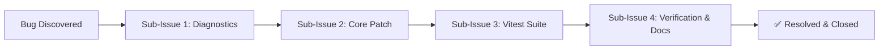

# HELIX -- Agents Documentation

Primary reference for agents, skills, plans, bugs, and templates used across all AI coding assistants working on this repo.

## Repository Layout

```
HELIX CLI/
├── HELIX/                # The bot (self-contained)
│   ├── index.ts          # Entry point
│   ├── src/              # Bot source (commands, handlers, plugins, db, server)
│   ├── dashboard/        # Web dashboard and OAuth2 router
│   └── package.json      # Bot package
├── .agents/              # Universal agent configuration
│   ├── agents/           # Project-type agent files
│   ├── skills/           # Framework and language skills
│   ├── plans/            # Phase roadmap tracking
│   ├── bugs/             # Bug tracking (one file per issue)
│   └── templates/        # YML scaffold templates with index
├── tests/                # Vitest test suite
│   ├── unit/
│   ├── integration/
│   └── fixtures/
├── .gemini/              # Antigravity-specific config
├── .copilot/             # GitHub Copilot-specific config
├── .opencode/            # Open Code-specific config
├── docs/                 # End-user documentation
└── package.json          # Workspace root (test runner only)
```

## Mandatory Rules (`.agents/rules/`)

Non-negotiable invariants for all AI coding assistants:

| Rule | Description | File |
|------|-------------|------|
| `00-agent-safety-compliance` | Safety rules: prevent irreversible damage, ensure strict instruction compliance | [00-agent-safety-compliance.md](.agents/rules/00-agent-safety-compliance.md) |
| `01-zero-ai-architecture` | No external AI dependencies; plugins execute locally | [01-zero-ai-architecture.md](.agents/rules/01-zero-ai-architecture.md) |
| `02-discord-bot-architecture` | Vanilla discord.js, unified `execute()`, named exports, no sub-indexes | [02-discord-bot-architecture.md](.agents/rules/02-discord-bot-architecture.md) |
| `03-message-formatting` | `messages.json` single source of truth, `message-handler.ts` only | [03-message-formatting.md](.agents/rules/03-message-formatting.md) |
| `04-remote-issue-protocol` | Safe UTF-8 file-based comments for `gh issue` / `gh pr` | [04-remote-issue-protocol.md](.agents/rules/04-remote-issue-protocol.md) |
| `05-documentation-standards` | Minimal root landing page, comprehensive `docs/` | [05-documentation-standards.md](.agents/rules/05-documentation-standards.md) |

---

## Agents (`.agents/agents/`)

| Agent | Purpose | File |
|-------|---------|------|
| `discord-bot` | Discord bot architecture, slash commands, gateway | [discord-bot.md](.agents/agents/discord-bot.md) |
| `web` | React, Vue, Svelte, Angular, Vite, Next.js | [web.md](.agents/agents/web.md) |
| `desktop` | Electron, Tauri v2 | [desktop.md](.agents/agents/desktop.md) |
| `mobile` | Flutter, React Native, Expo | [mobile.md](.agents/agents/mobile.md) |
| `game-engine` | Unity, Godot 4, RPG Maker MZ, Ren'\''Py | [game-engine.md](.agents/agents/game-engine.md) |
| `backend` | Rust, Go, Java, Python | [backend.md](.agents/agents/backend.md) |
| `code-hosting` | GitHub, GitLab, Bitbucket CI/CD | [code-hosting.md](.agents/agents/code-hosting.md) |

---

## Skills (`.agents/skills/`)

### Discord
- [discord-bot-setup](.agents/skills/discord-bot-setup.md): discord.js project setup

### Web
- [web-basics](.agents/skills/web-basics.md): HTML5, CSS3, Vite
- [react-development](.agents/skills/react-development.md): React 19, hooks, Vite
- [vue-development](.agents/skills/vue-development.md): Vue 3 Composition API, Pinia
- [angular-development](.agents/skills/angular-development.md): Angular standalone, signals
- [svelte-development](.agents/skills/svelte-development.md): Svelte 5 runes, SvelteKit

### Desktop
- [electron-setup](.agents/skills/electron-setup.md): Electron main/preload/renderer, IPC
- [tauri-setup](.agents/skills/tauri-setup.md): Tauri v2, Rust backend

### Mobile
- [flutter](.agents/skills/flutter.md): Flutter, Riverpod/Bloc
- [react-native](.agents/skills/react-native.md): React Native, Expo Router

### Game Engines
- [unity](.agents/skills/unity.md): Unity C#, assembly definitions
- [rpgm](.agents/skills/rpgm.md): RPG Maker MZ/MV plugins
- [ren-py](.agents/skills/ren-py.md): Ren'\''Py visual novel scripting
- [godot](.agents/skills/godot.md): Godot 4 GDScript

### Backend
- [rust](.agents/skills/rust.md): Cargo, Tokio, Serde
- [go](.agents/skills/go.md): Go modules, goroutines
- [java](.agents/skills/java.md): Java 21, Spring Boot
- [python](.agents/skills/python.md): Python, uv, FastAPI

### Platform
- [code-hosting-platforms](.agents/skills/code-hosting-platforms.md): gh, glab, Bitbucket

---

## Plan Tracking (`.agents/plans/`)

- [roadmap.md](.agents/plans/roadmap.md) — Master 9-phase roadmap
- [phase1.md](.agents/plans/phase1.md) — Core Foundation & Agent Ecosystem
- [phase2.md](.agents/plans/phase2.md) — Project Scaffolding Engine & Template System
- [phase3.md](.agents/plans/phase3.md) — Database Architecture & Autonomous Schema Migrations
- [phase4.md](.agents/plans/phase4.md) — Web Dashboard & NextAuth OAuth2 Infrastructure
- [phase5.md](.agents/plans/phase5.md) — Discord Bot Gateway Client & Core 25 Commands
- [phase6.md](.agents/plans/phase6.md) — Production Packaging, Docker & Deployment
- [phase7.md](.agents/plans/phase7.md) — Full Discord Bot Architecture Transition
- [phase8.md](.agents/plans/phase8.md) — Language Plugin System & Code Intelligence Engine
- [phase9.md](.agents/plans/phase9.md) — Plugin Template Repository & Community Ecosystem

---

## Bug Tracking (`.agents/bugs/`)

All bugs and milestones are tracked via live GitHub Issues using decomposed Sub-Issues and visual Mermaid diagrams:



- [bug-tracking.md](.agents/bugs/bug-tracking.md) — Active bug index and Sub-Issue lifecycle
- [BUG-001](.agents/bugs/BUG-001-credential-discovery-path.md) — Cross-platform config path resolution — **Resolved** (4 Sub-Tasks)
- [BUG-002](.agents/bugs/BUG-002-game-engine-template-placeholders.md) — Binary asset preservation in templates — **Resolved** (4 Sub-Tasks)
- [BUG-003](.agents/bugs/BUG-003-heroku-deploy-dynamic-url-detection.md) — Heroku dynamic URL detection — **Resolved** (4 Sub-Tasks)
- [BUG-004](.agents/bugs/BUG-004-auto-resolve-url-env.md) — Auto-resolve NEXTAUTH_URL and callback URLs — **Resolved** (4 Sub-Tasks)
- [BUG-005](.agents/bugs/BUG-005-typescript-strict-mode-errors.md) — TypeScript strict mode errors — **Resolved** (4 Sub-Tasks)
- [BUG-006](.agents/bugs/BUG-006-messages-json-formatting-refactor.md) — Centralized Message Formatting Engine & messages.json refactor — **Resolved** (4 Sub-Tasks)
- [BUG-007](.agents/bugs/BUG-007-plugin-repositories-database-backed.md) — DB-backed per-guild plugin repositories — **Resolved** (4 Sub-Tasks)
- [BUG-008](.agents/bugs/BUG-008-test-suite-rebuild.md) — Vitest test suite modular rebuild — **Resolved** (4 Sub-Tasks)
- [BUG-009](.agents/bugs/BUG-009-sdk-circular-import.md) — SDK circular import fix — **Resolved** (4 Sub-Tasks)
- [BUG-010](.agents/bugs/BUG-010-user-active-ticket-ordering.md) — getUserActiveTicket deterministic ordering — **Resolved** (3 Sub-Tasks)
- [BUG-011](.agents/bugs/BUG-011-nextauth-botport-dead-arg.md) — Dead botPort argument removal — **Resolved**
- [BUG-012](.agents/bugs/BUG-012-duplicate-app-json.md) — Root and .github/app.json deduplication — **Resolved**
- [BUG-013](.agents/bugs/BUG-013-gateway-intent-fallback-and-clean-invite.md) — Gateway DisallowedIntents fallback & clean invite URL — **Resolved**
- [BUG-014](.agents/bugs/BUG-014-build-artifact-nesting-and-export-default.md) — Build artifact nesting in src/dist & duplicate export defaults — **Resolved** (4 Sub-Tasks)
- [BUG-015](.agents/bugs/BUG-015-slash-command-limits-and-per-guild-enablement.md) — Slash command limits & optional per-guild category enablement — **Resolved** (4 Sub-Tasks)
- [BUG-016](.agents/bugs/BUG-016-multi-platform-deployment-sync.md) — Multi-platform one-click deployment sync & container runtime configuration — **Resolved** (4 Sub-Tasks)
- [BUG-017](.agents/bugs/BUG-017-keep-alive-service.md) — Built-in autonomous keep-alive self-ping service for cloud hosting platforms — **Resolved** (4 Sub-Tasks)
- [BUG-018](.agents/bugs/BUG-018-remove-docker-support.md) — Full deprecation & removal of Docker containerization in favor of native Node.js runtimes — **Resolved** (4 Sub-Tasks)
- [BUG-019](.agents/bugs/BUG-019-self-hosting-static-urls.md) — Full deprecation of 1-click cloud deployments & transition to static self-hosting architecture — **Resolved** (4 Sub-Tasks)
- [BUG-020](.agents/bugs/BUG-020-permission-flags-and-command-interactions.md) — Discord PermissionFlagsBits standardization, prefix argument parsing & help interaction router — **Resolved** (4 Sub-Tasks)
- [BUG-021](.agents/bugs/BUG-021-help-duplicate-custom-id-and-prefix-routing.md) — Help component duplicate custom ID elimination & prefix dynamic import resolution — **Resolved** (4 Sub-Tasks)
- [BUG-022](.agents/bugs/BUG-022-guild-settings-registration-and-slash-purge.md) — Guild settings end-to-end bot state registration & stale slash command registry purge — **Resolved** (4 Sub-Tasks)
- [BUG-023](.agents/bugs/BUG-023-help-embed-overhaul-and-command-missing-args-help.md) — Help Command Embed Overhaul & Automated Missing Arguments Help Response — **Resolved** (4 Sub-Tasks)
- [BUG-024](.agents/bugs/BUG-024-guild-settings-bot-session-and-db-sync.md) — Universal In-Memory Bot Session State & Unified Database Synchronization — **Resolved** (4 Sub-Tasks)

---

## Templates (`.agents/templates/`)

All templates indexed in [.agents/templates/index.md](.agents/templates/index.md):

`discord-bot.md`, `web-react.md`, `web-vue.md`, `web-app.md`,
`desktop-electron.md`, `desktop-tauri.md`, `desktop-app.md`,
`mobile-flutter.md`, `mobile-react-native.md`,
`game-unity.md`, `game-godot.md`, `game-rpgm.md`, `game-renpy.md`,
`backend-rust.md`, `backend-go.md`, `backend-java.md`, `backend-python.md`,
[mermaid-diagram-guide.md](.agents/templates/mermaid-diagram-guide.md),
[commit-message-guide.md](.agents/templates/commit-message-guide.md)

---

## Quick Start

```bash
# Start the bot and web dashboard
npm start

# Run the full test suite
npm test

# Type check
npm run typecheck

# Configure a guild in Discord
>set prefix >
>set tickets-hub #support
>set mod-log-channel #mod-logs
>ticket setup-hub

# Install a language plugin
>plugin install HELIX-Origin/helix-origin
```
