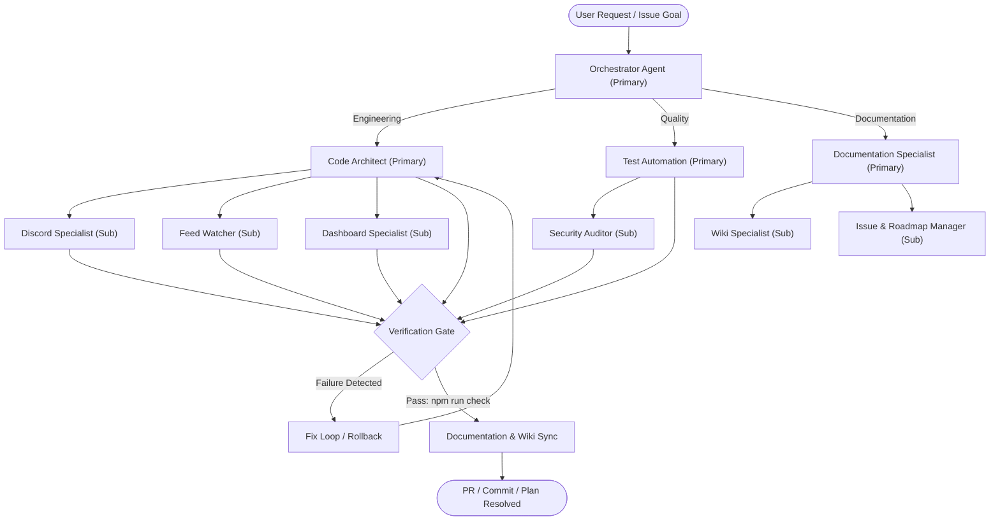

# AGENTS

This document is the central entry point and operating manual for all AI agents, coding assistants, and automated agents working on this repository.

> **Tracking Files**: `PLAN.md` (current session plan), `TODO.md` (task checklist), and `BUGS.md` (bug & issue tracker) are repository-tracked planning files that hold active workstream state. All architecture rules, standards, and permanent documentation reside in `AGENTS.md`, `.agents/`, and `wiki/`.
>
> **Bug & Issue Tracking**: Active bug/problem tracking lives in the `BUGS.md` tracker (only still-open bugs are listed; closed or superseded entries are removed). `AGENTS.md` is the agent ecosystem entry point, not a tracker.

## Project

**HELIX Discord Bot** is a self-hosted, multi-user Discord bot built in TypeScript ESM — RSS/Atom/Reddit/Free-Games feed delivery, YouTube & Twitch live/upload alerts, guild administration, and an integrated management dashboard.
- **Runtime dependencies**: Minimal (uses native Node.js `http`, `node:sqlite`, and web standard APIs; in-memory `ioredis-mock` for coordination without external redis binaries).
- **Architecture**: In-memory write-through repository layer (`AppState`), native SQLite persistence, integrated dashboard UI with Light/Dark themes, Discord OAuth authentication, and direct message embed delivery to Discord channels/threads.
- **Discord.js Standard**: Strict adherence to **discord.js v14** standards, self-contained commands with subcommands and options colocated directly in their command files (`src/bot/commands/<category>/<command>.ts`), modular shared libraries/modules/utilities in `src/bot/lib/`, builder patterns, and robust event handling.

---

## Bug & Issue Tracking

Only bugs that are **still open** are tracked in the **`BUGS.md`** tracker. Once a bug is fixed or superseded, its entry is removed from the file. This file is the agent ecosystem entry point and operating manual — it is not itself a tracker.

- **Active/public roadmap work** is tracked on GitHub as roadmap issues and sub-issues per **Rule 04** (`remote-issue-protocol.md`).

---

## Agent Ecosystem Architecture & Orchestration

The repository operates on a multi-agent team model where agents collaborate, decompose tasks, execute automated verification, and maintain documentation synchronization.

---

## Agent Team Catalog & Capabilities

Agents are organized as **primary agents with sub-agents** grouped by focus area under `.agents/agents/{focus}` (see [`.agents/agents/README.md`](.agents/agents/README.md)).

| Agent | Focus Area | Key Responsibilities | Specification File |
|---|---|---|---|
| **Orchestrator** | Coordination (Primary) | Task decomposition, roadmap execution, primary-agent coordination, permission handling, rollback | [orchestrator.md](.agents/agents/orchestrator/orchestrator.md) |
| **Code Architect** | Engineering (Primary) | TypeScript ESM architecture, zero-unsolicited runtime injection, SQLite write-through, HTTP routing, engineering sub-agent ownership | [code-architect.md](.agents/agents/engineering/code-architect.md) |
| **Discord Specialist** | Engineering (Sub) | discord.js v14 standards, command registry, event dispatch, permissions, EmbedHandler | [discord-specialist.md](.agents/agents/engineering/sub-agents/discord-specialist.md) |
| **Feed Watcher** | Engineering (Sub) | Feed polling, HTML scraping, XML parsing, deduplication, forum single-thread delivery, Sunday free games | [feed-watcher.md](.agents/agents/engineering/sub-agents/feed-watcher.md) |
| **Dashboard Specialist** | Engineering (Sub) | Zero-frontend-dep SSR, Discord OAuth2, guild admin authorization, theme engine | [dashboard-engineer.md](.agents/agents/engineering/sub-agents/dashboard-engineer.md) |
| **Test Automation** | Quality (Primary) | Test-driven development (TDD), Vitest suite, mock servers, regression coverage, quality sub-agent ownership | [test-automation.md](.agents/agents/quality/test-automation.md) |
| **Security Auditor** | Quality (Sub) | Vulnerability scanning, secrets protection, ESLint rule enforcement, formatting, dependency audits | [security-auditor.md](.agents/agents/quality/sub-agents/security-auditor.md) |
| **Documentation Specialist** | Documentation (Primary) | wiki/, md files, README, issues, rule/skill/template catalogs, documentation sub-agent ownership | [documentation-specialist.md](.agents/agents/documentation/documentation-specialist.md) |
| **Wiki Specialist** | Documentation (Sub) | `wiki/*.md`, README, `AGENTS.md`, `.env.example`, `.agents/` catalog sync | [wiki-specialist.md](.agents/agents/documentation/sub-agents/wiki-specialist.md) |
| **Issue & Roadmap Manager** | Documentation (Sub) | GitHub issues, living roadmaps, PRs, release notes, issue title standard | [issue-manager.md](.agents/agents/documentation/sub-agents/issue-manager.md) |

---

## Standard Agent Execution Capabilities

All agents have access to and must leverage the repository's standard execution toolset:
1. **File System Operations**: Read, write, and patch files with rigorous error handling and path resolution.
2. **Type Checking**: `npm run typecheck` (`tsc --noEmit`).
3. **Linting & Fixing**: `npm run lint` (`eslint src --max-warnings 0`) and automatic correction.
4. **Code Formatting**: `npm run format` and validation via `npm run format:check`.
5. **Automated Testing**: `npm test` (`vitest run`) and `npm run test:watch`.
6. **Full Validation Gate**: `npm run check` (runs typecheck, format check, linting, and all unit + integration tests in one unified command).
7. **Compilation**: `npm run build` (outputs to `dist/`).
8. **Version Control & Rollbacks**: `git status`, `git diff`, `git checkout`, `git restore` for safe rollbacks whenever test regressions occur.

---

## Agent Rules (`.agents/rules/`)

All agent actions are bound by `.agents/rules/`:
- **Rule 00 (`agent-safety-compliance.md`)**: Safety invariants, zero irreversible damage, credentials/tokens stay in `.env`, never committed.
- **Rule 01 (`zero-unsolicited-injection.md`)**: Runtime dependencies require explicit user approval; only standard dev tooling is permitted.
- **Rule 02 (`typescript-architecture.md`)**: Strict TypeScript ESM structure across `src/`.
- **Rule 03 (`message-formatting.md`)**: Embed building and Discord channel routing standards via `EmbedHandler`.
- **Rule 04 (`remote-issue-protocol.md`)**: Roadmap-first tracking; the first post is the roadmap edited as progress occurs; Mermaid diagrams required.
- **Rule 05 (`documentation-standards.md`)**: Keep `wiki/` and agent files synchronized (documentation is hosted entirely via `wiki/`).
- **Rule 06 (`discord-js-standards.md`)**: **MANDATORY** — Strict discord.js standards for commands, events, embeds, options, handlers, registry, and dispatch. Command options and subcommands remain colocated in command files (`src/bot/commands/<category>/<command>.ts`), while `src/bot/lib/` is dedicated to reusable libraries, modules, and utilities used by commands and events. Strongly prefers dynamic methods over hardcoding (dynamic command registry, dynamic discovery, dynamic option builders). Zero tolerance for violations.
- **Rule 07 (`dashboard-standards.md`)**: Management dashboard & Discord integration standards — zero runtime frontend dependencies, Discord OAuth2 authentication, guild administrator authorization, SSR HTML with CSS custom properties theme engine, and EmbedHandler preview parity.
- **Rule 08 (`release-standards.md`)**: Semantic versioning (`MAJOR.MINOR.PATCH`), multi-file version synchronization, and structured GitHub release notes with emojis and code blocks.
- **Rule 09 (`mermaid-standards.md`)**: GitHub-flavored Mermaid & diagram standards — GitHub-compatible syntax, one concern per diagram, split large flows into multiple diagrams to keep them legible.

---

## Testing & Verification Standard

- Always run `npm run check` before submitting changes.
- Never write ad-hoc scratch scripts outside the `tests/` directory.
- Mocks and test helpers must reside in `tests/helpers/` and `tests/mocks/`.