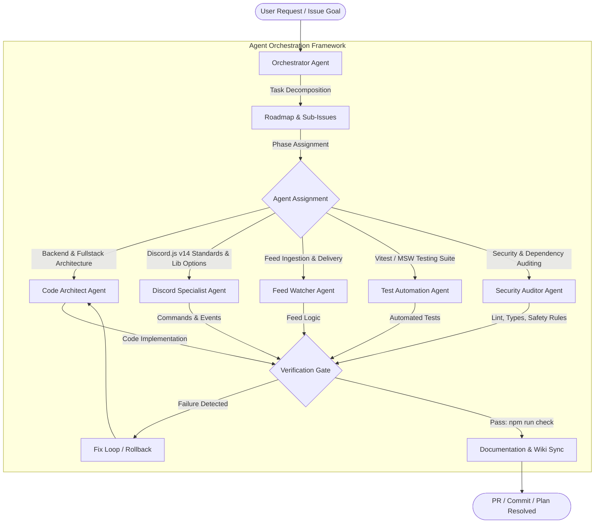

# AGENTS

This document is the central entry point and operating manual for all AI agents, coding assistants, and automated agents working on this repository.

> **Local Tracking Files**: `PLAN.md`, `BUGS.md`, and `TODO.md` are local-only workspace scratchpads and are gitignored. They must never be committed to the repository. All architecture rules, standards, and permanent documentation reside in `AGENTS.md`, `.agents/`, and `wiki/`.

## Project

**HELIX Discord Bot** is a self-hosted, multi-user Discord bot built in TypeScript ESM — RSS/Atom/Reddit/Free-Games feed delivery, YouTube & Twitch live/upload alerts, guild administration, and an integrated management dashboard.
- **Runtime dependencies**: Minimal (uses native Node.js `http`, `node:sqlite`, and web standard APIs; in-memory `ioredis-mock` for coordination without external redis binaries).
- **Architecture**: In-memory write-through repository layer (`AppState`), native SQLite persistence, integrated dashboard UI with Light/Dark themes, Discord OAuth authentication, and direct message embed delivery to Discord channels/threads.
- **Discord.js Standard**: Strict adherence to **discord.js v14** standards, self-contained commands with subcommands and options colocated directly in their command files (`src/bot/commands/<category>/<command>.ts`), modular shared libraries/modules/utilities in `src/bot/lib/`, builder patterns, and robust event handling.

---

## Current Issues

This section documents active and recently resolved critical issues as required by project tracking standards:

### 1. Cloudflare OAuth Failure & Retirement (Resolved / Retired)
- **Problem**: Cloudflare OAuth login failed with `Page not found: The route /oauth/error does not exist`. Furthermore, Cloudflare OAuth requires custom domains and public SSL certificates which cannot be sustained under self-hosted zero-cost requirements.
- **Resolution**:
  - Cloudflare OAuth provider and dependencies were retired entirely from the codebase.
  - Dedicated `/oauth/error` and `/api/oauth/error` routes were implemented in `src/dashboard/routes/oauth.ts` and `src/dashboard/http/oauth-callback.ts` to ensure clean error recovery.
  - Discord OAuth remains the primary authentication and authorization provider.
  - The obsolete `Integrations` tab was removed from the dashboard navigation.
  - In-dashboard OAuth credential configuration was removed from Settings to avoid out-of-sync credential state; configuration is exclusively handled through `.env`.

### 2. Legacy Webhook Terminology in Dashboard UI (Resolved)
- **Problem**: Earlier iterations of the dashboard referenced "Webhooks" and "Missing Webhooks", whereas the service now posts directly to Discord channels via the bot.
- **Resolution**: UI labels, modal subtitles, diagnostic metrics, and status badges were updated to reflect direct Discord Channel delivery.

### 3. Theme Support (Resolved)
- **Problem**: The dashboard was dark-mode only without theme customization.
- **Resolution**: Fully responsive Light and Dark themes were implemented with auto-detection via `prefers-color-scheme`, local storage persistence, and an interactive toggle in the header.

### 4. Site Status Monitors Retirement (Resolved / Retired)
- **Problem**: Site status monitors added unnecessary complexity and maintenance overhead without Cloudflare support.
- **Resolution**: Decommissioned and removed status monitoring across backend services, SQLite persistence, dashboard UI, and bot commands (`/monitor`). Service is streamlined to focus exclusively on RSS/Atom/Scrape feeds to Discord.

### 5. One-Click Cloud Deploy Retirement & Manual PaaS Policy (Resolved)
- **Problem**: One-click cloud deploy buttons (Heroku, Render, Railway templates) added maintenance overhead, fragile out-of-sync credentials, and payment barriers.
- **Resolution**:
  - One-click deploy buttons, `app.json`, and Heroku `Procfile` were retired.
  - Manual container-based PaaS hosting (Railway, Render, Fly.io) is supported when users configure their own persistent storage volumes for SQLite (`/app/data`) and manage credentials in their provider dashboard.
  - Port binding supports `PORT` / `INTERNAL_URL` / `DISCORD_PORT` (default 3131).
  - Deployment documentation in `wiki/Deployment-and-Hosting.md` details Docker, VPS/systemd, Local Windows, and manual PaaS (Railway, Render, Fly.io).

### 6. News Feeds Tab Regression & Dashboard Env Theme Engine (Resolved)
- **Problem**: Renaming the "Popular Feeds" tab to "News Feeds" left a lingering `loadPopularTab()` call in `src/dashboard/views/dashboard.ts`, throwing `loadPopularTab is not defined` after enabling a catalog feed. Dashboard looked fixed/dark-only with no configurable appearance.
- **Resolution**:
  - Replaced `loadPopularTab()` with `loadNewsTab()` and removed the stale `'popular'` tab alias (`tabId === 'news'`).
  - Added an **env-only theme engine**: `DASHBOARD_THEME` (glassmorphism, dark, light, cyberpunk, dracula, nord, emerald), `DASHBOARD_COLOR_SCHEME` (11 accent schemes), and `LANDING_PAGE_ENABLED` — configured exclusively via `.env` per Rule 00.
  - Added theme-aware landing page with `/`, `/home`, `/landing` routes; `/` redirects to `/dashboard` when `LANDING_PAGE_ENABLED=false`.
  - Documented new variables in `.env.example`; planned and tracked via `PLAN.md` and [#19](https://github.com/HELIX-Origin/HELIX-Discord-Bot/issues/19).

### 7. Developer Tools Tab Restored with Owner/Team-Only Logs Page (Resolved)
- **Problem**: The host-only Dev Tools page (introduced in `3e9a4d1`) was removed during the large dashboard rewrite; the `activity_log` table and `/api/admin/*` endpoints existed but had no dashboard UI.
- **Resolution**:
  - Restored a **Developer Tools** sidebar tab, rendered only for the Discord bot owner/team (`isOwnerUser` → role `owner`, set for application owner + team members during OAuth).
  - Added a runtime diagnostics grid (`/api/admin/stats`): feeds, entries delivered, users, DB size, uptime, memory RSS/heap, Node version, platform.
  - Added a **Service Logs** page (`/api/admin/activity`) with level filtering (all/info/warn/error/debug) and adjustable limits.
  - Added Developer Actions: "Poll All Feeds Now", "Sync Discord Slash Commands", "Optimize SQLite DB" — every action is written to the activity log.
  - Hardened all `/api/admin/*` routes to `requireOwner` (owner/team only at the API layer as well).

### 8. Dashboard Operational Fixes & Derived App Name (Resolved)
- **Problem**: The Overview "Discord Delivery" stat stayed at `0`, `/privacy` & `/tos` rendered links/formatting as raw markdown, and the app name was hardcoded instead of using the Discord bot application name.
- **Resolution**:
  - `loadOverviewTab()` now calls `loadDiscordChannels()` so the delivered-channels stat reflects the real bot channel state.
  - Rewrote `markdownToHtml` in `src/dashboard/views/legal.ts` as a line-based renderer (headings, bold/italic/code, `[text](url)` links, lists, `---` rules) for `/privacy` and `/tos`.
  - App name now derives from the Discord application (`DiscordBot.getAppName()` via `appDisplayName(deps)` in `src/app.ts`) across bot embeds (`/about`, `/stats`, `/help`, `/feed`), dashboard views, auth/error pages, and OAuth views.

### 9. Discord Threads as Feed Delivery Targets (Implemented)
- **Problem**: Feeds could only deliver into text/announcement channels; Discord Threads were filtered out of channel discovery in `src/bot/rest.ts` and unsupported as delivery targets.
- **Resolution**:
  - **Implemented per [#20](https://github.com/HELIX-Origin/HELIX-Discord-Bot/issues/20)**: optional, per-guild forum/thread delivery. Each feed in a thread-enabled guild delivers into its own dedicated thread inside a forum channel (one thread per feed; first entry is the opening post).
  - `FeedThreadManager` in `src/feed/threads.ts`: forum channel selection (per-guild dashboard config or `FORUM_CHANNEL_IDS` env default), thread creation/rotation, keepalive polling, archive-at-size (`THREAD_MAX_MESSAGES`, default 100).
  - Schema v5: `feeds.thread_channel_id`/`thread_entry_count`; `discord_guilds.threads_enabled`/`forum_channel_ids`.
  - Config via dashboard **Feeds tab** (per server, not host-only) or env (`FORUM_CHANNEL_IDS`, `THREAD_KEEPALIVE_ENABLED`, `THREAD_KEEPALIVE_INTERVAL_MS`, `THREAD_KEEPALIVE_GRACE_MS`, `THREAD_MAX_MESSAGES`).
  - Legacy channel delivery is unchanged for guilds without thread delivery enabled.

### 10. Dashboard Guild-Centric Rework, Landing Page Audit, Manual Polling Removal & Daily Free Games Polling (Complete)
- **Problem**: The dashboard is per-feed with large cards and per-feed channel pickers, which does not scale. Manual polling is unreliable for several sources. The landing page still advertises retired and unsupported features. Free Games only runs weekly, missing short-lived giveaways.
- **Status**: **Complete — tracked in [#21](https://github.com/HELIX-Origin/HELIX-Discord-Bot/issues/21).** All phases (1-16) are implemented and pushed.
- **Supported sources locked**: **RSS/Atom/JSON (including News presets), Reddit, Free Games**. YouTube & Twitch are supported as **live-stream + upload/online alerts** (delivered primarily via webhooks with periodic polling fallback; `feedCategory` → `streamalerts`), **not** as RSS-fetch feed types. TikTok and Bluesky are **not supported**.
  - Channel/thread assignment is **per guild, per category** (`rss`, `reddit`, `freegames`, `streamalerts`), not per individual feed.
  - Manual polling endpoints/buttons removed entirely.
  - Free Games polls **daily** and posts only new giveaways.
  - **Product expansion (tracked in [#21](https://github.com/HELIX-Origin/HELIX-Discord-Bot/issues/21), Phases 11+):** dashboard **Feeds primary tab** with per-feed sub-pages, **Guild Admin** page + administration commands, and **entertainment GIF commands (KLIPY API)**.
  - The project/development name is **HELIX Discord Bot** (renamed from HELIX RSS); the dashboard and bot embeds keep using the live Discord application name + icon at runtime.

### 11. Lavalink Music Features Retirement (Resolved / Retired)
- **Problem**: Music playback using Lavalink required ongoing maintenance overhead, voice connection fragility, and unnecessary complexity.
- **Resolution**:
  - All music playback commands, modules, routes, dashboard views, Lavalink management, and `ws` dependencies were completely removed and retired.
  - Removed DJ role configuration and music feature flags.
  - Discord bot and dashboard remain streamlined on feed syndication, alerts, GIFs, and administration.

### 12. Entertainment GIF Commands — KLIPY Integration (Resolved)
- **Problem**: No entertainment/reaction GIF commands.
- **Resolution**:
  - Added `/gif [category]` with Discord autocomplete (25+ categories: anime, jojo, waifu, slap, gintama, doggo, cat, etc.).
  - Added 14 action-style convenience commands (`/slap`, `/hug`, `/kiss`, `/pat`, `/bonk`, `/cuddle`, `/tickle`, `/pet`, `/poke`, `/baka`, `/smug`, `/cry`, `/angry`, `/meme`) mapping to KLIPY tags.
  - KLIPY API integration (public, no auth) with graceful fallback.
  - Gated by `GIFS_ENABLED` feature flag (default `true`).
  - Documentation: `wiki/Entertainment.md`, `wiki/Discord-Bot.md`, `README.md` feature flags table.

### 13. Guild Administration Commands (Resolved / In Progress)
- **Problem**: Monolithic command architecture risked hitting Discord limits; server moderation and voice controls needed proper modular separation per discord.js v14 standards.
- **Resolution**:
  - Implemented discrete administration commands in dedicated files under `src/bot/commands/admin/`:
    - Moderation: `/kick`, `/ban`, `/warn`, `/purge`, `/slowmode`, `/lock`, `/unlock`, `/announce`.
    - Roles: `/role add`, `/role remove`, `/role list`.
    - Voice: `/voice mute`, `/voice unmute`, `/voice deafen`, `/voice undeafen`, `/voice move`, `/voice disconnect`.
  - All commands enforce Discord native permissions (`default_member_permissions`), role hierarchy (`canManageMember`), and case-numbered mod log embeds.
  - Mod log channel support (`/set mod-log-channel` or dashboard) with case-numbered embed logs.
  - Gated by `ADMINISTRATION_ENABLED` feature flag (default `true`).
  - Documentation: `wiki/Administration.md`, `wiki/Discord-Bot.md`, `README.md` feature flags table.

### 14. Forum Single-Thread Per Source & Weekly Sunday Free Games (Resolved)
- **Problem**: Each RSS post created a new forum thread instead of sticking to one dedicated thread per source. Free Games was duplicating posts during daily polling.
- **Resolution**:
  - Enforced single thread per feed in `src/feed/threads.ts`: automatically unarchives archived threads and persists existing thread IDs in memory and SQLite.
  - Free Games schedule adjusted to poll strictly once per week at the start of Sunday (`getUTCDay() === 0`), completely eliminating duplicate mid-week alerts.

### 15. Discord.js Standard Rebuild & Modular Command Architecture (Resolved)
- **Problem**: Monolithic legacy command implementations risking Discord's 4,000 character and 25 option/choice limits; inconsistent embed formatting.
- **Resolution**:
  - Entire agent ecosystem rebuilt (`AGENTS.md`, `.agents/rules/`, `.agents/agents/`, `.agents/skills/`, `.agents/templates/`).
  - Strict Rule 06: mandatory discord.js v14 standards, zero magic numbers. Subcommands and options stay colocated within their respective command files in `src/bot/commands/<category>/<command>.ts` for clear scoping.
  - `src/bot/lib/` is exclusively dedicated to reusable libraries, modules, and utilities (e.g. `embeds/`, `admin/`, `feeds/`).
  - Standardized `EmbedHandler` enforcing strict title/description/field length limits.

### 16. Professional Modular Dashboard Rebuild (Resolved)
- **Problem**: Monolithic 2,371-line `dashboard.ts` mixing stylesheet, HTML markup for 8 flat unorganized tabs, and 1,300 lines of client-side JavaScript.
- **Resolution**:
  - Modularized dashboard view components into `src/dashboard/views/dashboard/`:
    - `styles.ts`: Theme-aware CSS stylesheet with modern Discord-style navigation, card borders, pills, badges, and responsive layouts.
    - `sidebar.ts`: Professional categorized sidebar (**General**, **Feeds & Alerts**, **System**) with active server switcher banner and footer links.
    - `overview.ts`: Executive server overview tab with live stat metrics, delivery channel status, and recent activity logs.
    - `feeds.ts`: News feeds catalog presets, custom RSS/Atom/Scrape creator, topic groupings, and feed setup drawer.
    - `sources.ts`: Specialized views for Reddit streams, Free Games store drops, and Stream Alerts.
    - `guildadmin.ts`: Guild administration tab for Admin role, feature toggles, and command prefix.
    - `settings.ts`: Host settings view for public/internal endpoints, active theme engine info, and registered team members.
    - `client-script.ts`: Browser client script for routing, feed CRUD, preset toggles, modal dialogs, and real-time updates.
  - Adheres strictly to Rule 07 (zero external frontend runtime dependencies, SSR HTML + CSS Custom Properties, Discord OAuth2).

### 17. Entertainment GIF Commands Retirement & Removal (Resolved / Retired)
- **Problem**: GIF commands powered by the upstream KLIPY API were broken and non-functional. External entertainment APIs added maintenance overhead and runtime fragility.
- **Resolution**:
  - Completely retired and removed all 22 entertainment slash commands (`/gif`, `/slap`, `/hug`, `/kiss`, `/pat`, `/bonk`, `/cuddle`, `/tickle`, `/pet`, `/poke`, `/baka`, `/smug`, `/cry`, `/angry`, `/meme`, `/anime`, `/jojo`, `/waifu`, `/amongus`, `/doggo`, `/gintama`, `/triggered`).
  - Removed `src/bot/commands/entertainment/` and `src/bot/utils/klipy.ts`.
  - Removed `'entertainment'` category from command loader and registry.
  - Removed `GIFS_ENABLED` and `KLIPY_API_KEY` configuration options and feature flags across backend, `.env.example`, and dashboard guild admin.
  - Synchronized documentation across wiki (`wiki/Entertainment.md` removed), `README.md`, and `AGENTS.md`.

---

## Agent Ecosystem Architecture & Orchestration

The repository operates on a multi-agent team model where agents collaborate, decompose tasks, execute automated verification, and maintain documentation synchronization.

---

## Agent Team Catalog & Capabilities

| Agent | Target Domain | Key Responsibilities | Specification File |
|---|---|---|---|
| **Orchestrator** | Project Management & Workflow | Task decomposition, roadmap execution, permission handling, user approval gateways, rollback coordination | [orchestrator.md](.agents/agents/orchestrator.md) |
| **Code Architect** | Backend & Fullstack Architecture | TypeScript ESM architecture, zero-unsolicited runtime injection, SQLite write-through state, HTTP routing | [code-architect.md](.agents/agents/code-architect.md) |
| **Discord Specialist** | Discord API & Bot Runtime | discord.js v14 standards, categorized `lib/options/` architecture, command registry, event dispatch, permissions, EmbedHandler | [discord-specialist.md](.agents/agents/discord-specialist.md) |
| **Feed Watcher** | RSS/Atom Ingestion & Delivery | Feed polling, HTML scraping, XML parsing, deduplication, forum single-thread delivery, Sunday weekly free games | [feed-watcher.md](.agents/agents/feed-watcher.md) |
| **Dashboard Specialist** | Management Dashboard & OAuth | Zero-frontend-dep SSR, Discord OAuth2, guild admin authorization, theme engine, bot RPC | [dashboard-engineer.md](.agents/agents/dashboard-engineer.md) |
| **Test Automation** | Quality Assurance | Test-driven development (TDD), Vitest suite, mock servers, MSW handlers, regression coverage | [test-automation.md](.agents/agents/test-automation.md) |
| **Security Auditor** | Security & Code Quality | Vulnerability scanning, secrets protection, ESLint rule enforcement, Prettier formatting, dependency audits | [security-auditor.md](.agents/agents/security-auditor.md) |

---

## Standard Agent Execution Capabilities

All agents have access to and must leverage the repository's standard execution toolset:
1. **File System Operations**: Read, write, and patch files with rigorous error handling and path resolution.
2. **Type Checking**: `npm run typecheck` (`tsc --noEmit`).
3. **Linting & Fixing**: `npm run lint` (`eslint src tests --max-warnings 0`) and automatic correction.
4. **Code Formatting**: `npm run format` and validation via `npm run format:check`.
5. **Automated Testing**: `npm test` (`vitest run`) and `npm run test:watch`.
6. **Full Validation Gate**: `npm run check` (runs typecheck, format check, linting, and all unit + integration tests in one unified command).
7. **Compilation**: `npm run build` (outputs to `dist/`).
8. **Version Control & Rollbacks**: `git status`, `git diff`, `git checkout`, `git restore` for safe rollbacks whenever test regressions occur.

---

## Agent Rules (`.agents/rules/`)

All agent actions are bound by `.agents/rules/`:
- **Rule 00 (`agent-safety-compliance.md`)**: Safety invariants, zero irreversible damage, credentials/tokens stay in `.env`, never committed.
- **Rule 01 (`zero-unsolicited-injection.md`)**: Runtime dependencies require explicit user approval; only standard dev tooling is permitted.
- **Rule 02 (`typescript-architecture.md`)**: Strict TypeScript ESM structure across `src/`.
- **Rule 03 (`message-formatting.md`)**: Embed building and Discord channel routing standards via `EmbedHandler`.
- **Rule 04 (`remote-issue-protocol.md`)**: Roadmap-first tracking; the first post is the roadmap edited as progress occurs; Mermaid diagrams required.
- **Rule 05 (`documentation-standards.md`)**: Keep `wiki/` and agent files synchronized (documentation is hosted entirely via `wiki/`).
- **Rule 06 (`discord-js-standards.md`)**: **MANDATORY** — Strict discord.js standards for commands, events, embeds, options, handlers, registry, and dispatch. Command options and subcommands remain colocated in command files (`src/bot/commands/<category>/<command>.ts`), while `src/bot/lib/` is dedicated to reusable libraries, modules, and utilities used by commands and events. Strongly prefers dynamic methods over hardcoding (dynamic command registry, dynamic discovery, dynamic option builders). Zero tolerance for violations.
- **Rule 07 (`dashboard-standards.md`)**: Management dashboard & Discord integration standards — zero runtime frontend dependencies, Discord OAuth2 authentication, guild administrator authorization, SSR HTML with CSS custom properties theme engine, and EmbedHandler preview parity.
- **Rule 08 (`release-standards.md`)**: Semantic versioning (`MAJOR.MINOR.PATCH`), multi-file version synchronization, and structured GitHub release notes with emojis and code blocks.

---

## Testing & Verification Standard

- Always run `npm run check` before submitting changes.
- Never write ad-hoc scratch scripts outside the `tests/` directory.
- Mocks and test helpers must reside in `tests/helpers/` and `tests/mocks/`.