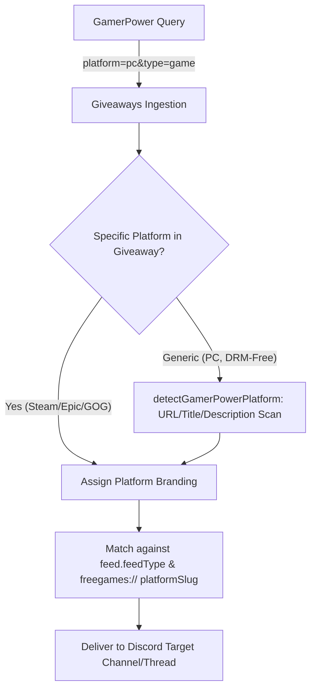

# BUGS — Bug & Issue Tracker

> This file is the **bug & issue tracker** for HELIX Discord Bot. It tracks active bugs
> and issues being addressed. Complements `PLAN` (roadmap) and `TODO`
> (task checklist). Remote, user-facing work is tracked as GitHub issues/roadmaps per
> Rule 04 (`remote-issue-protocol`).

## Status Legend

| Status | Meaning |
|---|---|
| 🟥 Open | Actively being worked on / unverified |
| 🟨 In Verification | Fix implemented, undergoing verification gate & testing |
| 🟩 Resolved | Verified passing `npm run check` and committed |

---

## 🐛 Open / In Progress Bugs

### 1. Free Game Alerts Fail or Are Hit-or-Miss on Individual Storefronts 🟨 In Verification

- **Reported Issue**: "free game alerts only seem to work when all platfroms is chosen. individual platforms are hit or miss."
- **Root Cause**:
  1. GamerPower upstream endpoint does not accept platform-specific queries for several storefronts (`platform=indiegala`, `platform=humble`, `platform=prime` return HTTP 404).
  2. In `src/feed/watcher.ts`, `pollFreeGamesLocked` evaluated `lowerUrl.includes('epic')` in its very first condition before inspecting `feed.feedType`. Since feeds created via Discord slash commands had default fallback `url: 'https://store.epicgames.com'`, all feeds were coerced to `platformKey = 'epic'`, ignoring Steam, GOG, Prime, and IndieGala entirely.
  3. GamerPower categorizes many giveaways under a generic `platforms: 'PC, DRM-Free'` string without the specific storefront name in the platform property.
- **Resolution**:
  - Queried `platform=pc&type=game` on GamerPower (returns all active giveaways with zero 404 errors).
  - Added `detectGamerPowerPlatform` in `src/feed/freegames.ts` analyzing titles, giveaway URLs, and instructions.
  - Fixed `watcher.ts` platformKey resolution to check `feedType` and `freegames://` URLs first.
  - Updated `/free-games` slash command in `src/bot/commands/feeds/free-games.ts` to store `url: freegames://${platformSlug}` and added choices for IndieGala, Itch.io, EA App, and Battle.net.
- **Affected Files**:
  - [`src/feed/freegames.ts`](file:///d:/Projects/HELIX-Discord-Bot/src/feed/freegames.ts)
  - [`src/feed/watcher.ts`](file:///d:/Projects/HELIX-Discord-Bot/src/feed/watcher.ts)
  - [`src/bot/commands/feeds/free-games.ts`](file:///d:/Projects/HELIX-Discord-Bot/src/bot/commands/feeds/free-games.ts)
  - [`tests/unit/feed/freegames.test.ts`](file:///d:/Projects/HELIX-Discord-Bot/tests/unit/feed/freegames.test.ts)



---

### 2. Free Game Embed Overwrites Storefront Platform Information When All Platforms Selected 🟨 In Verification

- **Reported Issue**: "the all platforms one shouldn't replace the platform information in the embeds. right now it's replacing the footer information."
- **Root Cause**: `freeGameEmbed` in `src/bot/utils/embeds.ts` always overrode the footer text with `${feedTitle} · Weekly Free Games` whenever `feedTitle` was provided. When the feed title was "Free Games (All Stores & Giveaways)", this replaced the game's actual platform name and icon.
- **Resolution**:
  - Added `isGenericOrAllTitle` check in `src/bot/utils/embeds.ts`.
  - When the feed title is generic or represents "All Stores & Giveaways" / "All Platforms", the embed footer strictly retains the game's individual storefront platform name (`${branding.name} · Free Games`) and icon (`branding.iconUrl`).
- **Affected Files**:
  - [`src/bot/utils/embeds.ts`](file:///d:/Projects/HELIX-Discord-Bot/src/bot/utils/embeds.ts)
  - [`tests/unit/feed/freegames.test.ts`](file:///d:/Projects/HELIX-Discord-Bot/tests/unit/feed/freegames.test.ts)

---

### 3. Dashboard Free Games & Reddit Tabs Lack One-Click Pill Catalog Options 🟨 In Verification

- **Reported Issue**: "we should adjust the page to use pill sections to enable the options as well, just like the reddit and news feed tabs."
- **Root Cause**: The Free Games and Reddit tabs on the web dashboard required manual input and lacked quick one-click catalog activation sections (`feed-pill`), unlike the News feeds catalog.
- **Resolution**:
  - Added `#freegames-options-container` to the Free Games tab in `src/dashboard/views/dashboard/sources.ts`.
  - Added `#reddit-presets-container` to the Reddit tab in `src/dashboard/views/dashboard/sources.ts`.
  - Implemented dynamic client-side rendering (`renderFreeGamesOptions`, `renderRedditPresets`) and one-click enablement (`enableFreeGamesOption`, `enableRedditPreset`) in `src/dashboard/views/dashboard/clientScript.ts`.
  - Updated feed add and delete callbacks so pill catalogs re-render immediately to reflect active subscriptions.
- **Affected Files**:
  - [`src/dashboard/views/dashboard/sources.ts`](file:///d:/Projects/HELIX-Discord-Bot/src/dashboard/views/dashboard/sources.ts)
  - [`src/dashboard/views/dashboard/clientScript.ts`](file:///d:/Projects/HELIX-Discord-Bot/src/dashboard/views/dashboard/clientScript.ts)
  - [`tests/unit/dashboard/views.test.ts`](file:///d:/Projects/HELIX-Discord-Bot/tests/unit/dashboard/views.test.ts)

---

### 4. Command Toggles Ineffective & Do Not Unregister Commands or Gate Dashboard Pages 🟨 In Verification

- **Reported Issue**: "the command toggles have absolutley no effect. they are suppose to enable or disabled the selected commands and their related features... when i say features i mean that any command that has it's own dashboard page should also have it's dashboard page hidden when the command is disabled... no error embed if command disabled. the command should be unregistered if it is disabled and the registration should be automatically applied to the guild."
- **Root Cause**: Disabled command settings were stored in database settings, but the bot never re-registered guild commands to prune disabled commands from Discord's guild registration, and the dashboard navigation never hid pages corresponding to disabled features.
- **Resolution**:
  - Implemented dynamic guild-level unregistration via `guild.commands.set` in `src/bot/handlers/commands.ts` & `registry.ts`.
  - Disabled commands are completely unregistered at the Discord API level with zero error embeds required.
  - Dynamically hid associated dashboard pages in `src/dashboard/views/dashboard/sidebar.ts` and `clientScript.ts`:
    - Feeds page hidden when `feed` is disabled
    - Stream alerts page hidden when both `youtube` and `twitch` are disabled
    - Welcome page hidden when `welcome` is disabled
    - Tickets page hidden when `ticket` is disabled
    - Logs page hidden when `logs` is disabled
- **Affected Files**:
  - [`src/bot/handlers/commands.ts`](file:///d:/Projects/HELIX-Discord-Bot/src/bot/handlers/commands.ts)
  - [`src/bot/handlers/registry.ts`](file:///d:/Projects/HELIX-Discord-Bot/src/bot/handlers/registry.ts)
  - [`src/dashboard/views/dashboard/sidebar.ts`](file:///d:/Projects/HELIX-Discord-Bot/src/dashboard/views/dashboard/sidebar.ts)
  - [`src/dashboard/views/dashboard/clientScript.ts`](file:///d:/Projects/HELIX-Discord-Bot/src/dashboard/views/dashboard/clientScript.ts)
  - [`tests/unit/admin/commandToggles.test.ts`](file:///d:/Projects/HELIX-Discord-Bot/tests/unit/admin/commandToggles.test.ts)

---

### 5. Ticket Setup Message Placeholder Displays "this server" Instead of Guild Name 🟨 In Verification

- **Reported Issue**: "also the ticket message needs to support placeholders... issue with the placholder output.s instead of displaying the server name `{server}` is showin `this server`. that is wrong... discord js can get the guild name by using guild.name so it is not incorrect to assume that the bot can get it's own name"
- **Root Cause**: Placeholder substitution in `src/bot/utils/placeholders.ts` defaulted to static string `'this server'` instead of inspecting `guild.name`.
- **Resolution**:
  - Dynamically resolve `guild.name` via the discord.js Guild object.
  - Added support for `{server}`, `{guild}`, `{user}`, `{member}`, `{channel}`, and `{time}` across ticket setup messages and live dashboard preview.
- **Affected Files**:
  - [`src/bot/utils/placeholders.ts`](file:///d:/Projects/HELIX-Discord-Bot/src/bot/utils/placeholders.ts)
  - [`src/bot/commands/admin/ticket.ts`](file:///d:/Projects/HELIX-Discord-Bot/src/bot/commands/admin/ticket.ts)
  - [`src/dashboard/views/dashboard/clientScript.ts`](file:///d:/Projects/HELIX-Discord-Bot/src/dashboard/views/dashboard/clientScript.ts)
  - [`tests/unit/bot/placeholders.test.ts`](file:///d:/Projects/HELIX-Discord-Bot/tests/unit/bot/placeholders.test.ts)

---

## 🛠️ Verification Gate

Before closing any bug or merging to remote, the unified verification gate must pass:
```bash
npm run check    # typecheck + format:check + lint + tests (must pass 100%)
npm run build    # tsc compile to dist/ (must pass)
```