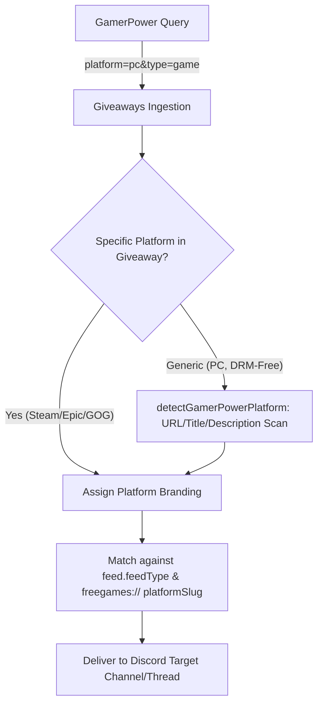

# 🐛 BUGS

> [!IMPORTANT]
> All known bugs are listed here. Keep in mind, that if a bug is missing, it may not have been discovered or reported yet.
>
> The repository maintainers (and contributors) actively search for new bugs and update this document accordingly. In some cases, a bug will be spotted and fixed without this page being immediately updated. This page is primarily a living index and may not always reflect the most current state of the codebase.
>
> AI agents are strongly advised to update this page first and push it to the remote before working on any new bug fixes or features. This way the remote repository always has the most up-to-date list of known issues.

## 📖 Legend

### 🚦 Status

- ⚠️ **open** — reproducible, needs fixing *(Detailed lists with possible fixes encouraged. Attempt to include steps to reproduce, expected behavior, and actual behavior. An estimate of how long it might take to fix is also helpful.)*
- 🚧 **investigating** — repro/root-cause in progress *(List of issues currently being worked on. Used for tracking active work. must reference an existing bug from the open section.)*
- 🚫 **wontfix** — accepted limitations *(features that can't be fixed at this time without significant changes or trade-offs)*
- ✅ **resolved** — verified and fixed *(moved to closed with the corresponding release version or commit)*

### 🚨 Severity

- 🔴 **Critical**: *Bugs that cause crashes or major functionality loss.*
- 🟠 **High**: *Bugs that significantly impact usability but do not crash the app.*
- 🟡 **Medium**: *Bugs that affect certain features or have minor usability issues.*
- 🟢 **Low**: *Minor bugs or visual glitches that do not significantly impact the user experience.*

## 🚫 Known quirks & external limitations (wontfix bucket)

- 🐢 **External Feed Throttling & Rate Limits:** Upstream APIs (Reddit, YouTube, Twitch, GamerPower) enforce rate limits. Handlers and background workers throttle requests and implement exponential backoff rather than spam-retrying.
- **Discord API Gateway & Rate Limits:** Discord enforces global and route-specific rate limits on interaction responses, guild command syncs, and embeds. Guild command updates must be debounced.

## 💡 Explicitly not bugs

- Disabled features intentionally hide their corresponding dashboard navigation links and unregister their slash commands from Discord guilds rather than rendering disabled error embeds.

## ⚠️ Open

*No open bugs currently reported.*

## 🚧 Investigating

### 1. Free Game Alerts Fail or Are Hit-or-Miss on Individual Storefronts

- **Severity**: 🟠 High (Feed Delivery / Free Games)
- **Status**: 🚧 investigating (in verification)
- **Reported Issue**: "free game alerts only seem to work when all platfroms is chosen. individual platforms are hit or miss."
- **Root Cause**:
  1. GamerPower upstream endpoint does not accept platform-specific queries for several storefronts (`platform=indiegala`, `platform=humble`, `platform=prime` return HTTP 404).
  2. In `src/feed/watcher.ts`, `pollFreeGamesLocked` evaluated `lowerUrl.includes('epic')` in its very first condition before inspecting `feed.feedType`. Since feeds created via Discord slash commands had default fallback `url: 'https://store.epicgames.com'`, all feeds were coerced to `platformKey = 'epic'`, ignoring Steam, GOG, Prime, and IndieGala entirely.
  3. GamerPower categorizes many giveaways under a generic `platforms: 'PC, DRM-Free'` string without the specific storefront name in the platform property.
- **Resolution**:
  - Queried `platform=pc&type=game` on GamerPower (returns all active giveaways with zero 404 errors).
  - Added `detectGamerPowerPlatform` in `src/feed/freegames.ts` analyzing titles, giveaway URLs, and instructions.
  - Fixed `watcher.ts` platformKey resolution to check `feedType` and `freegames://` URLs first.
  - Updated `/free-games` slash command in `src/bot/commands/feeds/free-games.ts` to store `url: freegames://${platformSlug}` and added choices for IndieGala, Itch.io, EA App, and Battle.net.
- **Affected Files**:
  - [`src/feed/freegames.ts`](file:///d:/Projects/HELIX-Discord-Bot/src/feed/freegames.ts)
  - [`src/feed/watcher.ts`](file:///d:/Projects/HELIX-Discord-Bot/src/feed/watcher.ts)
  - [`src/bot/commands/feeds/free-games.ts`](file:///d:/Projects/HELIX-Discord-Bot/src/bot/commands/feeds/free-games.ts)
  - [`tests/unit/feed/freegames.test.ts`](file:///d:/Projects/HELIX-Discord-Bot/tests/unit/feed/freegames.test.ts)


```mermaid
flowchart TD
    A["GamerPower Query"] -->|"platform=pc&type=game"| B["Giveaways Ingestion"]
    B --> C{"Specific Platform in Giveaway?"}
    C -->|"Yes (Steam/Epic/GOG)"| D["Assign Platform Branding"]
    C -->|"Generic (PC, DRM-Free)"| E["detectGamerPowerPlatform: URL/Title/Description Scan"]
    E --> D
    D --> F["Match against feed.feedType & freegames:// platformSlug"]
    F --> G["Deliver to Discord Target Channel/Thread"]
```

### 2. Free Game Embed Overwrites Storefront Platform Information When All Platforms Selected

- **Severity**: 🟡 Medium (Embed Formatting)
- **Status**: 🚧 investigating (in verification)
- **Reported Issue**: "the all platforms one shouldn't replace the platform information in the embeds. right now it's replacing the footer information."
- **Root Cause**: `freeGameEmbed` in `src/bot/utils/embeds.ts` always overrode the footer text with `${feedTitle} · Weekly Free Games` whenever `feedTitle` was provided. When the feed title was "Free Games (All Stores & Giveaways)", this replaced the game's actual platform name and icon.
- **Resolution**:
  - Added `isGenericOrAllTitle` check in `src/bot/utils/embeds.ts`.
  - When the feed title is generic or represents "All Stores & Giveaways" / "All Platforms", the embed footer strictly retains the game's individual storefront platform name (`${branding.name} · Free Games`) and icon (`branding.iconUrl`).
- **Affected Files**:
  - [`src/bot/utils/embeds.ts`](file:///d:/Projects/HELIX-Discord-Bot/src/bot/utils/embeds.ts)
  - [`tests/unit/feed/freegames.test.ts`](file:///d:/Projects/HELIX-Discord-Bot/tests/unit/feed/freegames.test.ts)

### 3. Dashboard Free Games & Reddit Tabs Lack One-Click Pill Catalog Options

- **Severity**: 🟡 Medium (Dashboard Usability)
- **Status**: 🚧 investigating (in verification)
- **Reported Issue**: "we should adjust the page to use pill sections to enable the options as well, just like the reddit and news feed tabs."
- **Root Cause**: The Free Games and Reddit tabs on the web dashboard required manual input and lacked quick one-click catalog activation sections (`feed-pill`), unlike the News feeds catalog.
- **Resolution**:
  - Added `#freegames-options-container` to the Free Games tab in `src/dashboard/views/dashboard/sources.ts`.
  - Added `#reddit-presets-container` to the Reddit tab in `src/dashboard/views/dashboard/sources.ts`.
  - Implemented dynamic client-side rendering (`renderFreeGamesOptions`, `renderRedditPresets`) and one-click enablement (`enableFreeGamesOption`, `enableRedditPreset`) in `src/dashboard/views/dashboard/clientScript.ts`.
  - Updated feed add and delete callbacks so pill catalogs re-render immediately to reflect active subscriptions.
- **Affected Files**:
  - [`src/dashboard/views/dashboard/sources.ts`](file:///d:/Projects/HELIX-Discord-Bot/src/dashboard/views/dashboard/sources.ts)
  - [`src/dashboard/views/dashboard/clientScript.ts`](file:///d:/Projects/HELIX-Discord-Bot/src/dashboard/views/dashboard/clientScript.ts)
  - [`tests/unit/dashboard/views.test.ts`](file:///d:/Projects/HELIX-Discord-Bot/tests/unit/dashboard/views.test.ts)

### 4. Ticket Setup Message Placeholder Displays "this server" Instead of Guild Name

- **Severity**: 🟡 Medium (Placeholders / Config)
- **Status**: 🚧 investigating (in verification)
- **Reported Issue**: "also the ticket message needs to support placeholders... issue with the placholder output.s instead of displaying the server name `{server}` is showin `this server`. that is wrong... discord js can get the guild name by using guild.name so it is not incorrect to assume that the bot can get it's own name"
- **Root Cause**: Placeholder substitution in `src/bot/utils/placeholders.ts` defaulted to static string `'this server'` instead of inspecting `guild.name`.
- **Resolution**:
  - Dynamically resolve `guild.name` via the discord.js Guild object.
  - Added support for `{server}`, `{guild}`, `{user}`, `{member}`, `{channel}`, and `{time}` across ticket setup messages and live dashboard preview.
- **Affected Files**:
  - [`src/bot/utils/placeholders.ts`](file:///d:/Projects/HELIX-Discord-Bot/src/bot/utils/placeholders.ts)
  - [`src/bot/commands/admin/ticket.ts`](file:///d:/Projects/HELIX-Discord-Bot/src/bot/commands/admin/ticket.ts)
  - [`src/dashboard/views/dashboard/clientScript.ts`](file:///d:/Projects/HELIX-Discord-Bot/src/dashboard/views/dashboard/clientScript.ts)
  - [`tests/unit/bot/placeholders.test.ts`](file:///d:/Projects/HELIX-Discord-Bot/tests/unit/bot/placeholders.test.ts)

## ✅ Closed

### 2026-10-02 — GitHub Push Webhook Delivery Fails (Cloudflare WAF / Managed Rule Block)

- **Severity**: 🟠 High (Feed Delivery / Webhooks)
- **Status**: ✅ resolved (External / Cloudflare Configuration Resolved)
- **Reported Issue**: GitHub organization push webhook (`https://helix-bot.helix-origin.club/api/feeds/webhooks/github`) failed to deliver or returned `500` / blocked errors.
- **Root Cause**: Cloudflare proxy/WAF configuration blocked upstream GitHub webhook POST requests from reaching the bot.
- **Resolution**: Resolved via Cloudflare WAF / firewall rule configuration adjustment on the domain proxy. Codebase was also hardened with foreign-key sanitization in commit `41cb717`.
- **Affected Files**:
  - [`src/dashboard/routes/feeds.ts`](file:///d:/Projects/HELIX-Discord-Bot/src/dashboard/routes/feeds.ts)
  - [`src/db/repositories/settings.ts`](file:///d:/Projects/HELIX-Discord-Bot/src/db/repositories/settings.ts)
  - [`src/feed/github.ts`](file:///d:/Projects/HELIX-Discord-Bot/src/feed/github.ts)

### 2026-10-02 — Command Toggles Ineffective & Do Not Unregister Commands or Gate Dashboard Pages

- **Severity**: 🟠 High (Dashboard & Command Management)
- **Status**: ✅ resolved (Obsolete / Feature Removed)
- **Reported Issue**: Command toggles in dashboard were ineffective and did not dynamically unregister commands from guild or gate pages.
- **Resolution**: Command toggles were completely removed from HELIX Discord Bot architecture; commands and feature routing no longer use toggle configuration.

## 🛠️ Verification Gate

Before closing any bug or merging to remote, the unified verification gate must pass:
```bash
npm run check    # typecheck + format:check + lint + tests (must pass 100%)
npm run build    # tsc compile to dist/ (must pass)
```