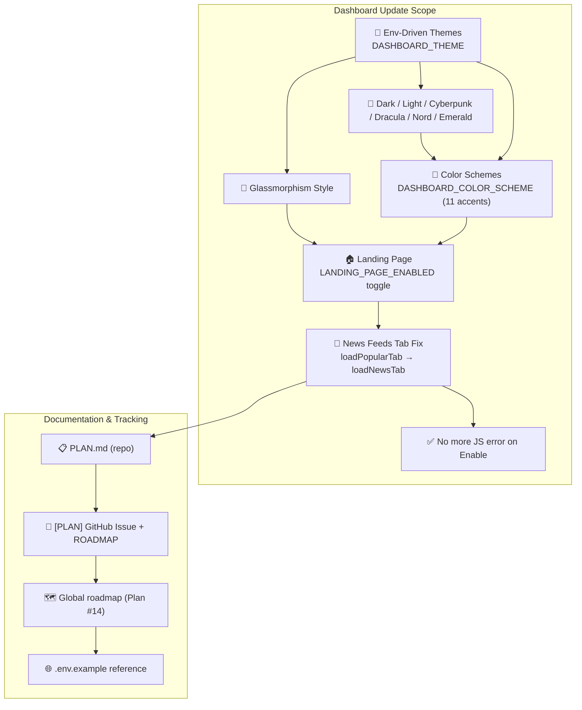

# 📋 PLAN — Env-Driven Dashboard Themes, Landing Page & News Feeds Fix

> 🏷️ **Tracking**: This plan is logged here (repo `PLAN.md`) and mirrored as a `[PLAN]` GitHub issue with a detailed ROADMAP.
> 🧭 **Protocol**: Roadmap-first tracking per `.agents/rules/remote-issue-protocol.md` (Rule 04). The first post of the issue is the roadmap; progress is recorded by editing it.

---

## 🎯 Objective

Deliver a **massive dashboard update** that makes every visual and structural preference **configuration-driven** (no in-dashboard editing) and repairs a regression introduced by renaming the *Popular Feeds* tab to **News Feeds**:

1. ✨ **Glassmorphism + theme options via env** — enable a glassmorphism-styled dashboard plus multiple named themes, set exclusively through environment variables.
2. 🎨 **Color schemes for every theme** — a removable accent palette that can be stacked on any theme.
3. 🏠 **Landing page toggle** — a marketing landing page switchable on/off via env.
4. 🐛 **News Feeds bug fix** — the renamed tab still triggered a call to the removed `loadPopularTab()` function, throwing an error after enabling a feed.

> ⚠️ **Design constraint**: All theme/landing configuration is handled via **`.env` only** — in-dashboard appearance changes are intentionally not user-editable from the Settings tab.

---

## 🗺️ Roadmap (Mermaid)

---

## ✅ Task Breakdown & Status

| # | Task | Status | Notes |
|---|------|--------|-------|
| 1 | Add optional env field for **glassmorphism** dashboard theme + other theme options | ✅ Done | `DASHBOARD_THEME` parsed in `src/config.ts`, applied in `dashboard.ts` / `login.ts` / `legal.ts` / `landing.ts` via `getThemeInfo()` |
| 2 | Include **various color schemes** for each theme | ✅ Done | `DASHBOARD_COLOR_SCHEME` + `getColorSchemeInfo()`; 11 accents: cyan, purple, blue, emerald, rose, amber, indigo, crimson, teal, sunset |
| 3 | Create a **landing page** enableable/disableable via env | ✅ Done | `LANDING_PAGE_ENABLED`; routes `/`, `/home`, `/landing` in `src/dashboard/server.ts`; view in `views/landing.ts` |
| 4 | **Fix** error caused by renaming *Popular* tab → **News Feeds** | ✅ Done | `src/dashboard/views/dashboard.ts`: `loadPopularTab()` → `loadNewsTab()`; removed stale `'popular'` tab alias |
| 5 | Log this plan to **`PLAN.md`** for proper tracking | ✅ Done | This file |
| 6 | Create the **plan issue on the repo** with a detailed ROADMAP | 🚧 In progress | `[PLAN]` issue via `gh` (Rule 04) |
| 7 | Sync global roadmap, AGENTS.md & `.env.example` | ✅ Done | `.agents/plans/roadmap.md`, `AGENTS.md` Current Issues, `.env.example` reference |

---

## 🔧 Configuration Reference

| Env Variable | Default | Values | Effect |
|---|---|---|---|
| `DASHBOARD_THEME` | `dark` | `glassmorphism` · `dark` · `light` · `cyberpunk` · `dracula` · `nord` · `emerald` | Sets the dashboard theme across all views |
| `DASHBOARD_COLOR_SCHEME` | `default` | `default` · `cyan` · `purple` · `blue` · `emerald` · `rose` · `amber` · `indigo` · `crimson` · `teal` · `sunset` | Accent/accent-color overlay on top of the selected theme |
| `LANDING_PAGE_ENABLED` | `true` | `true` · `false` | When `false`, `/` redirects straight to `/dashboard` |

Aliases supported for backwards compatibility: `DEFAULT_THEME` / `THEME`, `COLOR_SCHEME` / `ACCENT_COLOR`, `ENABLE_LANDING_PAGE`.

---

## 🧭 Files Touched

- `src/config.ts` — parsed `defaultTheme`, `dashboardColorScheme`, `landingPageEnabled`
- `src/dashboard/views/dashboard.ts` — theme + scheme CSS engine, header badge, News Feeds bug fix
- `src/dashboard/views/landing.ts` — new landing page view (theme-aware)
- `src/dashboard/views/login.ts`, `legal.ts` — theme-aware auth/legal pages
- `src/dashboard/server.ts` — `/`, `/home`, `/landing` routes gated by `landingPageEnabled`
- `.env.example` — documented the new variables

---

## ✅ Verification

- `npm run check` (typecheck + prettier + eslint) ✔ — must pass before submitting.
- Manual smoke: load `/` with `LANDING_PAGE_ENABLED=true/false`; switch `DASHBOARD_THEME` variants; enable a News Feeds preset and confirm no `loadPopularTab is not defined` error.