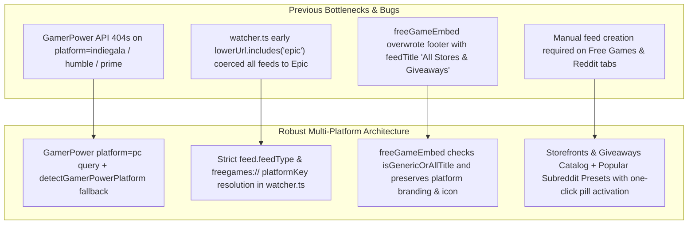

# HELIX Discord Bot — Current Session Plan

> 🏷️ **Tracking**: Session/roadmap planning companion to `TODO` (task checklist) and `BUGS` (bug & issue tracker). Roadmap issue: [#27](https://github.com/HELIX-Origin/HELIX-Discord-Bot/issues/27).

---

## 🎯 Active Plan

### Goal — Free Games Reliability, Storefront Platform Parity & Dashboard Pill Catalogs

Resolve hit-or-miss individual storefront alerts (`steam`, `epic`, `gog`, `indiegala`, `humble`, `itchio`, `ubisoft`, `prime`, `ea`, `battlenet`), ensure embed footers retain individual game storefront branding when "All Platforms" is selected, and add one-click pill catalog sections to the Free Games and Reddit dashboard tabs.

**Locked user directives** (do not re-litigate):

- **Storefront reliability**: "free game alerts only seem to work when all platfroms is chosen. individual platforms are hit or miss."
- **Embed footer retention**: "the all platforms one shouldn't replace the platform information in the embeds. right now it's replacing the footer information."
- **Pill sections parity**: "we should adjust the page to use pill sections to enable the options as well, just like the reddit and news feed tabs."

---

### Architectural Analysis: Root Causes & Target Architecture

1. **GamerPower API Queries & Platform Detection**:
   - Querying GamerPower with `platform=indiegala`, `platform=humble`, or `platform=prime` resulted in HTTP 404 responses.
   - Solution: Query `platform=pc&type=game` which returns all active giveaways across all PC storefronts without HTTP 404s, and use `detectGamerPowerPlatform` to inspect titles, URLs, and descriptions, resolving storefront even when GamerPower marks as `PC, DRM-Free`.
2. **Watcher URL Resolution**:
   - `watcher.ts` evaluated `lowerUrl.includes('epic')` before checking `feed.feedType`. Feeds created via Discord slash commands had `url: 'https://store.epicgames.com'`, causing all feeds to be treated as Epic.
   - Solution: Strictly check `feed.feedType` (`free_games_steam`, etc.) and `freegames://${slug}` URLs first.
3. **Embed Footer Platform Retention**:
   - `freeGameEmbed` set `footer.text = `${feedTitle} · Weekly Free Games``. When `feedTitle` was "Free Games (All Stores & Giveaways)", this replaced the game's actual platform name and icon.
   - Solution: Add `isGenericOrAllTitle` check. For generic or all-platforms feeds, footer text preserves `${branding.name} · Free Games` and `branding.iconUrl`.
4. **Dashboard Pill Sections**:
   - Add `#freegames-options-container` to Free Games tab and `#reddit-presets-container` to Reddit tab.
   - Dynamic JavaScript hooks `renderFreeGamesOptions`, `enableFreeGamesOption`, `renderRedditPresets`, and `enableRedditPreset`.

---

### Implementation & Verification Checklist

- [x] `src/feed/freegames.ts`: Overhaul storefront fetching, detect dedicated storefronts, add `'pc'` to `PLATFORM_BRANDING`
- [x] `src/feed/watcher.ts`: Strict `feed.feedType` matching in `pollFreeGamesLocked`
- [x] `src/bot/commands/feeds/free-games.ts`: `freegames://${platformSlug}` URLs, expanded platform choices
- [x] `src/bot/utils/embeds.ts`: Embed footer platform retention
- [x] `src/dashboard/views/dashboard/sources.ts`: `#freegames-options-container` & `#reddit-presets-container`
- [x] `src/dashboard/views/dashboard/clientScript.ts`: Pill rendering & activation logic
- [x] `tests/unit/feed/freegames.test.ts`: New unit tests for multi-storefront fetching and embed footer retention
- [x] `tests/unit/dashboard/views.test.ts` & `tests/unit/feed/watcher.test.ts`: Updated tests
- [ ] Export `FetchResult` in `src/feed/fetch.ts` and pass `npm run check` and `npm run build`
- [ ] Git commit and push

---

### Files Touched

- `src/feed/freegames.ts`
- `src/feed/fetch.ts`
- `src/feed/watcher.ts`
- `src/bot/commands/feeds/free-games.ts`
- `src/bot/utils/embeds.ts`
- `src/dashboard/views/dashboard/sources.ts`
- `src/dashboard/views/dashboard/clientScript.ts`
- `tests/unit/feed/freegames.test.ts`
- `tests/unit/feed/watcher.test.ts`
- `tests/unit/dashboard/views.test.ts`
- `tests/unit/admin/commandToggles.test.ts`

---

## 📦 Past Completed Workstreams (Archived)

- **Command Toggles, Feature Gating & Dynamic Guild Command Registration** (guild-level slash command unregistration for disabled commands, dynamic dashboard page hiding for disabled feature tabs).
- **Ticket Message Placeholders & Dynamic Guild Resolution** (`{server}`, `{guild}`, `{user}`, `{member}`, `{channel}`, `{time}` placeholders, dynamic `guild.name` resolution).
- **Optional Embed Support for Ticket Message Setup** (ticket setup slash command, embed format toggle, simulated Discord embed preview).
- **Stream Alerts Audit, Zero-Config YouTube Ingestion & Rich Twitch Metadata** (YouTube Atom parsing, Twitch live stream extraction, rich embed formatting).
- **Dashboard UI Window-Fitting & Simulated Discord Previews** (responsive 2-column layout for Welcome and Tickets tabs; real-time simulated Discord preview cards; tab carryover fix; options modularization).
- **Real-Time Single-Newest-Post Feed Delivery & Rate-Limit Shield** (delivered strictly the single newest post per polling cycle across all feed types; backlog draining; removed artificial 6h floor; Reddit persistent community home post filter).
- **Guild Admin Sections & Dedicated Tabs** (welcome, tickets, logs, manage-feeds tabs; ticket text-channel button; forum-to-thread refactor; role subscriptions).
- **Theme System Single Source of Truth** (`src/dashboard/views/themes/*.ts`, removed duplicate scheme layer).
- **Dead Code Cleanup & Vitest Structural Scan Guard** (`tests/unit/quality/deadCode.test.ts`).

---

## 🔖 Metadata

- **Project**: HELIX Discord Bot · **version** 0.6.0
- **Repos**: `HELIX-Discord-Bot`.