# HELIX Discord Bot — Current Session Plan

> 🏷️ **Tracking**: Session/roadmap planning companion to `TODO` (task checklist) and `BUGS` (bug & issue tracker). Roadmap issue: [#27](https://github.com/HELIX-Origin/HELIX-Discord-Bot/issues/27).

---

## 🎯 Active Plan

### Goal — Real-Time Single-Newest-Post Feed Delivery & Rate-Limit Shield

Modernize feed delivery across all feed types (RSS/Atom, Scrape, Reddit, Free Games, YouTube, Twitch) so feeds are not bound by artificial multi-hour poll interval floors or once-per-day quotas. Feeds pick up new posts as they arrive and deliver **strictly the single newest post** per feed check cycle. This ensures Discord channels stay continuously up-to-date in near-real-time while eliminating backlog dumps of 10–20 posts at once and completely avoiding Discord channel rate limits.

**Locked user directives** (do not re-litigate):

- **No poll interval limitation**: "All feeds should not be limited by poll intervals. Instead they should pick up new posts as they arrive and post them."
- **Single newest post on arrival**: "We should make sure they post the single newest post as it comes in. That way they are always up to date and aren't posting 10 to 20 posts at a time."
- **Rate-limit prevention & information integrity**: "this is the correct way to handle the rate limiting problem while still ensuring they don't miss information. We should prepare a plan in our PLAN.md for this update, as well as update our TODO.md accordingly."
- **File naming scheme**: camelCase file naming across the codebase (e.g., `manageFeeds.ts`).

---

### Architectural Analysis: Current Bottlenecks vs. Target Solution

```mermaid
flowchart TD
    subgraph Current["Current Polling & Delivery Bottlenecks"]
        A1["Long Poll Interval (Default 1 Hour)"] --> B1["Artificial Rate Floor (6h + Once Per UTC Day)"]
        B1 --> C1["Backlog Inversion: Reverses to Oldest Post First"]
        C1 --> D1["Channels Fall Behind / Bursts of 10-20 Posts (Free Games / Stream Alerts)"]
    end

    subgraph Target["Target Real-Time Single-Post Shield"]
        A2["Near-Real-Time Cadence (Webhooks + 1-2m Background Check)"] --> B2["Detect Unseen Posts in Chronological Order"]
        B2 --> C2["Select Single Newest Unposted Entry"]
        C2 --> D2["Deliver 1 Embed to Discord Target/Thread"]
        D2 --> E2["Drain Backlog: Mark Remaining Unseen as Sent & Advance Cursor"]
        E2 --> F2["Zero Channel Flooding & 100% Rate Limit Safe"]
    end
```

1. **Current Bottlenecks**:
   - `RSS_POST_INTERVAL_FLOOR_MS = 6 * 60 * 60 * 1000` artificially blocks delivery if a post occurred in the last 6 hours or on the same UTC calendar day.
   - Long default interval (`pollIntervalMs = 3_600_000`, 1 hour) delays fresh updates.
   - When multiple posts accumulate, free games and stream alerts iterate through `toSend` and attempt to blast all entries in a tight loop, triggering Discord API 429s.
   - RSS feeds reverse entries to oldest first (`toSend.reverse()`) and post only `toSend[0]`, meaning channels receive hours- or days-old news rather than breaking updates.
2. **Target Solution**:
   - Remove `RSS_POST_INTERVAL_FLOOR_MS` and UTC-day gating entirely.
   - Fast background check cadence (e.g., 60–120s polling interval) combined with WebSub/PubSubHubbub webhooks for instant event-driven delivery.
   - For any feed with unposted items, immediately deliver **only the single newest post** (`entries[0]` / newest publication timestamp).
   - Mark all unposted backlog items from that cycle as processed in `sent_entries` and update `lastEntryId`/`lastCheckedAt`/`lastPostedAt` so they do not accumulate into a delayed cascade.
   - Apply identical single-newest-post gating to Free Games and Stream Alerts (`pollStreamAlertFeed` / `pollFreeGamesLocked`) to eliminate multi-message bursts.
   - Add inter-feed pacing in `pollAllFeeds` / `pollGuildFeeds` to prevent concurrent Discord delivery spikes across multiple feeds.

---

### Implementation Plan

1. **Feed Watcher Core Refactor (`src/feed/watcher.ts`)**:
   - Delete `RSS_POST_INTERVAL_FLOOR_MS` and remove the `canPost` 6-hour / once-per-day restriction.
   - Refactor `pollFeedLocked`:
     - Sort/inspect parsed entries to locate the single newest unseen post.
     - Deliver only the newest post to the configured Discord channel or dedicated thread.
     - Bulk-mark all older unseen entries in this cycle as sent via `repo.markEntrySent` / `redis.markEntrySent` so backlog items do not leak into future cycles.
     - Update feed state (`setFeedPosted`, `setFeedChecked`) with the newest entry ID.
   - Refactor `pollFreeGamesLocked`:
     - Deliver only the single newest / most recent free game entry instead of looping through all unposted games.
     - Mark remaining unposted games as sent to prevent spamming 10+ games in one tick.
   - Refactor `pollStreamAlertFeed`:
     - Deliver only the single newest stream/video alert entry instead of looping through all unposted streams.
     - Mark remaining stream entries as sent.
   - Inter-feed delivery pacing: Introduce non-blocking staggered delays (e.g., 250ms) between feed dispatches in `pollAllFeeds` to remain well below Discord's global REST limits.

2. **Scheduler & Polling Cadence Update (`src/config.ts`, `src/index.ts`, `src/scheduler/scheduler.ts`)**:
   - Update default `pollIntervalMs` in `defaultConfig()` from `3_600_000` (1 hour) to `60_000` (1 minute) for responsive near-real-time checks.
   - Support `POLL_INTERVAL_MS` environment variable parsing in `defaultConfig()` so operators can configure custom frequencies.
   - In `pollFeedLocked`, allow checks to proceed smoothly without requiring a 1-hour delay between runs.

3. **Webhook & Event Alignment (`src/dashboard/webhooks/router.ts`)**:
   - Ensure webhook-driven ingestion (YouTube PubSubHubbub, Twitch EventSub, WebSub) adheres to the exact same single-newest-post delivery pattern and deduping logic.
   - Advance `lastEntryId` and mark entries sent upon webhook delivery.

4. **Testing & Quality Verification**:
   - Add unit tests in `tests/unit/feed/watcher.test.ts` covering:
     - Single newest post is selected and delivered when multiple entries are present.
     - Backlog older entries are marked as sent and not queued for future cycles.
     - No 6-hour or once-per-day artificial block prevents timely delivery.
     - Free games and stream alerts post only 1 newest entry per cycle.
     - Rapid successive polls deliver new arrivals immediately without duplicate posting.
   - Run complete validation gate: `npm run check` (typecheck, lint, formatting, tests).

---

### Files Touched

- `src/feed/watcher.ts`: Core delivery logic, removal of 6h floor, single newest post selection, backlog drain.
- `src/config.ts`: `pollIntervalMs` configuration update and env parsing.
- `src/index.ts`: Polling scheduler initialization check.
- `src/dashboard/webhooks/router.ts`: Parity check for webhook entry processing.
- `tests/unit/feed/watcher.test.ts`: Comprehensive test suite for real-time single-post delivery.

---

## 📦 Past Completed Workstreams (Archived)

- **Guild Admin Sections & Dedicated Tabs** (welcome, tickets, logs, manage-feeds tabs; ticket text-channel button; forum-to-thread refactor; role subscriptions).
- **Theme System Single Source of Truth** (`src/dashboard/views/themes/*.ts`, removed duplicate scheme layer).
- **Dead Code Cleanup & Vitest Structural Scan Guard** (`tests/unit/quality/deadCode.test.ts`).

---

## 🔖 Metadata

- **Project**: HELIX Discord Bot · **version** 0.5.0
- **Repos**: `HELIX-Discord-Bot`.