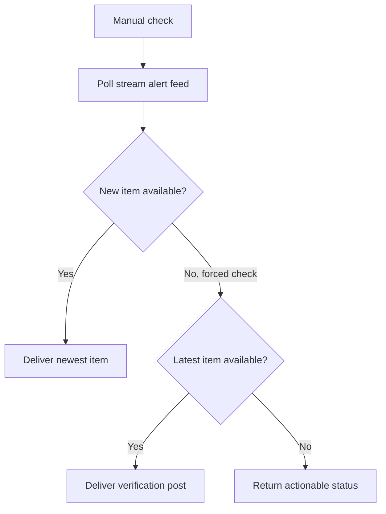
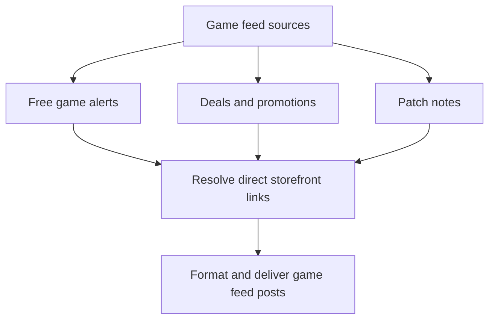

# HELIX Discord Bot — Sprint & Planning Log

> 🗺️ **Living Source of Truth**: This page records current sprint plans, implementation decisions, and completed work. See [`TODO.md`](./TODO.md) for workstream checklists, [`BUGS.md`](./BUGS.md) for open bugs, and [`ROADMAP.md`](./ROADMAP.md) for long-term milestones.

> [!IMPORTANT]
> Keep this page and related tracking files synchronized as work progresses. Record new work before implementation and update its status as decisions or scope change.

---

## 📜 Tracking Rules

- **Consistent Formatting**: Keep workstreams, directives, and checklists clear and actionable.
- **Regular Updates**: Update active plans as implementation progresses; move completed work into the completed section.
- **Cross-File Tracking**: Track implementation tasks in [`TODO.md`](./TODO.md), open bugs in [`BUGS.md`](./BUGS.md), and long-term architecture in [`ROADMAP.md`](./ROADMAP.md).
- **Universal Direct Store Links**: Every game alert, giveaway, or deal must resolve to the actual storefront page of the game.

---

## 🎯 Sprint 1: Stream Alerts Manual Trigger Delivery

> Ensure manual checks for YouTube and Twitch provide a useful latest-item verification post rather than silently returning nothing.

### 🧭 Delivery Flow


```mermaid
flowchart TD
    A["Manual check"] --> B["Poll stream alert feed"]
    B --> C{"New item available?"}
    C -->|Yes| D["Deliver newest item"]
    C -->|No, forced check| E{"Latest item available?"}
    E -->|Yes| F["Deliver verification post"]
    E -->|No| G["Return actionable status"]
```

### Root Cause Analysis

1. `src/feed/watcher.ts`: `pollStreamAlertFeed` checks `this.repo.isEntrySent(feed.id, entry.id)` and `redis.isEntrySent(...)`.
2. When a user clicks **Check Now** or invokes `/api/feeds/:id/poll`, the latest item may already have been delivered, or the channel may be offline, leaving `toSend` empty and producing no feedback.
3. A forced check should deliver the latest available video or broadcast when there are no new unposted items, with a clear verification indication.

### Implementation Checklist

- [ ] Pass `force = true` through manual polling to `pollStreamAlertFeed(userId, feed, force)`.
- [ ] When a forced check has no unposted entries, deliver the most recent available item as a verification post.
- [ ] Add tests in `tests/unit/feed/streamAlerts.test.ts` for forced delivery of the latest entry.
- [ ] Verify with `npm run check` and `npm run build`.

---

## 🎮 Sprint 2: Game Feeds Tab Evolution

> Plan the expansion of the Free Games tab into a Game Feeds area supporting free game alerts, deals and promotions, and patch notes.

### 🧭 Feature Flow


```mermaid
flowchart TD
    A["Game feed sources"] --> B["Free game alerts"]
    A --> C["Deals and promotions"]
    A --> D["Patch notes"]
    B --> E["Resolve direct storefront links"]
    C --> E
    D --> E
    E --> F["Format and deliver game feed posts"]
```

### Feature Scope

1. **Free Game Alerts**: 100% off giveaways and permanent claims (GamerPower and Epic Games Store API). Embeds show value, availability, platform, and a direct claim link without a footer.
2. **Deals and Promotions**: Discounted PC games that are not free. Embeds show discount, original and sale prices, savings, and a direct store link.
3. **Patch Notes**: Game updates, balance changes, and changelogs. Embeds show game title, version/build, highlights, and a direct changelog link.

### Architecture Checklist

- [ ] Define feed type keys in `src/state/types.ts` for `free_games_*`, `game_deals_*`, and `game_patchnotes_*`.
- [ ] Add deal and patch-note fetchers with universal direct-store URL resolution.
- [ ] Add `gameDealsEmbed` and `patchNotesEmbed`.
- [ ] Rename the dashboard tab to **Game Feeds** and add category filters and catalogs.
- [ ] Add Discord command support for all three categories.
- [ ] Update relevant wiki documentation and add parser/embed tests.

---

## ✅ Completed

### Free Games Provider-Based Architecture & Direct Store URL Resolution

- Restructured Free Game feeds around genuine providers (`GamerPower Free Game Alerts`, `Epic Games Store Official`, and `All Free Game Drops`).
- Removed the footer from `freeGameEmbed` and displayed the storefront platform in the `🏷️ Platform` field.
- Implemented `resolveDirectGiveawayUrl` to follow up to five redirects with timeout protection.
- Implemented `detectStorePlatform` for Steam, GOG, IndieGala, Stove, Epic Games Store, Itch.io, Humble Bundle, Ubisoft, EA App, Prime Gaming, and Battle.net.
- Added dedicated Stove branding and the `free_games_stove` feed type.
- Cleaned up reported typos in `BUGS.md`; the related implementation was verified by 387 passing Vitest tests.

---

## 🛠️ Verification Commands

```bash
npm run check
npm run build
npm test
```

---

## 🔖 Metadata

- **Project**: HELIX Discord Bot · **version** 0.6.0
- **Agent Ecosystem**: [`AGENTS.md`](./AGENTS.md) and [`.agents/`](.agents/) are tracked in the repository.
