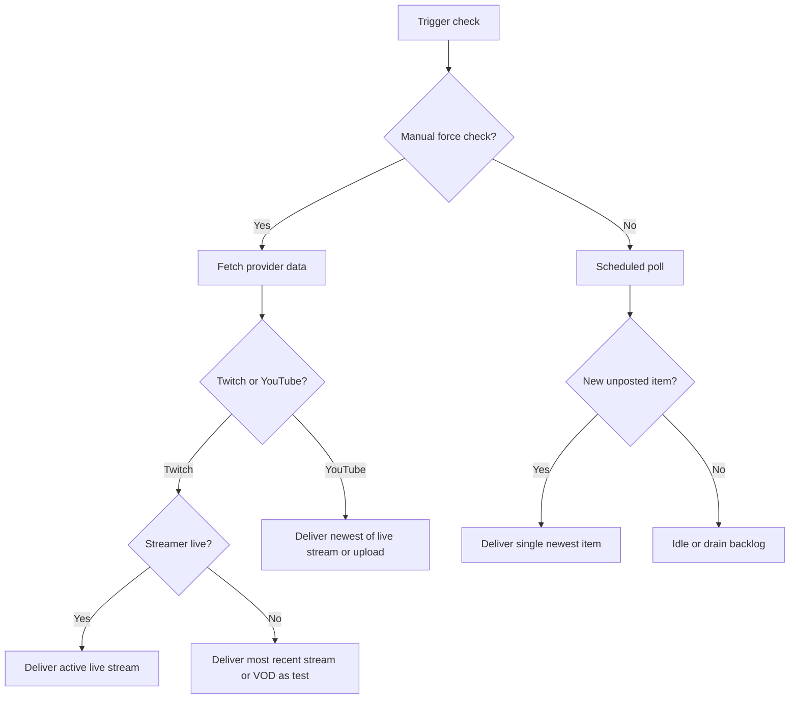
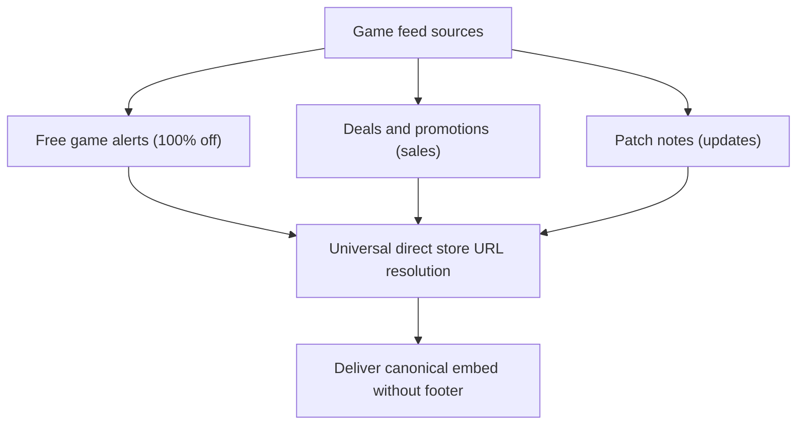

# HELIX Discord Bot — Sprint & Planning Log

> 🗺️ **Living Source of Truth**: This page records current sprint plans, implementation decisions, and completed work. See [`TODO.md`](./TODO.md) for workstream checklists, [`BUGS.md`](./BUGS.md) for open bugs, and [`ROADMAP.md`](./ROADMAP.md) for long-term milestones.

> [!IMPORTANT]
> AI agents strictly required to update this page and all related pages **before** working on any new bug fixes or features and push it to the remote first, without exception. Failure to do so may result in working with outdated information and potentially introducing conflicts or redundant work. 

---

## 📜 Tracking Rules

- **No Typo Duplication**: When recording user reports, clean and fix all typos to preserve professional quality.
- **Consistent Formatting**: Maintain consistent formatting and style throughout all documentation to ensure readability and professionalism.
- **Clear Sectioning**: Use clear and descriptive headers for each section to improve navigation and readability.
- **Active Items First**: The currently active milestone, sprint, task, or workstream must always be placed at the top of the content sections.
- **Regular Updates**: Ensure that the roadmap is regularly updated to reflect the latest developments and changes in the project.
- **Improve User Directives**: Continuously refine and clarify user directives to ensure they are easily understood and actionable.
- **Universal Direct Store Links**: Every game alert, giveaway, or deal **MUST** resolve to the actual storefront page of the game.
- **Always Track Everything**: Every new feature request, enhancement, or bug report must be logged in [`BUGS.md`](./BUGS.md), [`TODO.md`](./TODO.md), and [`ROADMAP.md`](./ROADMAP.md) before execution.

---

## 🎯 Active Sprints

### 🎯 Sprint 1: Stream Alerts Manual Trigger Delivery & Dual YouTube/Twitch Ingestion

> Ensure manual checks for YouTube and Twitch provide a useful latest-item verification post rather than silently returning nothing, differentiating between Twitch live broadcasts and YouTube live/upload feeds.

#### 📝 Tasks 


```mermaid
flowchart TD
    A["Trigger check"] --> B{"Manual force check?"}
    B -->|Yes| C["Fetch provider data"]
    B -->|No| D["Scheduled poll"]
    C --> E{"Twitch or YouTube?"}
    E -->|Twitch| F{"Streamer live?"}
    F -->|Yes| G["Deliver active live stream"]
    F -->|No| H["Deliver most recent stream or VOD as test"]
    E -->|YouTube| I["Deliver newest of live stream or upload"]
    D --> J{"New unposted item?"}
    J -->|Yes| K["Deliver single newest item"]
    J -->|No| L["Idle or drain backlog"]
```

1. **Parameter Propagation & Poller Dispatch**:
    - Pass force flag: Pass `force: boolean` through `pollFeed` to `pollStreamAlertFeed(userId, feed, force)`.
        - Verify `watcher.ts`: Update `pollFeed` call site to pass `force` when invoking `pollStreamAlertFeed`.
    - Handle forced empty backlog: When `force === true && toSend.length === 0`, select `entries[0]` for delivery.
        - Mark entry sent after delivery: Ensure cursor advancement and delivery records are maintained.

2. **Twitch Ingestion & Offline Test Fallback**:
    - Live stream query: Query `/helix/streams` for active broadcasts.
        - Offline VOD fallback on force: If streamer is offline and `force === true`, query `/helix/videos` to fetch the most recent stream or VOD.
    - Credential verification: Log actionable diagnostics if `TWITCH_CLIENT_ID` or `TWITCH_CLIENT_SECRET` are unset.
        - Prevent silent failures: Return a diagnostic status explaining credential or feed failure.

3. **YouTube Dual Ingestion (Live Streams & Uploads)**:
    - Ingest both media types: Extract both live broadcasts and video uploads from Atom XML / Data API v3.
        - Sort by published date: Select whichever item is newest (most recent live stream or latest upload).
    - Deliver latest on force: On manual trigger, deliver the most recent item immediately.
        - Public Atom feed robustness: Support channel ID, `@handle`, and custom URLs seamlessly.

---

### 🎮 Sprint 2: Game Feeds Tab Evolution

> Plan the expansion of the Free Games tab into a Game Feeds area supporting Free Game Alerts, Deals & Promotions, and Patch Notes.

#### 📝 Tasks 


```mermaid
flowchart TD
    A["Game feed sources"] --> B["Free game alerts (100% off)"]
    A --> C["Deals and promotions (sales)"]
    A --> D["Patch notes (updates)"]
    B --> E["Universal direct store URL resolution"]
    C --> E
    D --> E
    E --> F["Deliver canonical embed without footer"]
```

1. **Data Model & Type Registry**:
    - Extend FeedType union: Add `game_deals_*` and `game_patchnotes_*` to `src/state/types.ts`.
        - Database migration: Prepare category filter columns if necessary.
    - Preset definitions: Define catalog presets for top PC games and storefronts.

2. **Feed Fetchers & Direct URL Engine**:
    - Implement `src/feed/gamedeals.ts`: Query game sales with discount %, original price, sale price, and direct storefront links.
        - Universal Direct Store URL: Follow 3xx redirects to the final storefront URL.
    - Implement `src/feed/patchnotes.ts`: Query Steam Community announcements and game RSS changelogs.
        - Formatter: Extract patch version, update highlights, and direct changelog links.

3. **Discord Embeds & Web Dashboard UI**:
    - Embed formatters: Create `gameDealsEmbed` and `patchNotesEmbed` with matching author icons and zero footers.
        - Dashboard redesign: Rename "Free Games" tab to "Game Feeds" (`fa-gamepad`) with sub-category tabs.

---

## ✅ Completed Sprints

### Sprint: Free Games Provider-Based Architecture & Direct Store URL Resolution

- Restructured Free Game feeds around genuine providers (`GamerPower Free Game Alerts`, `Epic Games Store Official`, and `All Free Game Drops`).
- Removed the footer from `freeGameEmbed` and displayed the storefront platform in the `🏷️ Platform` field with matching author branding.
- Implemented `resolveDirectGiveawayUrl` to follow up to five redirects with timeout protection.
- Implemented `detectStorePlatform` for Steam, GOG, IndieGala, Stove, Epic Games Store, Itch.io, Humble Bundle, Ubisoft, EA App, Prime Gaming, and Battle.net.
- Added dedicated Stove branding and the `free_games_stove` feed type.
- Cleaned up reported user typos in `BUGS.md` and verified with 387 passing Vitest tests.

---

## 🛠️ Verification Commands

```bash
npm run check               # typecheck + format:check + lint + tests (must pass)
npm run build               # tsc compile to dist/ (must pass)
npm test                    # vitest run
```

---

## 🔖 Metadata

- **Project**: HELIX Discord Bot · **version** 0.6.0
- **Agent Ecosystem:** [`AGENTS`](./AGENTS) and [`.agents/`](.agents/) are tracked directly in repository git tracking.
