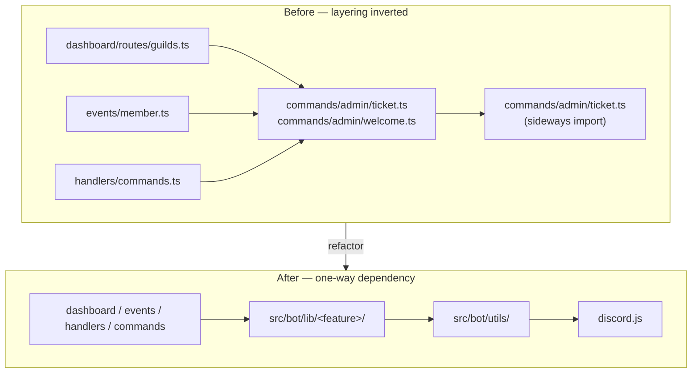
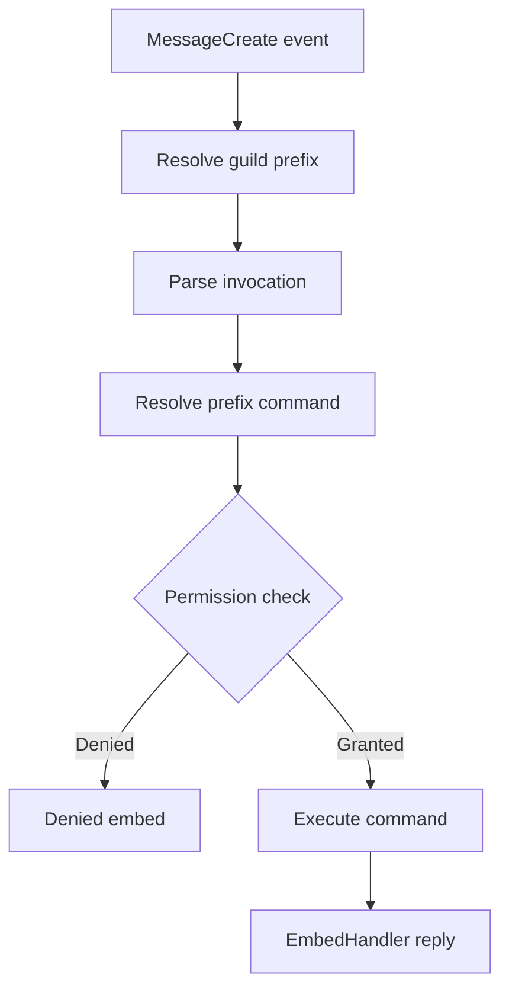

# HELIX Discord Bot — Sprint & Planning Log

> 🗺️ **Living Source of Truth**: This page records current sprint plans, implementation decisions, and completed work. See [`TODO.md`](./TODO.md) for workstream checklists, [`BUGS.md`](./BUGS.md) for open bugs, and [`ROADMAP.md`](./ROADMAP.md) for long-term milestones.

> [!IMPORTANT]
> AI agents strictly required to update this page and all related pages **before** working on any new bug fixes or features and push it to the remote first, without exception. Failure to do so may result in working with outdated information and potentially introducing conflicts or redundant work. 

---

## 📜 Tracking Rules

- **No Typo Duplication**: When recording user reports, clean and fix all typos to preserve professional quality.
- **Consistent Formatting**: Maintain consistent formatting and style throughout all documentation to ensure readability and professionalism.
- **Clear Sectioning**: Use clear and descriptive headers for each section to improve navigation and readability.
- **Active Items First**: The currently active milestone, sprint, task, or workstream must always be placed at the top of the content sections.
- **Regular Updates**: Ensure that the roadmap is regularly updated to reflect the latest developments and changes in the project.
- **Improve User Directives**: Continuously refine and clarify user directives to ensure they are easily understood and actionable.
- **Universal Direct Store Links**: Every game alert, giveaway, or deal **MUST** resolve to the actual storefront page of the game.
- **Always Track Everything**: Every new feature request, enhancement, or bug report must be logged in [`BUGS.md`](./BUGS.md), [`TODO.md`](./TODO.md), and [`ROADMAP.md`](./ROADMAP.md) before execution.

---

## 🎯 Active Sprints

### 🧩 Sprint 3: discord.js Standards Alignment & Command Boundary (W.16 / M.12) — Phase A

> Move non-command logic out of `src/bot/commands/` so those folders carry commands
> only (Rule 06 §3.1), then align command definitions and the interaction model with
> real discord.js v14. Phase A is behavior-preserving and unblocks W.13 Phases 2–3.

#### 📝 Phase A Architecture


```mermaid
flowchart TD
    subgraph Before["Before — layering inverted"]
        B1["dashboard/routes/guilds.ts"] --> B2["commands/admin/ticket.ts<br/>commands/admin/welcome.ts"]
        B3["events/member.ts"] --> B2
        B4["handlers/commands.ts"] --> B2
        B2 --> B5["commands/admin/ticket.ts<br/>(sideways import)"]
    end
    subgraph After["After — one-way dependency"]
        A1["dashboard / events / handlers / commands"] --> A2["src/bot/lib/&lt;feature&gt;/"]
        A2 --> A3["src/bot/utils/"]
        A3 --> A4["discord.js"]
    end
    Before -->|refactor| After
```

**Phase A scope:**
1. **Shared discord helpers** — `optionRaw`, `optionValue`, `parseHexColor`, `errorResponse` to `src/bot/lib/discord/interactions.ts`; `resolveGuildName` to `src/bot/lib/discord/guild.ts`. Collapses the triple duplication currently present in both `admin/welcome.ts` and `admin/ticket.ts` and removes the sideways import.
2. **Welcome subsystem** → `src/bot/lib/welcome/`.
3. **Ticket subsystem** → `src/bot/lib/tickets/`.
4. **Feed management logic** → `src/bot/lib/feeds/`.
5. **Delete the 7 withdrawn command files** and derive `DASHBOARD_CONFIGURED_COMMANDS`.
6. **Architecture test** pinning the boundary.

**Behavior invariants:** embed output must stay byte-identical. The private
`errorResponse` wraps `createEmbed(...)`, so its embeds carry a timestamp and the
`HELIX Discord Bot` footer. `errorEmbedResponse` in `src/bot/lib/embeds/responses.ts`
hardcodes `0xef4444` with neither. They are **not** interchangeable — substituting
would silently strip branding from every error embed.

**Later phases:** Phase B adopts `SlashCommandBuilder` and closes BUG-002/BUG-003;
Phase C unifies both interaction paths behind `InteractionResolver`.

### 🧩 Sprint 2: Guild Prefix Commands Engine (W.13 / M.09) — Phase 1: Foundation

> Introduce traditional guild prefix commands alongside slash commands, bypassing Discord's per-guild slash registration limits. Delivered in reviewable phases; Phase 1 establishes the engine and the `set` command surface.

#### 📝 Phase 1 Architecture


```mermaid
flowchart TD
    A["MessageCreate event"] --> B["Resolve guild prefix"]
    B --> C["Parse invocation"]
    C --> D["Resolve prefix command"]
    D --> E{"Permission check"}
    E -->|Denied| F["Denied embed"]
    E -->|Granted| G["Execute command"]
    G --> H["EmbedHandler reply"]
```

**Phase 1 scope:**
1. **Prefix settings library** — per-guild command prefix (with validation) and manager role persistence.
2. **Feature toggle catalog** — user-facing feature ids mapped onto the guild `feature_*` setting keys already enforced by the watcher, welcome, and ticket subsystems.
3. **Parser** — invocation parsing with quoted-argument tokenization and mention/ID resolution for channels, roles, and users.
4. **Registry & dispatcher** — dynamic prefix command registry, permission gate, and `MessageCreate` wiring.
5. **`set` command surface** — `[prefix]set prefix`, `[prefix]set manager_role`, `[prefix]set <feature> <enabled|disabled>`.
6. **Tests & documentation.**

**Later phases:** Phase 2 adds feed commands (`news`, `reddit`, `youtube`, `twitch`, `free-games`, `game-deals`, `patch-notes`); Phase 3 adds channel/role commands (`hub`, `welcome`, `tickets`, `role`, `dj`).

**Phase 1 outcomes:**

1. ✅ **Prefix settings library** — `src/bot/lib/prefix/settings.ts`: per-guild prefix (validated, `!` default, 5-char cap), manager role get/set, `reset` writes the literal default because `SettingsRepository` has no delete primitive.
2. ✅ **Feature toggle catalog** — `src/bot/lib/prefix/features.ts`: 11 user-facing ids over `feature_<id>` keys, plus a **derived family aggregate** that disables the shared gate only when every member feature is off, so `feature_feeds`, `feature_streamalerts`, `feature_welcome`, and `feature_ticket` enforcement in `src/feed/watcher.ts` stays correct.
3. ✅ **Parser** — `src/bot/lib/prefix/parser.ts`: quote-aware `tokenize()`, `parsePrefixInvocation()`, and channel/role/user ID resolvers accepting `<#id>`, `#id`, `<@&id>`, `@id`, or a bare snowflake.
4. ✅ **Registry & dispatcher** — `src/bot/handlers/prefix.ts`: dynamic registry with aliases, `isGuildManager()` gate (owner / ManageGuild / Administrator / manager role), and `Events.MessageCreate` wiring in `src/bot/handlers/events.ts`.
5. ✅ **Dynamic discovery** — `src/bot/handlers/loader.ts` routes the `prefix` category to `registerPrefixCommand()` and warns when a scanned category yields zero registrations.
6. ✅ **Command surface** — `set` (prefix, manager role, feature toggles, bare summary) and a dynamic `help`.
7. ✅ **Tests** — `prefixParser`, `prefixSettings`, `prefixDispatch`, `loader` suites. Gate green at **516 tests**, `npm run build` clean.

#### ✅ Sprint 1 Outcomes (W.11 / M.08)

1. ✅ **Data Model & Type Registry** — `game_deals_*` and `game_patchnotes_*` feed types added to `src/state/types.ts`. `feedCategory()` and `rowToGuildCategory()` updated.

2. ✅ **Feed Fetchers & Direct URL Engine** — `src/feed/gamedeals.ts` (CheapShark API, redirect resolution) and `src/feed/patchnotes.ts` (Steam News API, 11 preset games) implemented. Pollers wired into `FeedWatcher.pollFeed`.

3. ✅ **Embed Layouts** — `gameDealsEmbed` (pricing, discount badge, no footer) and `patchNotesEmbed` (version, summary, no footer) implemented in `src/bot/utils/embeds.ts`.

4. ✅ **Dashboard UI** — Sidebar tab renamed to "Game Feeds" (`fa-gamepad`). Sources dropdown redesigned with optgroups. `GAME_FEEDS_OPTIONS` catalog added to `clientScript.ts`. `submitAddFreeGamesFeed`, `categoryForFeed`, `feedTopicOf`, and `renderFeedPill` all updated.

5. ✅ **Slash Command** — `/free-games` expanded to cover all game feed types. `PLATFORM_NAMES` now maps all 16 feed keys. `isGameFeed` predicate covers all three categories.

6. ✅ **Tests** — `tests/unit/feed/gameFeeds.test.ts` added.

7. ✅ **Build gate + branch push** — `npm run build` clean. Pushed to `feat/game-feeds-w11`.

---

## 🛠️ Hotfix Log

### ✅ Feed type registry drift (fixed, commit `3747ad5`)

`FeedType` was declared as a hand-written union while `isFeedType()` validated against a second hand-written list. The two had drifted: `game_deals_all` and every `game_patchnotes_*` type offered by the dashboard catalog and `/free-games` existed only in neither list. `rowToFeed()` therefore hit its `rss` fallback on read-back, so **dashboard-created Deals and Patch Notes feeds were silently downgraded to plain RSS feeds** and never polled through the game feed pipeline.

The union is now derived from the runtime tuple, so the type and its validator cannot drift apart again. All 11 Steam preset games plus `game_deals_all` are registered, with a regression test asserting every game feed type survives a `rowToFeed` round-trip while genuinely unknown types still fall back to `rss`.

### ✅ Verification gate was unpassable (fixed, commit `019685a`)

`npm run check` could not pass on a Windows checkout. With `core.autocrlf=true`, no `.gitattributes`, and Prettier's default `endOfLine: "lf"`, `format:check` failed on **all 129 files** in `src/` regardless of content. Added a line-ending policy and applied real formatting fixes to the 16 genuinely drifted files.

### ✅ Prefix mention resolvers rejected every real mention (fixed, W.13 Phase 1)

`resolveChannelId()`, `resolveRoleId()`, and `resolveUserId()` each wrapped their marker group as mandatory, and the role pattern additionally spelled `<@&>` including a closing bracket. The result: `<#123…>` failed because the pattern demanded `<#>`; `<@&987…>` failed for the same reason; and a bare snowflake failed because the marker was not optional. **Every** role and channel token was rejected, so `[prefix]set manager_role` could never accept a mention.

Markers are now optional (`^(?:<@&|@&?|role:)?(\d{16,20})>?$`), which accepts full mentions, `#id` / `@id` shorthand, and bare IDs while still rejecting cross-kind tokens such as `<@123…>` when a role is expected.

### ✅ Confirmed withdrawn action commands are correctly unregistered (W.13 Phase 1)

The new `loader.test.ts` asserts against the real command tree, which showed that `src/bot/commands/feeds/` and the action-style `admin/welcome.ts` and `admin/ticket.ts` export no `BotCommand` — so `/rss`, `/youtube`, `/twitch`, `/free-games`, `/reddit`, `/welcome`, and `/ticket` are never registered with Discord.

This is **intended**, not a defect: those action commands were withdrawn because they never worked reliably, and the prefix command system replaces them. An interim commit briefly added `'feeds'` to `COMMAND_CATEGORIES` and logged this as BUG-001; both have been reverted.

What remains from the investigation:
- `COMMAND_CATEGORIES` is documented as holding only registrable categories, with an explicit warning against adding a `BotCommand` to the withdrawn modules.
- `loader.test.ts` gained `WITHDRAWN_ACTION_COMMANDS`, asserting all seven stay unregistered — a future well-meaning "fix" now fails the gate instead of silently resurrecting them.
- The loader still warns when a scanned category yields zero registrations, which is a genuine guard for the categories that *should* register.

### ✅ YouTube command unit tests hit the live network (fixed, W.13 Phase 1)

`tests/unit/commands/feeds.test.ts > adds a YouTube channel feed` resolved `@veritasium` through the real scraper, issuing an outbound request to `youtube.com` with a 10s timeout inside a 5s test budget. It passed alone (1.7s) and flaked under full-suite load (5.01s vs a 5000ms limit) — a real gate flake, not a new regression.

Added `stubFetchRaw()` to `tests/helpers/feed.ts`, which replaces `fetchRaw` with a URL-driven canned responder, and made both YouTube command tests use it. The suite is now hermetic and deterministic, and asserts the resolved channel URL rather than depending on a warm module-level cache.

---

## ✅ Completed Sprints

### Sprint: Stream Alerts Manual Trigger Delivery & Dual YouTube/Twitch Ingestion

- Passed `force: boolean` through `pollFeed` down to `pollStreamAlertFeed(userId, feed, force)`.
- Implemented forced delivery fallback: when `force === true && toSend.length === 0`, deliver `entries[0]` so manual checks provide immediate verification.
- Added offline VOD fallback for Twitch: on forced manual checks for offline streamers, query `/helix/videos` to retrieve and post the most recent broadcast.
- Implemented dual ingestion for YouTube: sorted public Atom feed entries newest first by published timestamp to support both live streams and video uploads seamlessly.
- Added graceful diagnostic logging when Twitch or YouTube credentials are unconfigured.
- Added unit test suite in `tests/unit/feed/streamAlerts.test.ts` verifying all fallback paths and forced manual delivery (390 passing tests).

### Sprint: Free Games Provider-Based Architecture & Direct Store URL Resolution

- Restructured Free Game feeds around genuine providers (`GamerPower Free Game Alerts`, `Epic Games Store Official`, and `All Free Game Drops`).
- Removed the footer from `freeGameEmbed` and displayed the storefront platform in the `🏷️ Platform` field with matching author branding.
- Implemented `resolveDirectGiveawayUrl` to follow up to five redirects with timeout protection.
- Implemented `detectStorePlatform` for Steam, GOG, IndieGala, Stove, Epic Games Store, Itch.io, Humble Bundle, Ubisoft, EA App, Prime Gaming, and Battle.net.
- Added dedicated Stove branding and the `free_games_stove` feed type.
- Cleaned up reported user typos in `BUGS.md` and verified with Vitest tests.

---

## 🛠️ Verification Commands

```bash
npm run check               # typecheck + format:check + lint + tests (must pass)
npm run build               # tsc compile to dist/ (must pass)
npm test                    # vitest run
```

---

## 🔖 Metadata

- **Project**: HELIX Discord Bot · **version** 0.6.0
- **Agent Ecosystem:** [`AGENTS`](./AGENTS) and [`.agents/`](.agents/) are tracked directly in repository git tracking.
