# HELIX Discord Bot — Feature Roadmap & Architectural Evolution

> 🗺️ **Living Source of Truth**: This page tracks multi-phase architectural evolutions and upcoming feature milestones across the entire repository history. Use [`TODO.md`](./TODO.md) for implementation checklists, [`BUGS.md`](./BUGS.md) for open bugs, and [`PLAN.md`](./PLAN.md) for current sprint plans.

> [!IMPORTANT]
> AI agents strictly required to update this page and all related pages **before** working on any new bug fixes or features and push it to the remote first, without exception. Failure to do so may result in working with outdated information and potentially introducing conflicts or redundant work. 

---

## 📜 Tracking Rules

- **No Typo Duplication**: When recording user reports, clean and fix all typos to preserve professional quality.
- **Consistent Formatting**: Maintain consistent formatting and style throughout all documentation to ensure readability and professionalism.
- **Clear Sectioning**: Use clear and descriptive headers for each section to improve navigation and readability.
- **Active Items First**: The currently active milestone, sprint, task, or workstream must always be placed at the top of the content sections.
- **Regular Updates**: Ensure that the roadmap is regularly updated to reflect the latest developments and changes in the project.
- **Improve User Directives**: Continuously refine and clarify user directives to ensure they are easily understood and actionable.
- **Universal Direct Store Links**: Every game alert, giveaway, or deal **MUST** resolve to the actual storefront page of the game.
- **Always Track Everything**: Every new feature request, enhancement, or bug report must be logged in [`BUGS.md`](./BUGS.md), [`TODO.md`](./TODO.md), and [`ROADMAP.md`](./ROADMAP.md) before execution.

---

## 🗺️ Repository Milestone Overview

| Milestone | Target Version | Category | Status | Primary Focus |
| :--- | :--- | :--- | :--- | :--- |
| **M.08** | `v0.7.0` | Game Feeds | 🚀 Active | Free Games, Game Deals & Promotions, Patch Notes Engine |
| **M.09** | `v0.8.0` | Bot Commands | 🔮 Planned | Guild Prefix Commands Engine & Slash Parity |
| **M.10** | `v0.9.0` | Voice Systems | 🔮 Planned | Dynamic User Voice Hub System & Auto Lifecycle |
| **M.11** | `v1.0.0` | Media & Music | 🔮 Planned | Discord Rythm Integration & Dashboard Queue Controller |
| **M.01** | `v0.1.0` | Core Inception | ✅ Completed | Foundation, Discord Gateway, Initial Feed Syndication |
| **M.02** | `v0.2.0` | Branding & UI | ✅ Completed | Canonical Embed System, Brand Identity, Logging |
| **M.03** | `v0.3.0` | Feed Engine | ✅ Completed | WebSub/PubSubHubbub, Reddit API, Multi-Provider Scraper |
| **M.04** | `v0.4.0` | Giveaways | ✅ Completed | Free Game Alerts, Standards Framework, Quality Scans |
| **M.05** | `v0.5.0` | Architecture | ✅ Completed | Lavalink Audio Retirement, Streamlined Core Services |
| **M.06** | `v0.6.0` | Administration | ✅ Completed | Single-Newest Delivery, Thread Feeds, Role Subscriptions, Theme System |
| **M.07** | `v0.6.1` | Stream Alerts | ✅ Completed | Manual Trigger Verification, Dual YouTube Handling, Twitch Offline VOD Fallback |

---

## 🚀 Active Milestones

### Milestone M.08: Game Feeds Tab Evolution (`v0.7.0`)

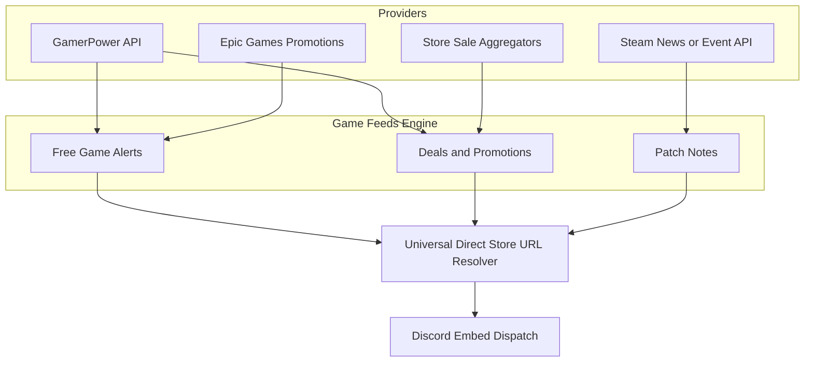

Evolve the Free Games tab into a comprehensive **Game Feeds** hub supporting three distinct feed categories: Free Game Alerts, Deals & Promotions, and Patch Notes.

#### 🧭 Architecture & Implementation Phases

1. ✅ **Feed Types & Schema Extension** — Added `game_deals_*` and `game_patchnotes_*` to `FeedType` in `src/state/types.ts`. `feedCategory()` and `rowToGuildCategory()` updated to handle all three categories.
2. ✅ **Deals & Patch Notes Ingestion Engines** — `src/feed/gamedeals.ts` (CheapShark API, redirect-resolved direct storefront URLs) and `src/feed/patchnotes.ts` (Steam News API for 11 preset games + custom AppIDs) fully implemented and wired into `FeedWatcher`.
3. ✅ **Embed Layouts & Dashboard UI** — `gameDealsEmbed` and `patchNotesEmbed` created with zero footers and branding author lines. Dashboard sidebar renamed to "Game Feeds", dropdown optgroups added, `GAME_FEEDS_OPTIONS` catalog wired into `submitAddFreeGamesFeed`. `/free-games` slash command expanded to all 16 game feed types.
4. ✅ **Test Coverage** — `tests/unit/feed/gameFeeds.test.ts` written and passing. **395/395 Vitest tests green**.
5. ✅ **Build Gate & Branch Push** — `npm run build` clean. Committed and pushed to `feat/game-feeds-w11`. Ready for review and merge to `main`.

---

## 🔮 Planned & Future Milestones

### Milestone M.09: Guild Prefix Commands Engine (`v0.8.0`)

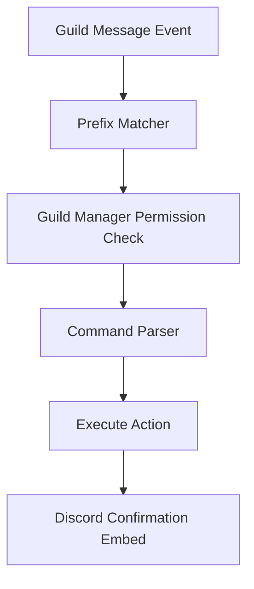

Introduce traditional guild prefix commands to operate alongside slash commands, bypassing Discord slash registration limits and offering fast command-line management for server admins.

#### 🎯 Strategic Objectives & Deliverables

1. **Prefix Command Dispatcher**:
    - Implement message listener matching custom per-guild prefixes (`!`, `?`, `.`, or custom).
    - Support management commands: `[prefix]set prefix`, `[prefix]set manager_role`, `[prefix]set <feature> <enabled|disabled>`.
2. **Feed & Feature Command Parity**:
    - Add prefix commands for `reddit`, `youtube`, `twitch`, `news`, `free-games`, `game-deals`, `patch-notes`, `welcome`, and `tickets`.

---

### Milestone M.10: Dynamic Voice Hub System (`v0.9.0`)

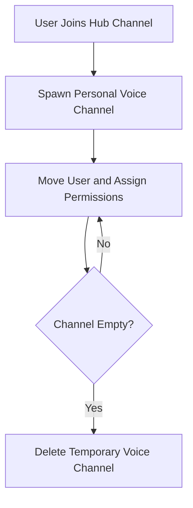

Allow guild members to dynamically generate private, temporary voice channels on demand by entering a designated hub channel, with automatic lifecycle cleanup.

#### 🎯 Strategic Objectives & Deliverables

1. **Hub Channel Listener**:
    - Detect `voiceStateUpdate` events when users connect to a configured voice hub channel.
    - Dynamically provision a temporary voice channel with tailored user permissions.
2. **Lifecycle Management**:
    - Automatically delete empty temporary voice channels to prevent guild clutter.
    - Add dashboard management controls and slash/prefix command configuration.

---

### Milestone M.11: Discord Rythm Music Integration (`v1.0.0`)

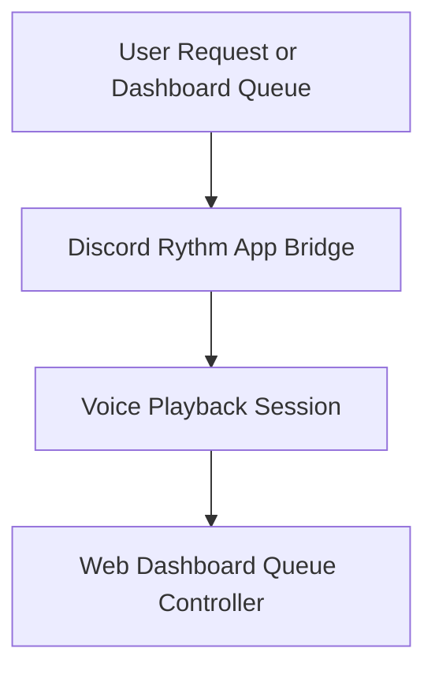

Reintroduce music playback by integrating Discord's native Rythm application architecture, providing stable playback without local audio encoding bottlenecks.

#### 🎯 Strategic Objectives & Deliverables

1. **Discord Rythm App Bridge**:
    - Leverage native Discord activity / Rythm architecture for high-fidelity audio streaming.
    - Provide slash/prefix commands: `/play`, `/pause`, `/resume`, `/skip`, `/queue`, `/loop`, `/volume`.
2. **Dashboard Queue Management**:
    - Implement real-time web dashboard queue controller for managing tracks and playlists.

---

## ✅ Completed Milestones (Historical Evolution)

### Milestone M.07: Stream Alerts Reliability & Manual Trigger Verification (`v0.6.1`)

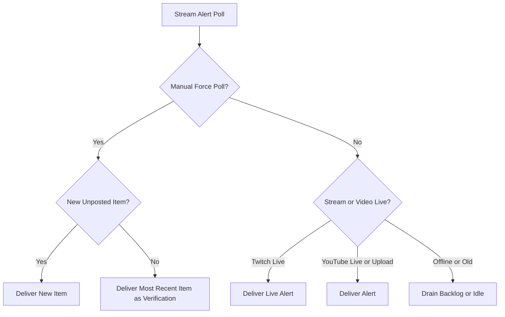

Ensured YouTube and Twitch stream alerts operate reliably, differentiating Twitch live broadcasts with offline VOD fallback and YouTube dual live/upload handling with forced manual verification delivery.

#### 🏛️ Architectural Accomplishments

1. **Forced Verification Delivery & Backlog Drain**:
    - Propagated `force: boolean` from route endpoints down through `watcher.ts`.
    - Delivered the most recent item when `toSend.length === 0` on forced manual checks.
2. **Twitch Offline Fallback & YouTube Dual Ingestion**:
    - Implemented `/helix/videos` fallback on forced Twitch checks when a streamer is offline.
    - Ordered YouTube Atom XML entries newest first by published timestamp to support both live streams and video uploads seamlessly.

---

### Milestone M.01: Core Inception & Discord Gateway (`v0.1.0`)

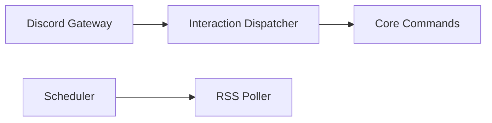

Established the project foundation as a TypeScript-driven, containerized Discord bot featuring scheduled feed polling, initial slash command dispatch, SQLite/PostgreSQL state tracking, and Discord API REST integrations.

#### 🏛️ Architectural Accomplishments

1. **Discord Gateway & REST Integration**:
    - Implemented Discord v10 REST client with interaction responses.
    - Added slash command registration and guild synchronization mechanisms.
2. **Scheduler & Polling Foundations**:
    - Introduced cron-based scheduler for background feed retrieval.
    - Implemented database migrations with SQLite and PostgreSQL support.

---

### Milestone M.02: Canonical Embed System & Bot Branding (`v0.2.0`)

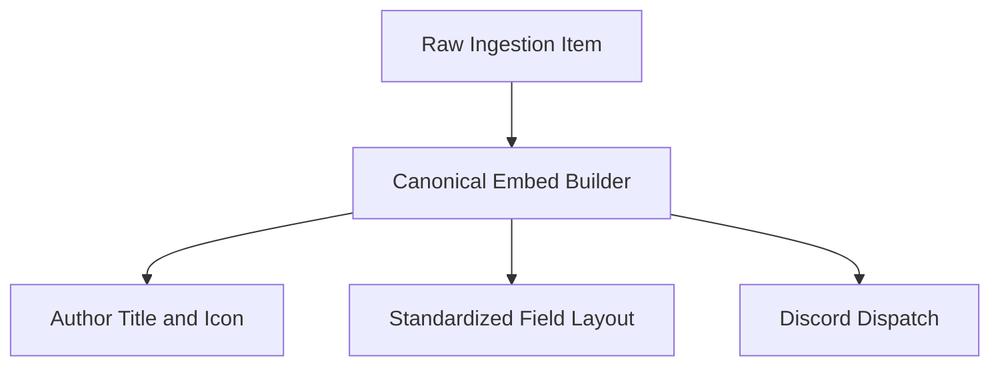

Standardized rich Discord embed layouts across all bot outputs, unifying colors, thumbnails, author branding, and timestamps into a shared utility layer.

#### 🏛️ Architectural Accomplishments

1. **Embed Design Standards**:
    - Created unified `embeds.ts` builders for feeds, errors, confirmations, and alerts.
    - Standardized field nomenclature (`🏷️ Platform`, `🔗 Link`, `📅 Published`).
2. **Logging & Diagnostic Pipelines**:
    - Implemented structured console logging with component context tags.
    - Added error capture and safe payload generation for Discord rate limits.

---

### Milestone M.03: Feed Engine & Multi-Source Syndication (`v0.3.0`)

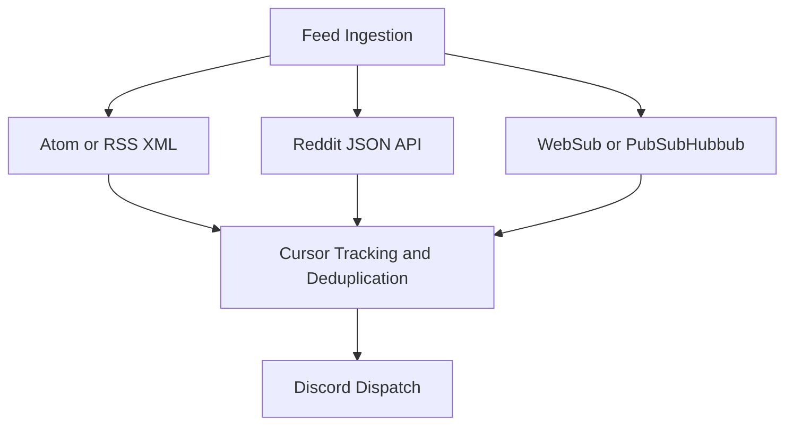

Transformed simple RSS fetching into a comprehensive, multi-provider syndication engine supporting live Reddit feeds, WebSub push notifications, and HTML scraping fallbacks.

#### 🏛️ Architectural Accomplishments

1. **Multi-Source Fetchers**:
    - Integrated native Reddit JSON endpoint consumption with rate-limiting backoff.
    - Implemented WebSub / PubSubHubbub webhook receiver endpoints for instant feed delivery.
2. **Persistence & Deduplication**:
    - Added persistent entry cursors and delivery tables in PostgreSQL/SQLite.
    - Prevented duplicate alerts across restarts and worker crashes.

---

### Milestone M.04: Free Game Alerts & Standards Framework (`v0.4.0` / `v0.4.1`)

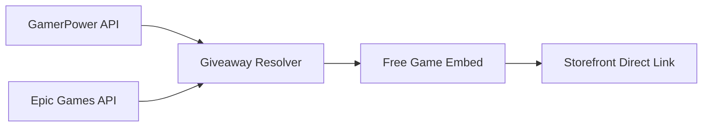

Introduced specialized free game alert feeds querying GamerPower and Epic Games Store, complete with value tags, expiry timers, and initial platform categorization. Established repository agent rules and coding guidelines.

#### 🏛️ Architectural Accomplishments

1. **Free Game Engine**:
    - Added `freegames.ts` ingestion supporting GamerPower and Epic Games Store promotions.
    - Implemented automatic value extraction, platform parsing, and thumbnail mapping.
2. **Engineering Standards**:
    - Documented agent rules in `.agents/rules/` and established release note workflows.
    - Integrated Vitest quality gates for dead code scanning and lint compliance.

---

### Milestone M.05: Architecture Streamlining & Audio Retirement (`v0.5.0`)

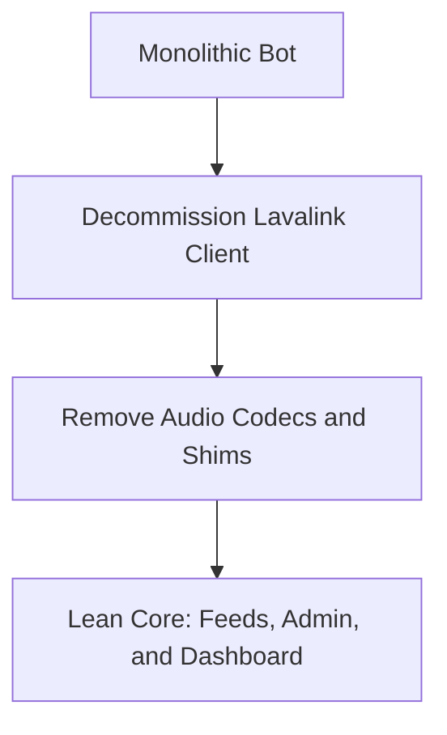

Retired heavy, unstable Lavalink audio dependencies to drastically reduce memory footprint, eliminate node process crashes, and refocus the bot on reliable feed delivery, community administration, and web management.

#### 🏛️ Architectural Accomplishments

1. **Codebase Footprint Reduction**:
    - Removed Lavalink client, audio codecs, and voice connection handlers.
    - Reduced Docker image size and eliminated native audio compilation issues.
2. **Refactored Service Boundaries**:
    - Decoupled web dashboard HTTP server from bot process runtime.
    - Hardened database connection pooling and graceful shutdown handling.

---

### Milestone M.06: Permission-Gated Administration, Single-Newest Delivery & Theme System (`v0.6.0`)

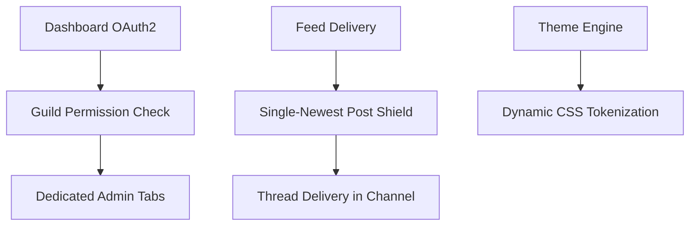

A massive milestone delivering real-time single-newest-post delivery to shield against Discord rate limits, permission-gated dashboard tabs (Welcome, Tickets, Logs, Feeds), forum-to-thread migration with per-feed role subscriptions, theme single source of truth, and universal direct storefront link resolution.

#### 🏛️ Architectural Accomplishments

1. **Rate-Limit Shield & Single-Newest Delivery**:
    - Eliminated artificial 6-hour floors and daily time gates in `watcher.ts`.
    - Implemented single newest unposted item delivery with automatic backlog draining.
2. **Permission-Gated Dashboard & Thread-Based Feeds**:
    - Replaced forum channels with dedicated public threads created directly in configured delivery channels.
    - Added per-feed role subscriptions (`addThreadRole`) and instant channel announcement notices on feed addition.
    - Gated dashboard sections behind Discord `MANAGE_GUILD` permissions while keeping Commands publicly viewable.
3. **Universal Direct Storefront Link Resolution**:
    - Implemented `resolveDirectGiveawayUrl` to trace 3xx redirect chains directly to actual store pages.
    - Implemented `detectStorePlatform` across Steam, GOG, IndieGala, Stove, Epic Games Store, Itch.io, Humble Bundle, Ubisoft, EA App, Prime Gaming, and Battle.net.
4. **Theme Architecture**:
    - Extracted all styling into centralized theme files (`themes/*.ts`), removing duplicate inline styles across all pages.

---

## 🛠️ Verification Commands

```bash
npm run check               # typecheck + format:check + lint + tests (must pass)
npm run build               # tsc compile to dist/ (must pass)
npm test                    # vitest run
```

---

## 🔖 Metadata

- **Project**: HELIX Discord Bot · **version** 0.6.0
- **Agent Ecosystem:** [`AGENTS`](./AGENTS) and [`.agents/`](.agents/) are tracked directly in repository git tracking.
