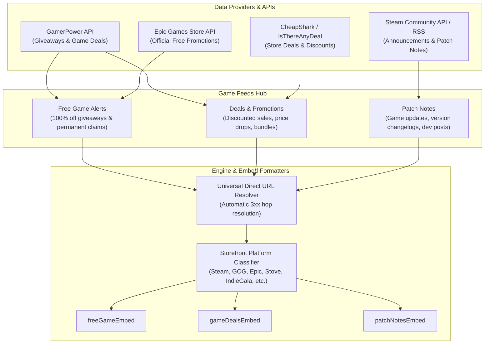

# HELIX Discord Bot — Feature Roadmap & Evolution Plan

> 🗺️ **Living Source of Truth**: This document tracks multi-phase architectural evolutions and upcoming major feature milestones for HELIX Discord Bot. Paired with [`TODO.md`](./TODO.md) (active checklists), [`BUGS.md`](./BUGS.md) (bug tracker), and [`PLAN.md`](./PLAN.md) (current sprint).

---

## 📜 Tracking & Workflow Rules

- **No Typo Duplication**: When recording user reports into `BUGS.md`, clean and fix all typos to preserve professional quality.
- **Universal Direct Store Links**: Every game alert, giveaway, or deal MUST resolve to the actual storefront page of the game.
- **Always Track Everything**: Every new feature request, enhancement, or bug report must be logged in `BUGS.md`, `TODO.md`, and `ROADMAP.md` before execution.

---

## Milestone M.{{N}}: Game Feeds Tab Evolution

Transform the standalone Free Games feature into a comprehensive **Game Feeds** system supporting three specialized gaming feed categories.

### Feed Categories & Purpose

| Category | Description | Data Providers | Embed Highlights |
| :--- | :--- | :--- | :--- |
| **Free Game Alerts** | Games given away for free to keep permanently (100% discount). | GamerPower API (`type=game`), Epic Store Official promotions API | Platform badge, original value, availability window, direct claim button. No footer. |
| **Deals and Promotions** | Games on sale / discounted across PC storefronts, but not free. | GamerPower Deals / CheapShark / Store sales APIs | Discount badge (`🏷️ -75%`), original price, current sale price, savings, sale countdown. |
| **Patch Notes** | Game updates, balance patches, changelogs, and release highlights. | Steam Community News/Event API, official studio RSS feeds | Game title, patch version, summary highlights, expandable change notes, direct changelog link. |

### Architecture & Implementation Phases

#### Phase 1: Database & Type Registry
- Add `game_deals` and `game_patchnotes` feed types to `src/state/types.ts`.
- Expand database schema / migrations if custom per-feed filter fields (e.g. minimum discount percentage or specific game title tracking) are needed.

#### Phase 2: Feed Engines & Formatters
- Implement `src/feed/gamedeals.ts` with direct store URL resolution and price formatting.
- Implement `src/feed/patchnotes.ts` parsing game update summaries and changelogs.
- Implement `gameDealsEmbed` and `patchNotesEmbed` in `src/bot/utils/embeds.ts`.

#### Phase 3: Dashboard Web Interface (`src/dashboard/views/dashboard/`)
- Rename Free Games tab to **Game Feeds** (`#tab-gamefeeds`).
- Add category pill selector (`Free Games`, `Deals & Promotions`, `Patch Notes`).
- Provide one-click activation catalogs for all 3 categories.
- Update client script routing and tab switching.

#### Phase 4: Discord Slash Commands (`src/bot/commands/feeds/`)
- Expand commands to support `/game-feeds` or dedicated `/game-deals` and `/patch-notes` subcommands.

#### Phase 5: Verification & Quality Gate
- Comprehensive Vitest unit tests for all three feed parsers and embed builders.
- Verification pass on `npm run check` and `npm run build`.

---

## Milestone M.{{N}}: Stream Alerts Reliability & Manual Testing

Enhance YouTube and Twitch alerts to address underlying implementation limitations: API key dependencies, offline stream detection, and silent failures on manual checks.

### Implementation Diagnosis & Objectives
1. **Twitch API Integration**:
   - The current `/helix/streams` implementation only returns data when a channel is **LIVE**. When a streamer is offline, it returns zero items.
   - Requires `TWITCH_CLIENT_ID` and `TWITCH_CLIENT_SECRET`. If missing, the feed returns empty without explaining why.
   - Solution: Fall back to `/helix/videos` to fetch the most recent broadcast/VOD or deliver an offline status notification so manual checks never return empty silence.
2. **YouTube Feed Integration**:
   - Free public Atom XML feeds require a canonical `UC...` channel ID. Scraping handles like `@channel` without an API key is vulnerable to YouTube anti-scraping blocks.
   - When scraping fails, fallback requires `YOUTUBE_API_KEY`.
   - Solution: Improve channel ID resolution caching, support direct channel ID and XML URL inputs, and fall back to Data API v3 when the key is provided.retrieved`, `Success`).
3. **Alert Types and Purposes**:
   - **Twitch Live Alerts**: Notify when a streamer goes live, including offline fallback to the latest VOD.
   - **YouTube Video Alerts**: Notify when a new video is uploaded, with offline detection and API key fallback.
   - **Manual Verification Alerts**: Triggered by "Check Now" or `/api/feeds/:id/poll` to ensure the feed is functioning correctly and provide diagnostic feedback.

## Milestone M.{{N}}: Manual Trigger Verification

### General Purpose and Important notes

1. **Manual Trigger Purpose and Use**:
    - The manual trigger is designed to allow guild administrators to manually verify the functionality of the feed, ensuring that alerts are correctly generated and diagnostic feedback is provided. This means that it needs to post the latest stream or video regardless of the current live status or deduplication state.
    - If a Twitch streamer is offline, the manual trigger should attempt to retrieve the latest VOD and provide a diagnostic message indicating that the channel is currently offline but the latest broadcast has been retrieved. This ensures that manual verification can still provide meaningful feedback even when the streamer is not live.
    - If the latest YouTube video is a live stream and the stream is currently offline, the manual trigger should provide a diagnostic message indicating that the live stream has ended but the latest video has been retrieved. This ensures that manual verification can still provide meaningful feedback even when the live stream is no longer active.
2. **YouTube API Key Requirement**:
    - When the manual trigger is used for YouTube feeds, if the public Atom XML feed fails due to anti-scraping blocks, the system should fall back to using the `YOUTUBE_API_KEY` to fetch the latest video. This ensures that manual verification can still succeed even when scraping is blocked.
3. **Twitch API Key Requirement**:
    - When the manual trigger is used for Twitch feeds, if the `TWITCH_CLIENT_ID` and `TWITCH_CLIENT_SECRET` are missing or invalid, the system should provide a clear diagnostic message indicating the missing credentials. This ensures that administrators are aware of the configuration issues affecting manual verification.
4. **Manual Trigger Verification (`force = true`)**:
   - Ensure "Check Now" and `/api/feeds/:id/poll` bypass the `isEntrySent` deduplication gate to post the latest video or recent broadcast as a test verification.
    - Ensure proper trigger verification is included for all feed types. This is not limited solely to YouTube and Twitch, but also to our News Feeds, Game Feeds, and all other feed types.
5. **Error Handling and Reporting**:
   - The system should provide clear and actionable error messages when manual verification fails, such as missing API keys, invalid feed URLs, or network issues.
   - Administrators should be able to view these error messages in the API response to quickly diagnose and resolve issues affecting the feed's functionality.
   - Administrators should be encouraged to regularly use the manual trigger to ensure that any changes to the feed configuration or API keys have not introduced new issues.
   - Administrators should also be able to access a history of manual trigger attempts, including timestamps, success or failure status, and any diagnostic messages, to track the reliability and performance of the feed over time.