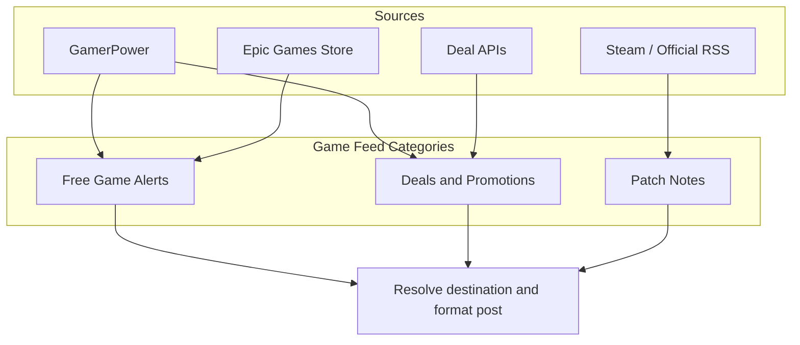
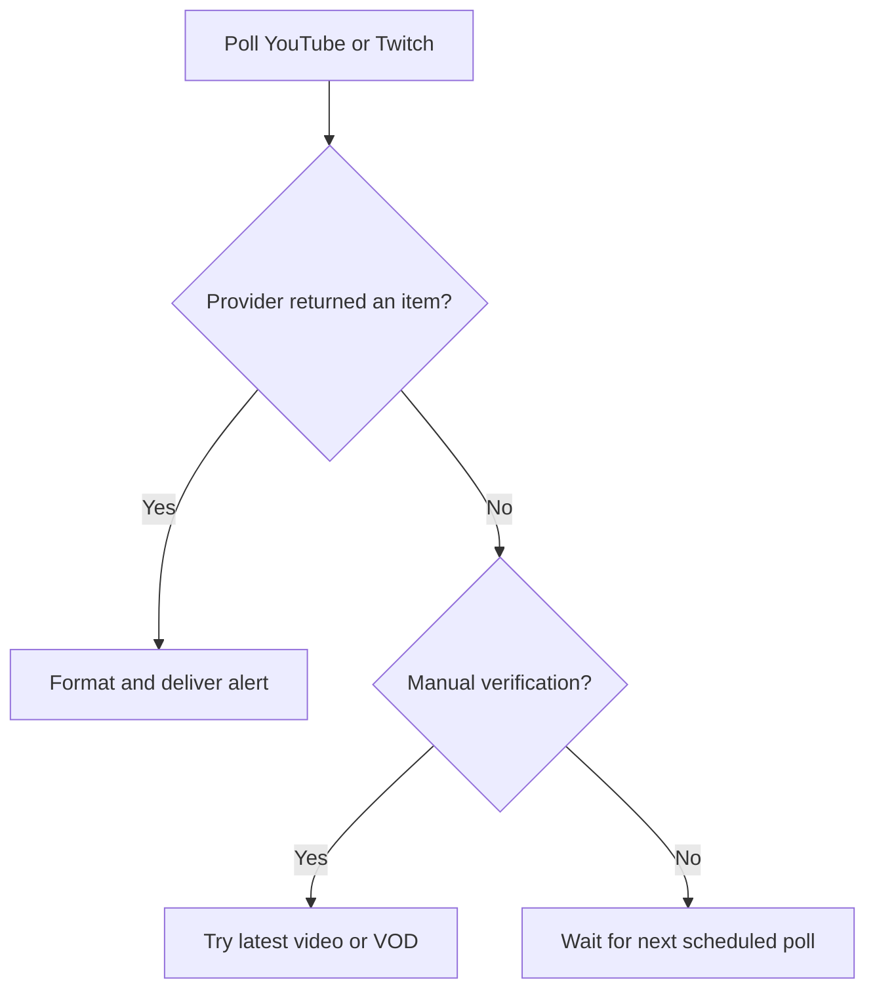
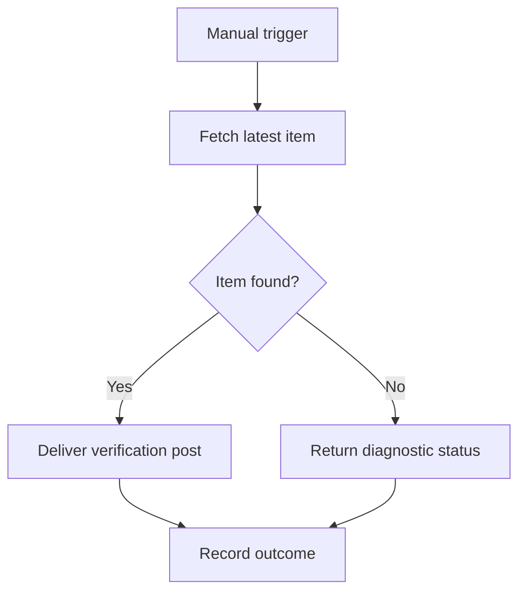

# HELIX Discord Bot — Feature Roadmap & Evolution Plan

> 🗺️ **Living Source of Truth**: This page tracks multi-phase architectural evolutions and upcoming feature milestones. Use [`TODO.md`](./TODO.md) for implementation checklists, [`BUGS.md`](./BUGS.md) for open bugs, and [`PLAN.md`](./PLAN.md) for current sprint plans.

> [!IMPORTANT]
> Keep milestone scope and status current as decisions are made. Record implementation details in the associated checklist and link related issues where applicable.

---

## 📜 Tracking & Workflow Rules

- **No Typo Duplication**: Correct typos when recording user reports.
- **Clear Milestones**: Keep each milestone focused, actionable, and supported by a concise diagram where useful.
- **Cross-File Tracking**: Track implementation tasks in [`TODO.md`](./TODO.md), current plans in [`PLAN.md`](./PLAN.md), and reported bugs in [`BUGS.md`](./BUGS.md).
- **Universal Direct Store Links**: Every game alert, giveaway, or deal must resolve to the actual storefront page of the game.
- **Track Before Execution**: Record new feature requests, enhancements, and bug reports in the appropriate tracking files before implementation.

---

## Milestone M.01: Game Feeds Tab Evolution

**Status**: Active

Transform the standalone Free Games feature into a comprehensive **Game Feeds** system supporting free game alerts, deals and promotions, and patch notes.



### Feed Categories & Purpose

| Category | Description | Data providers | Embed highlights |
| :--- | :--- | :--- | :--- |
| **Free Game Alerts** | Games given away to keep permanently (100% discount). | GamerPower (`type=game`), Epic Games Store promotions API | Platform, original value, availability window, direct claim link; no footer. |
| **Deals and Promotions** | Games on sale or discounted across PC storefronts, but not free. | GamerPower Deals, CheapShark, other store-sale APIs | Discount, original and sale prices, savings, and direct store link. |
| **Patch Notes** | Game updates, balance patches, changelogs, and release highlights. | Steam Community News/Event API, official studio RSS feeds | Game title, patch version, summary, and direct changelog link. |

### Architecture & Implementation Phases

1. **Database & Type Registry**
   - Add `game_deals` and `game_patchnotes` feed types to `src/state/types.ts`.
   - Extend the schema or migrations if provider-specific filter fields are needed.
2. **Feed Engines & Formatters**
   - Implement deal and patch-note fetchers, parsers, and embed formatters.
   - Apply direct-store URL resolution to game alerts and deals.
3. **Dashboard**
   - Rename the Free Games tab to **Game Feeds**.
   - Add category filters and one-click catalogs for all three feed types.
4. **Discord Commands**
   - Add a `/game-feeds` command or dedicated deal and patch-note command options.
5. **Verification & Documentation**
   - Add parser and embed tests and update relevant wiki documentation.
   - Pass `npm run check` and `npm run build`.

---

## Milestone M.02: Stream Alerts Reliability

**Status**: Active

Improve YouTube and Twitch ingestion and make stream-alert manual checks useful across online and offline states. The related open user-reported issue is tracked in [`BUGS.md`](./BUGS.md), with its implementation checklist in [`TODO.md`](./TODO.md).

### Integration Diagnosis & Objectives

1. **Twitch API**
   - The current `/helix/streams` integration only returns active broadcasts.
   - Fetch the most recent VOD when a streamer is offline, and report missing or invalid `TWITCH_CLIENT_ID` / `TWITCH_CLIENT_SECRET` clearly.
2. **YouTube Feed**
   - Public Atom feeds require a canonical `UC...` channel ID; scraping handles can be blocked.
   - Support channel ID and XML URL inputs, improve channel ID resolution, and use Data API v3 as an optional fallback when configured.
3. **Alert Types**
   - Twitch alerts notify about live broadcasts, with a recent-broadcast fallback for manual verification.
   - YouTube alerts support uploaded videos and live-stream posts.

### Reliability Flow



---

## Milestone M.03: Manual Trigger Verification

**Status**: Planned

Make **Check Now** and `/api/feeds/:id/poll` provide a reliable confirmation that feed configuration is working. This requirement applies to stream alerts and should inform manual verification behavior for other feed types as appropriate.

### General Purpose & Requirements

1. **Latest-item verification**
   - Manual checks should post the latest available stream or video regardless of its current live status or deduplication state.
   - If Twitch is offline, try the latest VOD and indicate that the channel is offline.
   - If a YouTube live stream has ended, indicate that while providing the latest available video.
2. **Credentials and fallbacks**
   - Use the public YouTube Atom feed first and fall back to the Data API when configured and needed.
   - Provide a clear diagnostic when Twitch credentials are missing or invalid.
3. **Error handling**
   - Return actionable errors for missing credentials, invalid feed URLs, and network failures.
   - Include delivery status in the manual-poll API response.
4. **History**
   - Consider recording timestamps, status, and diagnostics for manual trigger attempts so administrators can review reliability over time.

### Verification Flow



---

## 🛠️ Verification Commands

```bash
npm run check
npm run build
npm test
```

---

## 🔖 Metadata

- **Project**: HELIX Discord Bot · **version** 0.6.0
- **Agent Ecosystem**: [`AGENTS.md`](./AGENTS.md) and [`.agents/`](.agents/) are tracked in the repository.
