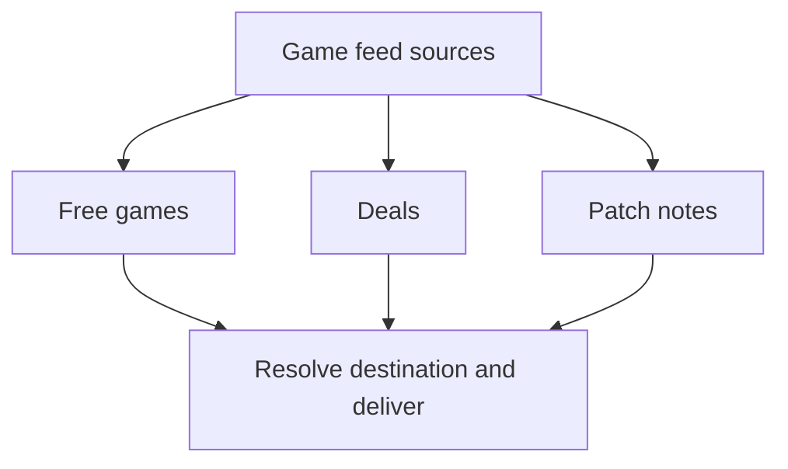
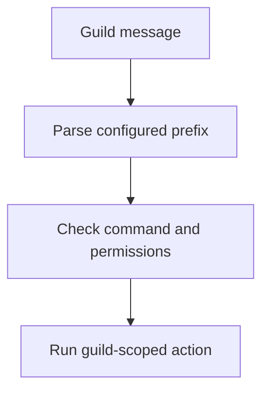
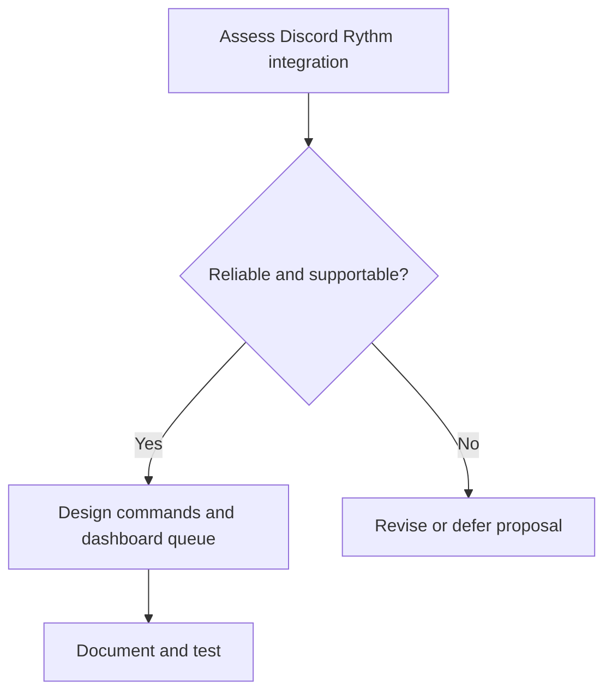
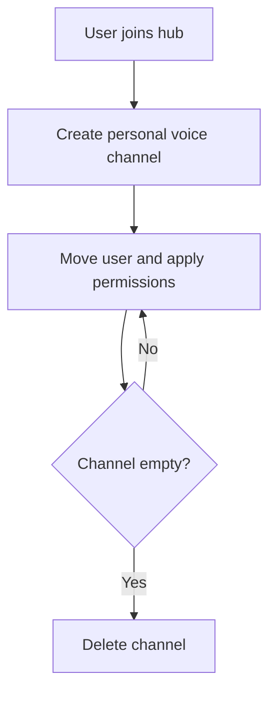

# HELIX Discord Bot — Task Checklist & Workstream Tracking

> 📋 **Living Source of Truth**: This page tracks active, upcoming, and completed implementation workstreams. See [`PLAN.md`](./PLAN.md) for current sprint plans, [`BUGS.md`](./BUGS.md) for open bugs, and [`ROADMAP.md`](./ROADMAP.md) for long-term milestones.

> [!IMPORTANT]
> AI agents strictly required to update this page and all related pages **before** working on any new bug fixes or features and push it to the remote first, without exception. Failure to do so may result in working with outdated information and potentially introducing conflicts or redundant work. 

---

## 📜 Tracking Rules

- **No Typo Duplication**: When recording user reports, clean and fix all typos to preserve professional quality.
- **Consistent Formatting**: Maintain consistent formatting and style throughout all documentation to ensure readability and professionalism.
- **Clear Sectioning**: Use clear and descriptive headers for each section to improve navigation and readability.
- **Active Items First**: The currently active milestone, sprint, task, or workstream must always be placed at the top of the content sections.
- **Regular Updates**: Ensure that the roadmap is regularly updated to reflect the latest developments and changes in the project.
- **Improve User Directives**: Continuously refine and clarify user directives to ensure they are easily understood and actionable.
- **Universal Direct Store Links**: Every game alert, giveaway, or deal **MUST** resolve to the actual storefront page of the game.
- **Always Track Everything**: Every new feature request, enhancement, or bug report must be logged in [`BUGS.md`](./BUGS.md), [`TODO.md`](./TODO.md), and [`ROADMAP.md`](./ROADMAP.md) before execution.

---

## 🔥 Active Workstreams

### 🎮 Workstream W.11: Game Feeds Tab Evolution (Free Games, Deals & Promotions, Patch Notes)



**Locked user directives:**
- The Free Games tab will become a **Game Feeds** tab.
- It will support **three** distinct types of feeds from the provided feed sources:
  1. **Free Game Alerts**: Games that are being given away for free (100% off / free to keep).
  2. **Deals and Promotions**: Games that are on sale / discounted, but not given away for free.
  3. **Patch Notes**: Game updates, changelogs, and patch notes.

**Implementation checklist:**
- [x] **Architecture & Schema Planning**:
  - [x] Define feed type keys: `free_games_*`, `game_deals_*`, `game_patchnotes_*` in `src/state/types.ts`
  - [x] Add data provider adapters for Deals and Patch Notes (CheapShark API, Steam News API)
- [x] **Feed Fetchers & Parser Engine**:
  - [x] Implement `src/feed/gamedeals.ts`: fetch discounted game promotions with discount %, original/sale price, and direct storefront links via CheapShark API
  - [x] Implement `src/feed/patchnotes.ts`: parse Steam Community patch notes, version numbers, and summary highlights
  - [x] Ensure universal direct store URL resolution applies to all game deals
- [x] **Discord Embed Handlers**:
  - [x] `gameDealsEmbed`: showcase game title, store platform, discount badge (`🏷️ -75%`), current/original price, and direct deal link
  - [x] `patchNotesEmbed`: showcase game title, patch/version number, update summary, and direct changelog link
- [x] **Dashboard UI Redesign (`sources.ts`, `sidebar.ts`, `clientScript.ts`)**:
  - [x] Rename sidebar tab from "Free Games" to "Game Feeds" with game controller icon (`fa-gamepad`)
  - [x] Form dropdown redesigned with optgroups for Free Games, Deals & Promotions, and Patch Notes
  - [x] `submitAddFreeGamesFeed` updated to `GAME_FEEDS_OPTIONS` catalog mapping all 16 feed types to correct `feedType` and `url`
  - [x] `categoryForFeed` updated to route `game_deals_*` and `game_patchnotes_*` to the freegames tab
  - [x] `feedTopicOf` updated to include `game_deals_*` and `game_patchnotes_*` topic categorization
  - [x] `renderFeedPill` updated with styled badges for Deals (`🏷️`) and Patch Notes (`📄`)
- [x] **Discord Slash Commands (`src/bot/commands/feeds/free-games.ts`)**:
  - [x] Expanded `/free-games enable` platform choices to include `game_deals_*` and `game_patchnotes_*` types
  - [x] Updated `PLATFORM_NAMES` map with all 16 game feed types
  - [x] Updated status/disable/check handlers to operate on all game feed types (free games + deals + patch notes)
  - [x] `isGameFeed` predicate covers `free_games`, `game_deals`, and `game_patchnotes` prefixes
  - [x] `defaultUrl` auto-generated from feedType (e.g. `gamedeals://steam`, `patchnotes://cs2`)
- [x] **Test Coverage & Validation**:
  - [x] `tests/unit/feed/gameFeeds.test.ts` created — embed structure, footer absence, field format, category mapping, and preset validation
  - [x] 395/395 Vitest tests passing
- [x] **Build Verification & Push**:
  - [x] `npm run build` — TypeScript compilation clean ✅
  - [x] Committed and pushed to `feat/game-feeds-w11` branch

---

## 📋 Upcoming Workstreams

### 🧩 Workstream W.13: Prefix Commands



**Locked user directives:**
- "Prefix commands should be added to replace the failed slash action commands without having to worry about the slash command registration limits."

**Implementation checklist:**
- [ ] Update our command handler to support both slash commands and prefix commands
- [ ] Create the following new `[prefix]` commands for users with the required permissions:
  - [ ] `[prefix]set prefix <new_prefix>`: Update the bot's command prefix per guild.
  - [ ] `[prefix]set manager_role <role_id: role_id>`: Update the manager role for the guild.
  - [ ] `[prefix]set <feature_id: news_feeds|game_feeds|reddit_feeds|patch_notes_feeds|stream_alerts|youtube_feeds|twitch_feeds|voice_hub|etc> <choice: enabled|disabled>`: Enable or disable feed types per guild.
  - [ ] `[prefix]hub <choice: add|remove> [channel: channel_id]`: Manage hub channels for the guild.
  - [ ] `[prefix]reddit <choice: list|add|remove> [subreddit: string] [channel: channel_id]`: Manage Reddit feeds for the specified subreddit.
  - [ ] `[prefix]youtube <choice: list|add|remove> [youtube_slug: string] [channel: channel_id]`: Manage YouTube feeds for the specified channel.
  - [ ] `[prefix]twitch <choice: list|add|remove> [twitch_slug: string] [channel: channel_id]`: Manage Twitch feeds for the specified channel.
  - [ ] `[prefix]patch-notes <choice: enable|disable> [channel: channel_id]`: Manage Patch Notes feeds.
  - [ ] `[prefix]news <choice: list|add|remove> [feed_id: source_id] [channel: channel_id]`: Manage News feeds for the specified feed ID.
  - [ ] `[prefix]free-games <choice: list|add|remove> [feed_id: source_id] [channel: channel_id]`: Manage Free Games feeds for the specified feed ID.
  - [ ] `[prefix]game-deals <choice: list|add|remove> [feed_id: source_id] [channel: channel_id]`: Manage Deals feeds for the specified feed ID.
  - [ ] `[prefix]welcome <choice: channel|message> [channel: channel_id] [message: string]`: Manage welcome message settings.
  - [ ] `[prefix]tickets <choice: channel|manager_role|message> [channel: channel_id] [manager_role: role_id] [message: string]`: Manage ticket settings.
  - [ ] `[prefix]role <choice: add|remove> [role: role_id] [user: user_id]`: Manage roles for the specified user.
  - [ ] `[prefix]set dj [role: role_id]`: Set the DJ role for managing music playback.

---

### 🎵 Workstream W.14: Music Support



**Locked user directives:**
- "Music support was something we wanted in the bot, but had to remove due to issues with stability and resource management."
- "We plan to revisit this feature again in order to come up with a more stable solution."
- "Our new plan will be to integrate Discord's own Rythm app for music support, leveraging its stability and resource management capabilities."
- "We will need to ensure that the integration with Rythm is seamless and does not negatively impact the bot's performance."
- "We will also need to provide clear documentation and support for users to understand how to use the music features effectively."
- "We will need to test the integration thoroughly to ensure it works reliably under various conditions."
- "A proper dashboard queue management system will be necessary to handle music requests efficiently and ensure a smooth user experience."

**Implementation checklist:**
- [ ] Create the new music support integration using Discord's Rythm app.
- [ ] Ensure seamless integration without impacting bot performance.
- [ ] Provide clear documentation and support for users.
- [ ] Test the integration thoroughly under various conditions.
- [ ] Implement a dashboard queue management system for music requests.
- [ ] Add new slash commands for music features:
  - [ ] `/play [song]`
  - [ ] `/pause`
  - [ ] `/resume`
  - [ ] `/skip`
  - [ ] `/jump [position]`
  - [ ] `/queue`
  - [ ] `/loop [mode]`
  - [ ] `/remove`
  - [ ] `/clear`
  - [ ] `/volume [level]`

---

### 🔊 Workstream W.15: Voice Hub System



**Locked user directives:**
- "The voice hub system will allow users to create personal voice channels dynamically by joining a designated hub channel."
- "When a user joins the hub channel, a personal voice channel will be created for them, and they will be moved to it automatically."
- "Users will have the necessary permissions to manage their personal voice channels."
- "Personal voice channels will be deleted automatically when they are empty."
- "We need to ensure that the system is stable and does not negatively impact the bot's performance."
- "Clear documentation and support will be provided to help users understand how to use the voice hub system effectively."
- "Thorough testing will be conducted to ensure the system works reliably under various conditions."

**Implementation checklist:**
- [ ] Create a designated hub channel for users to join.
- [ ] Automatically create personal voice channels when users join the hub channel.
- [ ] Assign necessary permissions to users for managing their personal voice channels.
- [ ] Automatically delete personal voice channels when they are empty.
- [ ] Ensure the system is stable and does not negatively impact bot performance.
- [ ] Provide clear documentation and support for users.
- [ ] Conduct thorough testing under various conditions.

---

## ✅ Completed Workstreams

### ✅ Workstream W.12: Stream Alerts (YouTube & Twitch) Manual Trigger Delivery Fix

**Locked user directives:**
- "When YouTube and Twitch alerts are manually triggered, they should get the last stream or video posted. Right now they post nothing and it makes me think they aren't working at all."
- "Live streams are intended to only post when a streamer is live. But the YouTube feeds support both live streams and video uploads. So that one needs to be able to handle both cases. The manual poll on Twitch should find the most recent live stream since it is intended as a way for users to test their integrations. YouTube should find either the most recent live stream or the newest upload (whichever came most recently)."
- "Note: YouTube and Twitch alerts might be dependent on API keys to work for what we are using them for. Basically, right now they might be failing due to how we are implementing them."

**Implementation checklist:**
- [x] In `src/feed/watcher.ts`: Pass `force: boolean` parameter into `pollStreamAlertFeed(userId, feed, force)`
- [x] When `force === true`:
  - [x] If no unposted entries exist in `toSend`: fetch the single most recent video or stream (YouTube) or most recent live stream/VOD (Twitch)
  - [x] Deliver this most recent item so the user receives immediate confirmation that the integration and channel handle are working
- [x] In `src/feed/youtube.ts` & `src/feed/watcher.ts`: Ensure YouTube ingestion supports both live streams and video uploads, returning whichever is newest
- [x] In `src/feed/watcher.ts`: When Twitch channel is offline and `force === true`, query `/helix/videos` to get the latest broadcast
- [x] Add diagnostic error messages when Twitch or YouTube API credentials are missing
- [x] Unit test: Verify manual force poll delivers latest entry even when previously sent (390/390 tests passing)

---

### ✅ Workstream W.01: Real-Time Single-Newest-Post Feed Delivery & Rate-Limit Shield

**Locked user directives:**
- "All feeds should not be limited by poll intervals. Instead they should pick up new posts as they arrive and post them."
- "We should make sure they post the single newest post as it comes in. That way they are always up to date and aren't posting 10 to 20 posts at a time."
- "this is the correct way to handle the rate limiting problem while still ensuring they don't miss information."

**Implementation checklist:**
- [x] `src/feed/watcher.ts`: Eliminate `RSS_POST_INTERVAL_FLOOR_MS` (6 hours) and once-per-UTC-day throttle
- [x] `src/feed/watcher.ts`: For RSS/scrape/Reddit feeds, select and post only the single newest unposted entry
- [x] `src/feed/watcher.ts`: Drain backlog: mark older unposted entries in the current cycle as sent (`repo.markEntrySent` / `redis.markEntrySent`) and advance cursor
- [x] `src/feed/watcher.ts`: Align Free Games delivery to single newest entry per cycle instead of looping over all unposted games
- [x] `src/feed/watcher.ts`: Align Stream Alerts (YouTube / Twitch fallback) to single newest entry per cycle instead of looping
- [x] `src/feed/watcher.ts`: Add inter-feed pacing in `pollAllFeeds` / `pollGuildFeeds` to avoid bursting Discord API
- [x] `src/config.ts`: Update default `pollIntervalMs` to 1 minute (`60_000`) and support `POLL_INTERVAL_MS` env var
- [x] `src/dashboard/webhooks/router.ts`: Verify single-entry delivery parity across WebSub / PubSubHubbub / EventSub
- [x] `tests/unit/feed/watcher.test.ts`: Create test suite verifying single-newest-post delivery, backlog drain, and zero artificial time gating
- [x] `npm run check` + `pnpm build` green

---

### ✅ Workstream W.02: Guild Admin Sections, Dedicated Feature Tabs & Permission-Gated Dashboard

**Locked user directives:**
- Guild Admin tab stays for specific/secure configurations; it is not a hiding place for features.
- Existing tabs stay as they are but get a guild-admin access check. New features get their own dedicated tabs with the same check.
- Users with Manage Channels permissions should have access to tabs that set things to channels.
- Guilds page shows all guilds the user is in; invite allowed only with invite permission. Buttons: invite icon + cog icon.
- Guilds page uses pill layout: guild icon left, buttons right.
- Privacy / ToS pages visible without login.
- Commands page requires no login (read-only).
- Ticket system: text channel hosts a button; clicking opens a new thread.
- Replace forum feed delivery with threads in configured channel.

**Implementation checklist:**
- [x] Relax Discord login (`auth.ts`): allow any Discord user; persist `discord_guilds` (full list w/ permissions)
- [x] Relax `canUserAccessDashboard` (`shared.ts`) to require only Discord auth; keep `canUserManageGuild`
- [x] `oauth/discord.ts`: add `hasInvitePermission` helper
- [x] Rewrite `GET /api/guilds`: merge user guilds + bot guilds → `{id,name,icon,botIn,canManage,canInvite,inviteUrl}`
- [x] Add `canManage` to `GET /api/guilds/:guildId/channels` response
- [x] Public `GET /commands` page (no auth) from registry metadata; `robots.txt` allow
- [x] Rewrite `/guilds` view + in-dashboard guild-selection to pill grid (invite btn + cog btn)
- [x] `sidebar.ts`: always-visible Commands tab; gate feed/admin sections by `canManage`; add Welcome/Tickets/Logs tabs
- [x] Split `guildadmin.ts`: keep Roles/Features/Commands/Prefix; new `welcome.ts`/`tickets.ts`/`logs.ts` tabs with per-tab save
- [x] `clientScript.ts`: pill grid, sidebar gating, `loadCommandsTab`, per-tab load/save, relaxed 403 handling
- [x] `dashboard.ts`: render new tab panes; pass `canManage` to sidebar
- [x] Ticket redesign: sticky text-channel button message → thread per ticket, manager role auto-added (`ticket_channel_id` key)
- [x] Forum→thread feed delivery: remove forum target end-to-end; thread-enabled feeds post to a dedicated thread in their own `channel_id`
- [x] Feed role subscription: per-feed `roleId` stored (`role_id` column + migration); `role` option on all feed-add slash commands + dashboard add/detail role selects
- [x] Feed-add channel notification: `notifyFeedAdded` (`src/bot/lib/feeds/notify.ts`) posts a confirmation into the feed's target channel
- [x] `npm run check` + `pnpm build` green

---

### ✅ Workstream W.03: Dashboard UI Window-Fitting, Live Discord Previews & Reddit Filter

**Locked user directives:**
- Filter out Reddit community home posts from subreddit syndication.
- Fix tab content carryover when changing tabs in dashboard.
- Fit welcome and tickets page content properly to the window with live previews.

**Implementation checklist:**
- [x] `src/feed/reddit.ts`: Filter out static community home posts from subreddit syndication
- [x] `src/dashboard/views/dashboard/clientScript.ts`: Fix tab switching carryover by strictly selecting and hiding all `.tab-pane` and `#feed-detail-view` elements
- [x] `src/dashboard/views/dashboard/styles.ts`: Add responsive styles and Discord preview components
- [x] `src/dashboard/views/dashboard/welcome.ts`: 2-column responsive layout with Welcome Configuration card and Live Discord Preview card
- [x] `src/dashboard/views/dashboard/tickets.ts`: 2-column responsive layout with Routing card and Live Button Preview card
- [x] `src/dashboard/views/dashboard/clientScript.ts`: Add `updateWelcomePreview()` and `updateTicketPreview()` with live markdown and placeholder parsing
- [x] `tests/unit/dashboard/views.test.ts`: Add unit tests for live preview containers and client hooks
- [x] `npm run check` + `pnpm build` green

---

### ✅ Workstream W.04: Theme System — Single Source of Truth (`themes/*.ts`)

**Locked user directives:**
- "all themes and colors should be handled by the theme files... the dashboard pages and elements need to import their styles from the actual theme files."

**Implementation checklist:**
- [x] Dashboard `styles.ts` → `${getThemeCss()}` + component CSS (import from `theme.ts`); no inline theme var blocks
- [x] login / landing / commands / legal / guilds / admin / oauth-callback pages import `getThemeCss()` and drop inline theme blocks
- [x] Delete dead `src/dashboard/handlers/pages.ts`
- [x] Remove color-scheme layer; unify into standalone theme definitions
- [x] `npm run check` + `pnpm build` green

---

### ✅ Workstream W.05: Dead Code Cleanup + Vitest Scan Guard

**Locked user directives:**
- Clean up dead code and add automated Vitest scanning to guard against unused exports.

**Implementation checklist:**
- [x] New `tests/unit/quality/dead-code.test.ts`: scan exports across `src/` and verify external consumers
- [x] Cleaned unused types and internal helper exports across `bot`, `dashboard`, `db`, `feed`, and `util`
- [x] `npx vitest run tests/unit/quality/dead-code.test.ts` → PASS (2 tests)
- [x] `npm run check` + `pnpm build` green

---

### ✅ Workstream W.06: Stream Alerts Audit, Zero-Config YouTube Ingestion & Rich Twitch Metadata

**Locked user directives:**
- Audit stream alert support to ensure reliable out-of-the-box operation for YouTube and Twitch.

**Implementation checklist:**
- [x] Audit stream alert ingestion across `watcher.ts`, `embeds.ts`, `youtube.ts`, and `twitch.ts`
- [x] Create `src/feed/youtube.ts`: zero-config public Atom XML parsing (`channel_id=UC...`) with smart handle resolution
- [x] Extract Twitch stream metadata (`game_name`, `viewer_count`, thumbnail URL)
- [x] Update `streamAlertEmbed` with dynamic category, viewers, and type fields
- [x] `tests/unit/feed/streamAlerts.test.ts`: 10 unit tests covering YouTube/Twitch resolution and formatting
- [x] `npm run check` + `npm run build` green

---

### ✅ Workstream W.07: Optional Embed Support for Ticket Message Setup

**Locked user directives:**
- Add optional embed support to the ticket message setup with parity to `/welcome`.

**Implementation checklist:**
- [x] `src/bot/lib/options/ticket.ts`: Add `embed` and `color` options to `/ticket` setup command
- [x] `src/bot/commands/admin/ticket.ts`: Support optional embed payloads hosting the `Open Ticket` button
- [x] `src/dashboard/views/dashboard/tickets.ts`: Add Format selector (`Plain text` / `Embed`) to routing card
- [x] `tests/unit/commands/ticket.test.ts`: Add unit tests for ticket embed setup and preview elements
- [x] `npm run check` + `npm run build` green

---

### ✅ Workstream W.08: Ticket Message Placeholders & Dynamic Guild Resolution

**Locked user directives:**
- Ticket messages must support placeholders and resolve dynamic guild name via `guild.name`.

**Implementation checklist:**
- [x] `src/bot/utils/placeholders.ts`: Add support for `{server}`, `{guild}`, `{user}`, `{member}`, `{channel}`, and `{time}`
- [x] Dynamically resolve guild name via `guild.name`
- [x] Support placeholders in slash command button messages and dashboard preview
- [x] `npm run check` + `npm run build` green

---

### ✅ Workstream W.09: Command Toggles, Feature Gating & Dynamic Guild Command Registration

**Locked user directives:**
- Command toggles must enable/disable features, dynamically register/unregister slash commands, and hide dashboard tabs.

**Implementation checklist:**
- [x] `src/bot/handlers/commands.ts` & `src/bot/handlers/registry.ts`: Dynamic guild command unregistration and registration
- [x] Dynamically hide associated dashboard pages when commands are toggled off
- [x] Re-register commands dynamically upon dashboard settings update
- [x] `npm run check` + `npm run build` green

---

### ✅ Workstream W.10: Free Games Provider-Based Architecture & Direct Store URL Resolution

**Locked user directives:**
- Restructure Free Game feeds around genuine providers (GamerPower Free Game Alerts & Epic Games Store Official).
- Embed footer must be completely removed from free game embeds.
- The platform the alert is for must be prominently displayed in the `🏷️ Platform` embed field.
- Universal Redirect Rule: for EVERY Free Game alert, regardless of platform, the giveaway URL in the embed must link directly to the actual page for the game being given away.
- When recording user-reported issues in `BUGS.md`, fix any typos so the recorded messages are clean and error-free.

**Implementation checklist:**
- [x] `src/bot/utils/embeds.ts`: Remove `footer` property completely from `freeGameEmbed`
- [x] `src/feed/freegames.ts`: Implement `resolveDirectGiveawayUrl` to follow 3xx redirects (up to 5 hops with timeout protection)
- [x] `src/feed/freegames.ts`: Implement `detectStorePlatform` inspecting resolved direct URLs, titles, instructions, and metadata
- [x] `src/feed/freegames.ts`: Add `stove` platform branding and `'free_games_stove'` feed type support
- [x] `src/feed/freegames.ts`: Update `fetchGamerPowerGiveaways` to concurrently resolve direct URLs and accurately identify platforms
- [x] `src/feed/freegames.ts`: Update `fetchFreeGames` to apply direct store URL resolution universally across all free game items
- [x] `src/dashboard/views/dashboard/sources.ts` & `clientScript.ts`: Update available feed choices to genuine providers (`gamerpower`, `epic`, `all`)
- [x] `src/bot/commands/feeds/free-games.ts`: Align choices to genuine providers (`free_games_gamerpower`, `free_games_epic`, `free_games`)
- [x] `tests/unit/feed/freegames.test.ts`: Add unit tests for `resolveDirectGiveawayUrl`, `detectStorePlatform`, and Stove platform branding (387 passing tests)
- [x] Clean up all unused imports from command files
- [x] Clean up user typos in `BUGS.md` and log verified resolution

---

## 🛠️ Verification Commands

```bash
npm run check               # typecheck + format:check + lint + tests (must pass)
npm run build               # tsc compile to dist/ (must pass)
npm test                    # vitest run
```

---

## 🔖 Metadata

- **Project**: HELIX Discord Bot · **version** 0.6.0
- **Agent Ecosystem:** [`AGENTS`](./AGENTS) and [`.agents/`](.agents/) are tracked directly in repository git tracking.