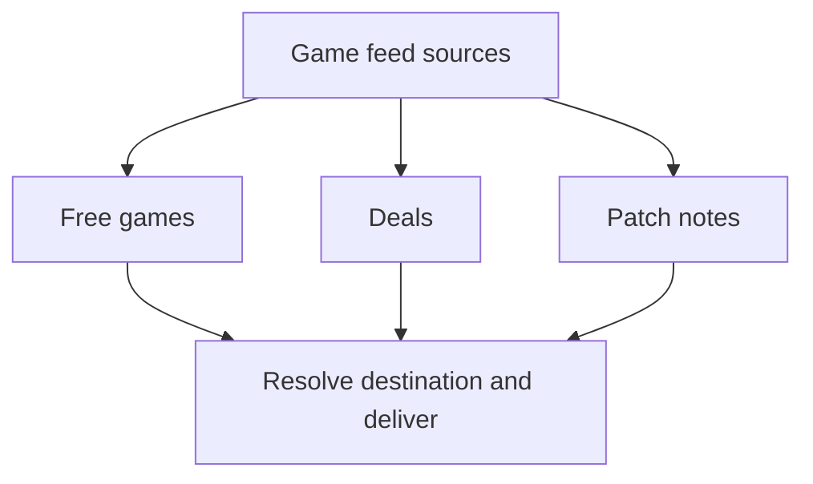
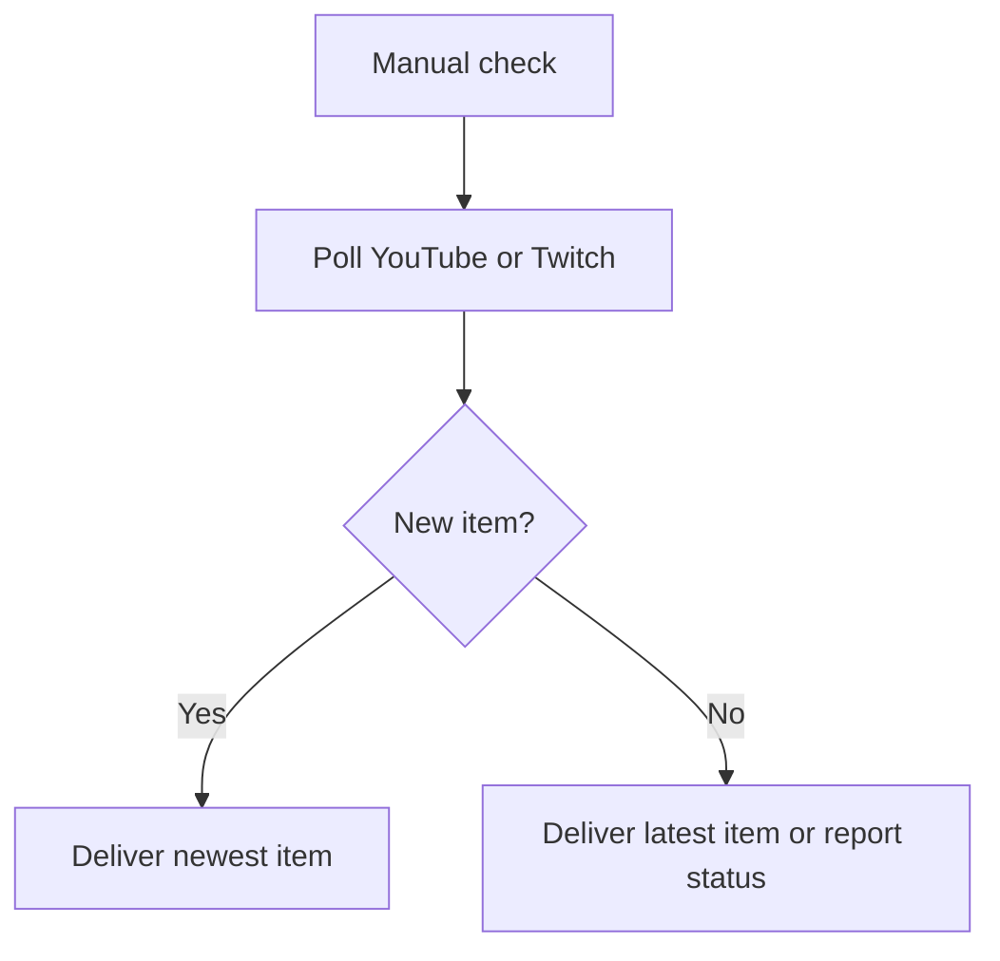
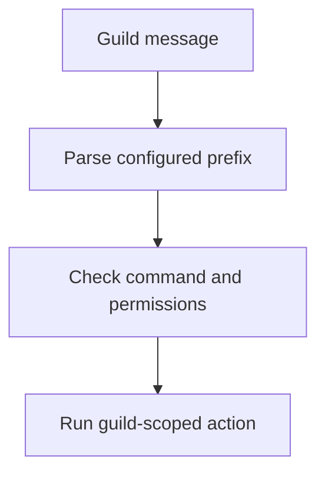
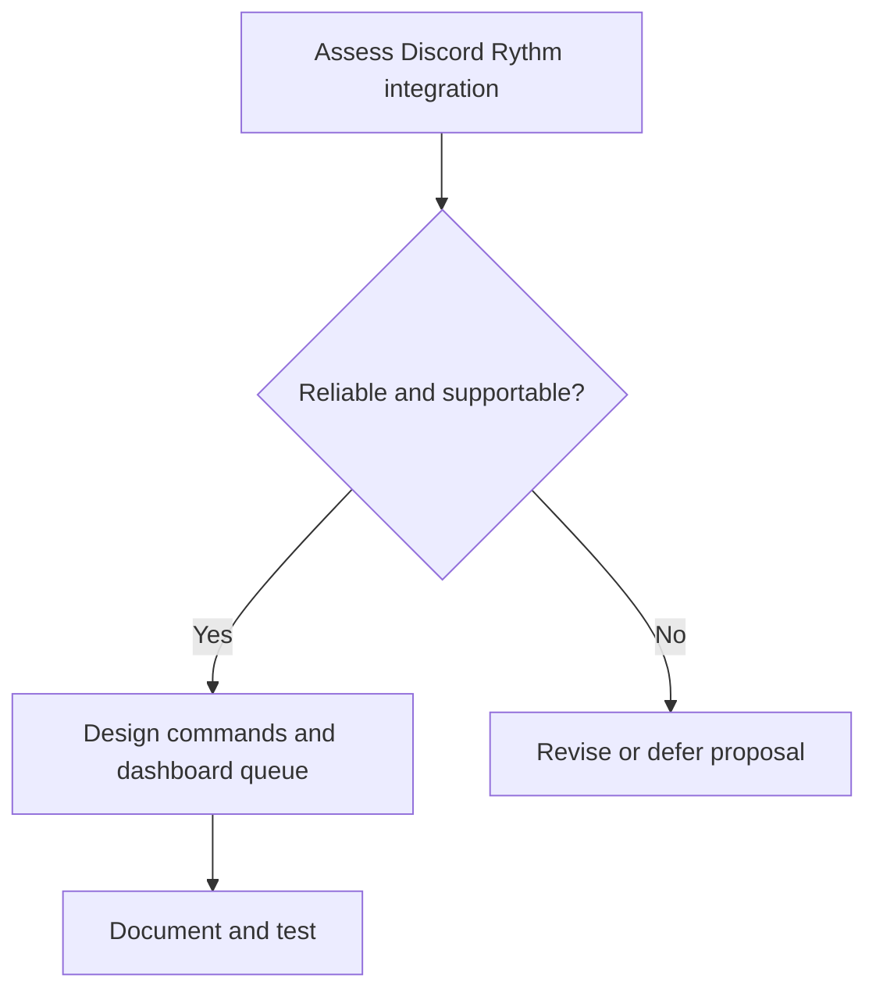
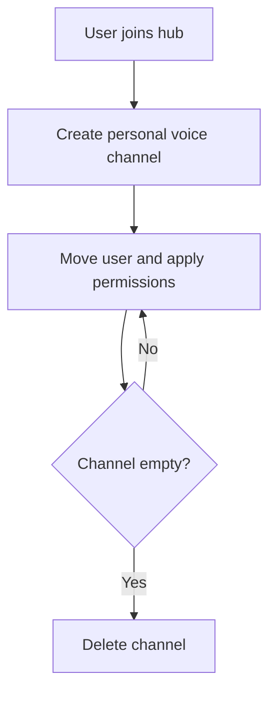

# HELIX Discord Bot — Task Checklist & Workstream Tracking

> 🗺️ **Living Source of Truth**: This page tracks active and completed implementation workstreams. See [`PLAN.md`](./PLAN.md) for current sprint plans, [`BUGS.md`](./BUGS.md) for open bugs, and [`ROADMAP.md`](./ROADMAP.md) for long-term milestones.

> [!IMPORTANT]
> Keep this page and related tracking files synchronized as work progresses. Add new work before implementation, preserve user directives, and update checklist status as tasks are completed.

---

## 📜 Tracking Rules

- **No Typo Duplication**: Correct typos when recording user reports or directives.
- **Clear, Actionable Tasks**: Keep checklist items specific and update them as the scope changes.
- **Cross-File Tracking**: Keep plans in [`PLAN.md`](./PLAN.md), bugs in [`BUGS.md`](./BUGS.md), and long-term milestones in [`ROADMAP.md`](./ROADMAP.md).
- **Universal Direct Store Links**: Every game alert, giveaway, or deal must resolve to the actual storefront page of the game.
- **Verification Gate**: Run `npm run check` and `npm run build` before considering a workstream complete.

---

## ✅ Completed Workstreams

### ✅ Workstream W.01: Real-Time Single-Newest-Post Feed Delivery & Rate-Limit Shield

**Locked user directives:**

- "All feeds should not be limited by poll intervals. Instead they should pick up new posts as they arrive and post them."
- "We should make sure they post the single newest post as it comes in. That way they are always up to date and aren't posting 10 to 20 posts at a time."
- "this is the correct way to handle the rate limiting problem while still ensuring they don't miss information."
- Use camelCase file naming scheme across the codebase.

**Implementation checklist:**

- [x] `src/feed/watcher.ts`: Eliminate `RSS_POST_INTERVAL_FLOOR_MS` (6 hours) and once-per-UTC-day throttle
- [x] `src/feed/watcher.ts`: For RSS/scrape/Reddit feeds, select and post only the single newest unposted entry
- [x] `src/feed/watcher.ts`: Drain backlog: mark older unposted entries in the current cycle as sent (`repo.markEntrySent` / `redis.markEntrySent`) and advance cursor
- [x] `src/feed/watcher.ts`: Align Free Games delivery to single newest entry per cycle instead of looping over all unposted games
- [x] `src/feed/watcher.ts`: Align Stream Alerts (YouTube / Twitch fallback) to single newest entry per cycle instead of looping
- [x] `src/feed/watcher.ts`: Add inter-feed pacing in `pollAllFeeds` / `pollGuildFeeds` to avoid bursting Discord API
- [x] `src/config.ts`: Update default `pollIntervalMs` to 1 minute (`60_000`) and support `POLL_INTERVAL_MS` env var
- [x] `src/dashboard/webhooks/router.ts`: Verify single-entry delivery parity across WebSub / PubSubHubbub / EventSub
- [x] `tests/unit/feed/watcher.test.ts`: Create test suite verifying single-newest-post delivery, backlog drain, and zero artificial time gating
- [x] `npm run check` + `pnpm build` green

### ✅ Workstream W.02: Guild Admin Sections, Dedicated Feature Tabs & Permission-Gated Dashboard

**Locked user directives:**

- Guild Admin tab stays for specific/secure configurations; it is not a hiding place for features.
- Existing tabs stay as they are but get a guild-admin access check. New features get their own dedicated tabs with the same check.
- Users with Manage Channels permissions should have access to tabs that set things to channels.
- Guilds page shows all guilds the user is in; invite allowed only with invite permission. Buttons: invite icon + cog icon.
- Guilds page uses pill layout: guild icon left, buttons right.
- Privacy / ToS pages visible without login.
- Commands page requires no login (read-only).
- Ticket system: text channel hosts a button; clicking opens a new thread.
- Replace forum feed delivery with threads: "if threads are enabled the feeds simply post to threads in the configured text channel. The forums seem to be a bit wonky for our usage." (m0755). Dedicated thread is auto-created in the feed's own delivery `channel_id` (m0759); the separate forum target is removed.
- Feed threads public + role subscription + add notification: "make the threads public... also add a message to the channels that a feed is set up in to notify of a feed being added to the channel." (m0116). Feed threads are already public (type 12); each feed gets an optional role auto-subscribed to its thread (per-feed role at add time, m0963) and a confirmation message is posted into the feed's channel on add.

**Implementation checklist:**

- [x] Relax Discord login (`auth.ts`): allow any Discord user; persist `discord_guilds` (full list w/ permissions)
- [x] Relax `canUserAccessDashboard` (`shared.ts`) to require only Discord auth; keep `canUserManageGuild`
- [x] `oauth/discord.ts`: add `hasInvitePermission` helper
- [x] Rewrite `GET /api/guilds`: merge user guilds + bot guilds → `{id,name,icon,botIn,canManage,canInvite,inviteUrl}`
- [x] Add `canManage` to `GET /api/guilds/:guildId/channels` response
- [x] Public `GET /commands` page (no auth) from registry metadata; `robots.txt` allow
- [x] Rewrite `/guilds` view + in-dashboard guild-selection to pill grid (invite btn + cog btn)
- [x] `sidebar.ts`: always-visible Commands tab; gate feed/admin sections by `canManage`; add Welcome/Tickets/Logs tabs
- [x] Split `guildadmin.ts`: keep Roles/Features/Commands/Prefix; new `welcome.ts`/`tickets.ts`/`logs.ts` tabs with per-tab save
- [x] `clientScript.ts`: pill grid, sidebar gating, `loadCommandsTab`, per-tab load/save, relaxed 403 handling
- [x] `dashboard.ts`: render new tab panes; pass `canManage` to sidebar
- [x] Ticket redesign: sticky text-channel button message → thread per ticket, manager role auto-added (`ticket_channel_id` key)
- [x] `npm run check` + `pnpm build` green
- [x] Commit + push; sync `PLAN`/`TODO`/`BUGS`, `wiki/`, roadmap issue #27 per Rule 04/05
- [x] Forum→thread feed delivery: remove forum target end-to-end; thread-enabled feeds post to a dedicated thread in their own `channel_id` (state types, repos, `FeedThreadManager`, targets, watcher, webhooks, bot, config, dashboard UI)
- [x] Feed role subscription: per-feed `roleId` stored (`role_id` column + migration); `role` option on all feed-add slash commands + dashboard add/detail role selects; ThreadSender subscribes the role to the feed thread on create/rotate (`addThreadRole`)
- [x] Feed-add channel notification: `notifyFeedAdded` (`src/bot/lib/feeds/notify.ts`) posts a confirmation into the feed's target channel on slash-command adds and dashboard POST /api/feeds
- [x] `npm run check` + `pnpm build` green (779e4bb)

### ✅ Workstream W.03: Dashboard UI Window-Fitting, Live Discord Previews & Reddit Filter

**Locked user directives:**
- Filter out Reddit community home posts: "The community home post should always be ignored in reddit feeds since it is a persistent static post that could cause reddit feeds to miss actual new posts."
- Fix tab content carryover: "there is also a slight issue with switching between tabs. the previous tab's content is being carried over when changing tabs."
- Window fitting & live preview: "also the content of the tickets page and welcome page need to be properly fitted to the window. just like the other pages were."
- Prefer options over subcommands with modular option files (`src/bot/lib/options/<command>.ts`).
- Preserve camelCase file naming scheme across the codebase.

**Implementation checklist:**
- [x] `src/feed/reddit.ts`: Filter out static community home posts from subreddit syndication
- [x] `src/dashboard/views/dashboard/clientScript.ts`: Fix tab switching carryover by strictly selecting and hiding all `.tab-pane` and `#feed-detail-view` elements
- [x] `src/dashboard/views/dashboard/styles.ts`: Add responsive styles and Discord preview components (`.discord-preview-container`, `.discord-btn-primary`, `.discord-mention`, etc.)
- [x] `src/dashboard/views/dashboard/welcome.ts`: 2-column responsive layout with Welcome Configuration card and Live Discord Preview card
- [x] `src/dashboard/views/dashboard/tickets.ts`: 2-column responsive layout with Routing card and Live Button Preview card
- [x] `src/dashboard/views/dashboard/clientScript.ts`: Add `updateWelcomePreview()` and `updateTicketPreview()` with live markdown and placeholder parsing
- [x] `tests/unit/dashboard/views.test.ts`: Add unit tests for live preview containers and client hooks
- [x] `npm run check` + `pnpm build` green
- [x] Repository documentation sync (README, wiki/*, .agents/*, IMPORTANT.md)

**Status:** dashboard phase (`627d783`), ticket redesign (`cf6c6c3`), forum→thread refactor (`21a4734`), docs sync + THREADS_ENABLED gate (`536e992`), and role-subscription + add-notification (`779e4bb`) committed + pushed — each ran green `npm run check` + `pnpm build`. Remaining: final docs/wiki/issue sync (roadmap issue #27 Phase 9/10 checkboxes + new Phase 11 role/notification row). Progress mirrored on roadmap issue #27.

### ✅ Workstream W.04: Theme System — Single Source of Truth (`themes/*.ts`)

**Locked user directives:**

- "all themes and colors should be handled by the theme files... the dashboard pages and elements need to import their styles from the actual theme files. this is a mandatory feature to allow contributors to easily create new themes and colors for the dashboard." (m1083)
- "since we have custom themes, separate color schemes might be a bit overkill. the themes can just provide their own unique color schemes." (m1131)

**Implementation checklist:**

- [x] Dashboard `styles.ts` → `${getThemeCss()}` + component CSS (import from `theme.ts`); no inline theme var blocks
- [x] login / landing / commands / legal / guilds / admin / oauth-callback pages import `getThemeCss()` and drop inline theme blocks; html classes now use real `theme.id`
- [x] Delete dead `src/dashboard/handlers/pages.ts` (unused local theme duplicates)
- [x] Remove color-scheme layer: `AppConfig.dashboardColorScheme`, `DashboardRuntimeConfig.colorScheme`, `DASHBOARD_COLOR_SCHEMES`/`DashboardColorScheme`, `colorSchemeOverrides` (shared.ts), `ColorSchemeInfo`/`getColorSchemeInfo` (theme.ts), `scheme-*` html classes, settings-tab scheme fields, `DASHBOARD_COLOR_SCHEME` env var (kept `colorSchemeMode` native `color-scheme` for scrollbars/inputs)
- [x] Docs: `.env.example`, `wiki/Configuration`, `wiki/Architecture-and-Design`, `.agents/rules/dashboard-standards`, `.agents/agents/engineering/sub-agents/dashboard-engineer`
- [x] `npm run check` + `pnpm build` green

### ✅ Workstream W.05: Dead Code Cleanup + Vitest Scan Guard

**Locked user directives:**

- "ok commit and push. then check for any dead code left behind." (m1180)
- "hold. up let's update out vitests suite to be able to handle scanning for dead code" (m0351) — the vitest suite gained a structural scan that fails on exported symbols with no external references.

**Implementation checklist:**

- [x] New `tests/unit/quality/dead-code.test.ts`: regex export extraction + identifier index over `src/` + `tests/`; fails with `path:name` list for exports referenced in zero other files; exempts dynamically-loaded `src/bot/commands/**`, `_`-prefixed identifiers, `default` exports; regression test ensures live `defaultConfig` stays flagged as consumed
- [x] `bot/**`: deleted `messages.ts`, `gateway.ts`, `lib/feeds/format.ts` (whole files); deleted dead helpers in `config.ts`, `handlers/commands.ts`, `handlers/registry.ts`, `utils/embeds.ts`, `utils/types.ts`; stripped `export` from internal-only typing across `bot.ts`, `rest.ts`, `lib/admin/*`, `lib/feeds/notify.ts`
- [x] `dashboard/**`: deleted dead `dashboard/config.ts`, `configuredOAuthError`, `isHostUser`/`requireHost` aliases, `subscribeFeedToWebhook`, `getBaseStyles` (themes/shared.ts `baseStyles` CSS block), `createDiscordRssServer` alias, dead helper middlewares/views; stripped internal-only `export` throughout auth/http/oauth/routes/views
- [x] `db/**`, `feed/**`, `scheduler/**`, `state/**`, `util/**`: stripped internal-only exports (e.g. `DbStats`, `FetchError`, `FeedPreset`, `RedisCoordinatorImpl`, `LogContext`); deleted unreferenced symbols (`childTextList`, `discoverFeedLinks`, `presetsGroupedByCategory`, `feedTopic`)
- [x] Cleaned now-unused imports/types fallout (`ApplicationCommand`, `IncomingMessage`, orphaned `GatewayOpcode` const+type)
- [x] `npx vitest run tests/unit/quality/dead-code.test.ts` → PASS (2 tests)
- [x] `npm run check` + `pnpm build` green (52 files, +82/−1013)

### ✅ Workstream W.06: Stream Alerts Audit, Zero-Config YouTube Ingestion & Rich Twitch Metadata

**Locked user directives:**
- "ok we need to audit our stream alert support. I don't know if they work or not, but we should check just in case."
- Ensure reliable out-of-the-box operation for YouTube video uploads/streams and Twitch live alerts.
- Use camelCase file naming scheme across the codebase.

**Implementation checklist:**
- [x] Audit stream alert ingestion, polling, and embed formatting across `src/feed/watcher.ts`, `src/bot/utils/embeds.ts`, `src/bot/commands/feeds/youtube.ts`, and `src/bot/commands/feeds/twitch.ts`
- [x] Create `src/feed/youtube.ts`: zero-config public Atom XML parsing (`channel_id=UC...`), smart channel ID resolution (`@handle`, `/channel/UC...`, bare IDs), and high-resolution thumbnail generation
- [x] `src/feed/watcher.ts`: Ingest YouTube feeds via public Atom feeds with zero API keys required; preserve optional YouTube Data API v3 fallback with corrected regex
- [x] `src/feed/watcher.ts`: Extract Twitch stream metadata (`game_name`, `viewer_count`, thumbnail URL, user login sanitization)
- [x] `src/bot/utils/embeds.ts`: Update `streamAlertEmbed` with dynamic `🎮 Category` and `👥 Viewers` for Twitch, and `▶️ Type` for YouTube
- [x] `src/feed/parser.ts`: Support nested `<media:group>` tags in `findEntryImage` and fallback `<media:description>` in `parseAtom`
- [x] `tests/unit/feed/streamAlerts.test.ts`: 10 comprehensive unit tests covering YouTube channel ID/XML resolution, Atom parsing, Twitch live stream extraction, and rich embed formatting
- [x] `npm run check` + `npm run build` green (22/22 test files, 348/348 tests passing)
- [x] Repository documentation sync (`README.md`, `wiki/Feeds-and-Scrapers.md`, `wiki/Configuration.md`, `.env.example`, `TODO.md`)

### ✅ Workstream W.07: Optional Embed Support for Ticket Message Setup

**Locked user directives:**
- "ok let's add optional embed support to the ticket message setup"
- Ensure parity with `/welcome` embed options across slash commands, web dashboard, and live Discord preview.
- Use camelCase file naming scheme across the codebase.

**Implementation checklist:**
- [x] `src/bot/lib/options/ticket.ts`: Add `embed` (boolean) and `color` (hex string) options to `/ticket` setup command
- [x] `src/bot/commands/admin/ticket.ts`: Update `TicketConfig` and `getTicketConfig` with `embed` and `color` settings
- [x] `src/bot/commands/admin/ticket.ts`: Update `sendTicketButtonMessage` to support optional embed payloads hosting the `Open Ticket` button
- [x] `src/bot/commands/admin/ticket.ts`: Update `handleSetup` and `handleView` to store, dispatch, and display embed format
- [x] `src/dashboard/views/dashboard/tickets.ts`: Add Format selector (`Plain text` / `Embed`) to the Ticket Routing & Message card
- [x] `src/dashboard/routes/guilds.ts`: Handle `embed` and `color` in `body.tickets` on `PUT /api/guilds/:guildId/settings`
- [x] `src/dashboard/views/dashboard/clientScript.ts`: Populate, save, and dynamically render simulated Discord embed card in `updateTicketPreview()`
- [x] `tests/unit/commands/ticket.test.ts` & `tests/unit/dashboard/views.test.ts`: Add unit tests for ticket embed setup and preview elements
- [x] `wiki/*`: Document embed options in `Administration.md`, `Discord-Bot.md`, and `API-Reference.md`
- [x] `npm run check` + `npm run build` green (22/22 test files, 350/350 tests passing)

### ✅ Workstream W.08: Ticket Message Placeholders & Dynamic Guild Resolution

**Locked user directives:**
- "also the ticket message needs to support placeholders."
- "The placeholder output is incorrect: instead of displaying the server name for `{server}`, it shows `this server`."
- "discord js can get the guild name by using guild.name so it is not incorrect to assume that the bot can get it's own name"

**Implementation checklist:**
- [x] `src/bot/utils/placeholders.ts`: Add support for `{server}`, `{guild}`, `{user}`, `{member}`, `{channel}`, and `{time}` placeholders in ticket messages
- [x] Resolve guild name dynamically via `guild.name` when available instead of defaulting to static `'this server'` fallback
- [x] Support ticket placeholders in both slash command button messages and live dashboard preview updates
- [x] Unit test coverage for placeholder replacement in `tests/unit/bot/placeholders.test.ts`
- [x] `npm run check` + `npm run build` green

### ✅ Workstream W.09: Command Toggles, Feature Gating & Dynamic Guild Command Registration

**Locked user directives:**
- "The command toggles have absolutely no effect. They are supposed to enable or disable the selected commands and their related features."
- "When I say features, I mean that any command with its own dashboard page should also have that page hidden when the command is disabled."
- "For instance, if the feed command is disabled, the feeds page should be hidden. If both YouTube and Twitch are disabled, the stream alerts page should be hidden."
- "no error embed if command disabled. the command should be unregistered if it is disabled and the registration should be automatically applied to the guild."

**Implementation checklist:**
- [x] `src/bot/handlers/commands.ts` & `src/bot/handlers/registry.ts`: Implement dynamic guild command unregistration and registration when commands are toggled on/off
- [x] Ensure disabled commands are unregistered from guild slash command registration without replying with an error embed
- [x] `src/dashboard/views/dashboard/sidebar.ts` & `src/dashboard/views/dashboard/clientScript.ts`: Dynamically hide associated dashboard pages when commands are toggled off:
  - Feeds page hidden when `feed` is disabled
  - Stream alerts page hidden when both `youtube` and `twitch` are disabled
  - Welcome page hidden when `welcome` is disabled
  - Tickets page hidden when `ticket` is disabled
  - Logs page hidden when `logs` is disabled
- [x] Re-register commands on guild level dynamically upon dashboard settings update
- [x] Unit test coverage in `tests/unit/admin/commandToggles.test.ts`
- [x] `npm run check` + `npm run build` green

### ✅ Workstream W.10: Free Games Provider-Based Architecture & Direct Store URL Resolution

**Locked user directives:**
- Restructure Free Game feeds around genuine providers (GamerPower Free Game Alerts & Epic Games Store Official) rather than splitting GamerPower into fake platform feeds.
- Embed footer must be completely removed from free game embeds.
- The platform the alert is for must be prominently displayed in the `🏷️ Platform` embed field so users redeem on the correct platform.
- Universal Redirect Rule: for EVERY Free Game alert, regardless of platform, the giveaway URL in the embed must link directly to the actual page for the game being given away, resolving intermediate redirect links.
- When recording user-reported issues in `BUGS.md`, fix any typos so the recorded messages are clean and error-free.

**Implementation checklist:**
- [x] `src/bot/utils/embeds.ts`: Remove `footer` property completely from `freeGameEmbed`
- [x] `src/feed/freegames.ts`: Implement `resolveDirectGiveawayUrl` to follow 3xx redirects (up to 5 hops with timeout protection)
- [x] `src/feed/freegames.ts`: Implement `detectStorePlatform` inspecting resolved direct URLs, titles, instructions, and metadata
- [x] `src/feed/freegames.ts`: Add `stove` platform branding and `'free_games_stove'` feed type support
- [x] `src/feed/freegames.ts`: Update `fetchGamerPowerGiveaways` to concurrently resolve direct URLs and accurately identify platforms
- [x] `src/feed/freegames.ts`: Update `fetchFreeGames` to apply direct store URL resolution universally across all free game items
- [x] `src/dashboard/views/dashboard/sources.ts` & `clientScript.ts`: Update available feed choices to genuine providers (`gamerpower`, `epic`, `all`)
- [x] `src/bot/commands/feeds/free-games.ts`: Align choices to genuine providers (`free_games_gamerpower`, `free_games_epic`, `free_games`)
- [x] `tests/unit/feed/freegames.test.ts`: Add unit tests for `resolveDirectGiveawayUrl`, `detectStorePlatform`, and Stove platform branding (387 passing tests)
- [x] Clean up all unused imports from command files
- [x] Clean up user typos in `BUGS.md` and log verified resolution

---

## 🔥 Active Workstreams

### 🎮 Workstream W.11: Game Feeds Tab Evolution (Free Games, Deals & Promotions, Patch Notes)



**Locked user directives:**
- The Free Games tab will become a **Game Feeds** tab.
- It will support **three** distinct types of feeds from the provided feed sources:
  1. **Free Game Alerts**: Games that are being given away for free (100% off / free to keep).
  2. **Deals and Promotions**: Games that are on sale / discounted, but not given away for free.
  3. **Patch Notes**: Game updates, changelogs, and patch notes.

**Implementation checklist:**
- [ ] **Architecture & Schema Planning**:
  - [ ] Define feed type keys: `free_games_*`, `game_deals_*`, `game_patchnotes_*` in `src/state/types.ts`
  - [ ] Add data provider adapters for Deals and Patch Notes (e.g. Steam Community announcements/patch notes API, CheapShark / IsThereAnyDeal / GamerPower Deals API, RSS game update feeds)
- [ ] **Feed Fetchers & Parser Engine**:
  - [ ] Implement `src/feed/gamedeals.ts`: fetch discounted game promotions with discount %, original price, sale price, and direct storefront links
  - [ ] Implement `src/feed/patchnotes.ts`: parse game patch notes, versions, changelogs, and summary highlights
  - [ ] Ensure universal direct store URL resolution applies to all game deals and patch notes
- [ ] **Discord Embed Handlers**:
  - [ ] `gameDealsEmbed`: showcase game title, platform, discount badge (`🏷️ -75%`), current/original price, savings, and direct claim/buy button
  - [ ] `patchNotesEmbed`: showcase game title, patch/version number, update summary, key changes, and direct changelog link
- [ ] **Dashboard UI Redesign (`sources.ts`, `sidebar.ts`, `clientScript.ts`)**:
  - [ ] Rename sidebar tab from "Free Games" to "Game Feeds" with game controller icon (`fa-gamepad`)
  - [ ] Sub-category filter / tabs: "Free Games", "Deals & Promotions", "Patch Notes"
  - [ ] One-click catalog pill sections for each of the three categories
  - [ ] Form dropdown to add feeds under each specific game feed type
- [ ] **Discord Slash Commands (`src/bot/commands/feeds/`)**:
  - [ ] Add `/game-feeds` (or expand `/free-games` into `/game-deals` and `/patch-notes`)
- [ ] **Test Coverage & Validation**:
  - [ ] Unit tests for deals fetcher, patch notes fetcher, and custom embeds
  - [ ] Full validation gate (`npm run check` and `npm run build`) passing 100%

---

### 📡 Workstream W.12: Stream Alerts (YouTube & Twitch) Manual Trigger Delivery Fix



**Locked user directives:**
- "When YouTube and Twitch alerts are manually triggered, they should get the last stream/video posted. Right now they post nothing and it makes me think they aren't working at all."

**Implementation checklist:**
- [ ] In `src/feed/watcher.ts`: Pass `force: boolean` parameter into `pollStreamAlertFeed(userId, feed, force)`
- [ ] When `force === true`:
  - If no unposted entries exist in `toSend`: fetch the single most recent video (YouTube) or most recent stream/VOD status (Twitch)
  - Deliver this most recent item with an indicator (or as the active stream alert) so the user receives immediate confirmation that the integration and channel handle are working
- [ ] In `src/dashboard/routes/feeds.ts`: Ensure `/api/feeds/:id/poll` returns delivery status in response JSON
- [ ] Unit test: Verify manual force poll delivers latest entry even when previously sent


---

### 🧩 Workstream W.13: Prefix Commands


**Locked user directives:**
- "Prefix commands should be added to replace the failed slash action commands without having to worry about the slash command registration limits."

**Implementation checklist:**
- [ ] Update our command handler to support both slash commands and prefix commands
- [ ] Create the following new `[prefix]` commands for users with the required permissions:
  - `[prefix]set prefix <new_prefix>`: Update the bot's command prefix per guild.
  - `[prefix]set manager_role <role_id: role_id>`: Update the manager role for the guild. This will affect which users have permission to manage the bot's settings via the commands and the dashboard. This simply allows for configuring the bot's features and settings, it does not grant any additional permissions beyond managing the bot.
  - `[prefix]set <feature_id: news_feeds|game_feeds|reddit_feeds|patch_notes_feeds|stream_alerts|youtube_feeds|twitch_feeds|voice_hub|etc> <choice: enabled|disabled>`: Enable or disable feed types per guild. This will not remove them from the dashboard; it toggles them per guild. The dashboard will need its own matching toggles.
  - `[prefix]hub <choice: add|remove> [channel: channel_id]`: Manage hub channels for the guild. The hub channel is a single voice channel that, when joined, creates a user voice channel and moves the user to it with the permissions necessary to manage their personal voice channel. The personal voice channel is deleted when empty. This feature is not implemented yet and needs planning before adding the command.
  - `[prefix]reddit <choice: list|add|remove> [subreddit: string] [channel: channel_id]`: Manage Reddit feeds for the specified subreddit.
  - `[prefix]youtube <choice: list|add|remove> [youtube_slug: string] [channel: channel_id]`: Manage YouTube feeds for the specified channel.
  - `[prefix]twitch <choice: list|add|remove> [twitch_slug: string] [channel: channel_id]`: Manage Twitch feeds for the specified channel.
  - `[prefix]patch-notes <choice: enable|disable> [channel: channel_id]`: Manage Patch Notes feeds
  - `[prefix]news <choice: list|add|remove> [feed_id: source_id] [channel: channel_id]`: Manage News feeds for the specified feed ID.
  - `[prefix]free-games <choice: list|add|remove> [feed_id: source_id] [channel: channel_id]`: Manage Free Games feeds for the specified feed ID.
  - `[prefix]game-deals <choice: list|add|remove> [feed_id: source_id] [channel: channel_id]`: Manage Deals feeds for the specified feed ID.
  - `[prefix]welcome <choice: channel|message> [channel: channel_id] [message: string]`: Manage welcome message settings for the specified channel.
  - `[prefix]tickets <choice: channel|manager_role|message> [channel: channel_id] [manager_role: role_id] [message: string]`: Manage ticket settings for the specified channel.
  - `[prefix]role <choice: add|remove> [role: role_id] [user: user_id]`: Manage roles for the specified user.
  - `[prefix]set dj [role: role_id]`: Set the DJ role for managing music playback. Requires the music support to be created first. This one will be held off until that is complete and fully tested.

---

### 🎵 Workstream W.14: Music Support



**Locked user directives:**
- "Music support was something we wanted in the bot, but had to remove due to issues with stability and resource management."
- "We plan to revisit this feature again in order to come up with a more stable solution."
- "Our new plan will be to integrate Discord's own Rythm app for music support, leveraging its stability and resource management capabilities."
- "We will need to ensure that the integration with Rythm is seamless and does not negatively impact the bot's performance."
- "We will also need to provide clear documentation and support for users to understand how to use the music features effectively."
- "We will need to test the integration thoroughly to ensure it works reliably under various conditions."
- "A proper dashboard queue management system will be necessary to handle music requests efficiently and ensure a smooth user experience."

**Implementation checklist:**
  - [ ] Create the new music support integration using Discord's Rythm app.
  - [ ] Ensure seamless integration without impacting bot performance.
  - [ ] Provide clear documentation and support for users.
  - [ ] Test the integration thoroughly under various conditions.
  - [ ] Implement a dashboard queue management system for music requests.
  - [ ] Add new slash commands for music features once integration is confirmed reliable:
    - [ ] `/play [song]` - Play a song in the user's current voice channel. Accepts the song name or URL.
    - [ ] `/pause` - Pause the currently playing song.
    - [ ] `/resume` - Resume the paused song.
    - [ ] `/skip` - Skip the currently playing song.
    - [ ] `/jump [position]` - Jump to a specific position in the music queue.
    - [ ] `/queue` - Display the current music queue.
    - [ ] `/loop [mode]` - Set the loop mode for the music queue. Modes can be `off`, `one`, or `all`.
    - [ ] `/remove` - Remove a song from the queue.
    - [ ] `/clear` - Clear the entire music queue.
    - [ ] `/volume [level]` - Set the playback volume for the music bot.

---

### 🔊 Workstream W.15: Voice Hub System



**Locked user directives:**
- "The voice hub system will allow users to create personal voice channels dynamically by joining a designated hub channel."
- "When a user joins the hub channel, a personal voice channel will be created for them, and they will be moved to it automatically."
- "Users will have the necessary permissions to manage their personal voice channels."
- "Personal voice channels will be deleted automatically when they are empty."
- "We need to ensure that the system is stable and does not negatively impact the bot's performance."
- "Clear documentation and support will be provided to help users understand how to use the voice hub system effectively."
- "Thorough testing will be conducted to ensure the system works reliably under various conditions."

**Implementation checklist:**
  - [ ] Create a designated hub channel for users to join.
  - [ ] Automatically create personal voice channels when users join the hub channel.
  - [ ] Assign necessary permissions to users for managing their personal voice channels.
  - [ ] Automatically delete personal voice channels when they are empty.
  - [ ] Ensure the system is stable and does not negatively impact bot performance.
  - [ ] Provide clear documentation and support for users.
  - [ ] Conduct thorough testing under various conditions.


---

## 🛠️ Verification Commands

```bash
npm run check
npm run build
npm test
```

---

## 🔖 Metadata

- **Project**: HELIX Discord Bot · **version** 0.6.0
- **Agent Ecosystem**: [`AGENTS.md`](./AGENTS.md) and [`.agents/`](.agents/) are tracked in the repository.